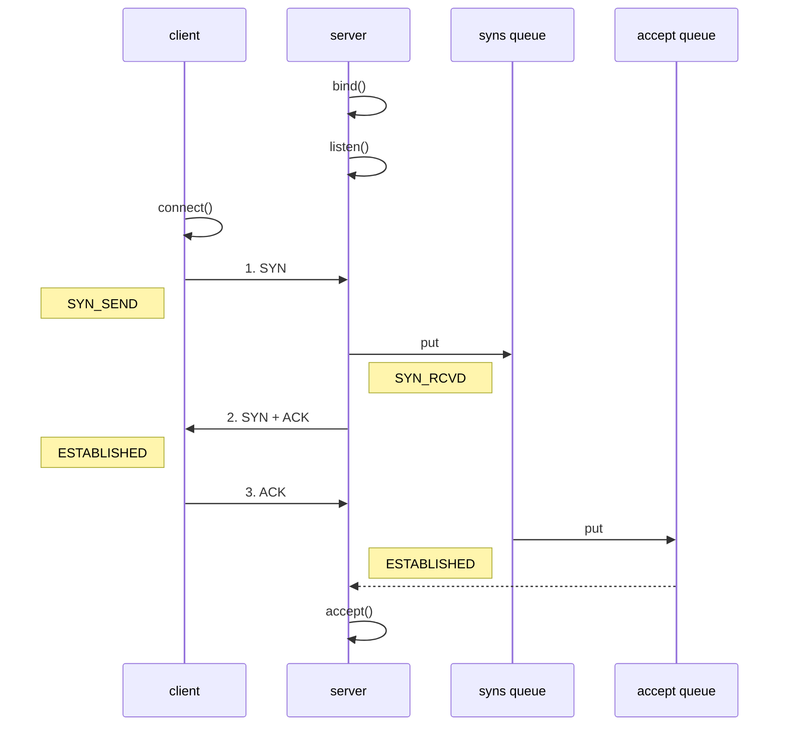

接着第1版的

## 4. 聊天室案例

#### 4.1 Message

```
@Data
public abstract class Message implements Serializable {
    /**
     * 根据消息类型字节，获得对应的消息 class
     * @param messageType 消息类型字节
     * @return 消息 class
     */
    public static Class<? extends Message> getMessageClass(int messageType) {
        return messageClasses.get(messageType);
    }

    private int sequenceId;

    private int messageType;

    public abstract int getMessageType();

    public static final int LoginRequestMessage = 0;
    public static final int LoginResponseMessage = 1;
    public static final int ChatRequestMessage = 2;
    public static final int ChatResponseMessage = 3;
    public static final int GroupCreateRequestMessage = 4;
    public static final int GroupCreateResponseMessage = 5;
    public static final int GroupJoinRequestMessage = 6;
    public static final int GroupJoinResponseMessage = 7;
    public static final int GroupQuitRequestMessage = 8;
    public static final int GroupQuitResponseMessage = 9;
    public static final int GroupChatRequestMessage = 10;
    public static final int GroupChatResponseMessage = 11;
    public static final int GroupMembersRequestMessage = 12;
    public static final int GroupMembersResponseMessage = 13;
    public static final int PingMessage = 14;
    public static final int PongMessage = 15;
    private static final Map<Integer, Class<? extends Message>> messageClasses = new HashMap<>();

    static {
        messageClasses.put(LoginRequestMessage, com.lin.netty.nettyadvance.message.request.LoginRequestMessage.class);
        messageClasses.put(LoginResponseMessage, com.lin.netty.nettyadvance.message.response.LoginResponseMessage.class);
        messageClasses.put(ChatRequestMessage, com.lin.netty.nettyadvance.message.request.ChatRequestMessage.class);
        messageClasses.put(ChatResponseMessage, com.lin.netty.nettyadvance.message.response.ChatResponseMessage.class);
        messageClasses.put(GroupCreateRequestMessage, com.lin.netty.nettyadvance.message.request.GroupCreateRequestMessage.class);
        messageClasses.put(GroupCreateResponseMessage, com.lin.netty.nettyadvance.message.response.GroupCreateResponseMessage.class);
        messageClasses.put(GroupJoinRequestMessage, com.lin.netty.nettyadvance.message.request.GroupJoinRequestMessage.class);
        messageClasses.put(GroupJoinResponseMessage, com.lin.netty.nettyadvance.message.response.GroupJoinResponseMessage.class);
        messageClasses.put(GroupQuitRequestMessage, com.lin.netty.nettyadvance.message.request.GroupQuitRequestMessage.class);
//        messageClasses.put(GroupQuitResponseMessage, GroupQuitResponseMessage.class);
        messageClasses.put(GroupChatRequestMessage, com.lin.netty.nettyadvance.message.request.GroupChatRequestMessage.class);
        messageClasses.put(GroupChatResponseMessage, com.lin.netty.nettyadvance.message.response.GroupChatResponseMessage.class);
        messageClasses.put(GroupMembersRequestMessage, com.lin.netty.nettyadvance.message.request.GroupMembersRequestMessage.class);
        messageClasses.put(GroupMembersResponseMessage, com.lin.netty.nettyadvance.message.response.GroupMembersResponseMessage.class);
    }
}
```

```
@Data
@AllArgsConstructor
public class ChatRequestMessage extends Message {
    private String from;

    private String to;

    private String content;

    @Override
    public int getMessageType() {
        return ChatRequestMessage;
    }
}
```

```
@Data
@ToString(callSuper = true) // toString包含父类
public abstract class AbstractResponseMessage extends Message {
    private boolean success;

    private String reason;

    public AbstractResponseMessage() {}

    public AbstractResponseMessage(boolean success, String reason) {
        this.success = success;
        this.reason = reason;
    }

}
```

```
@Data
@ToString(callSuper = true) // toString包含父类
public class ChatResponseMessage extends AbstractResponseMessage {
    private String from;

    private String content;

    public ChatResponseMessage(boolean success, String reason) {
        super(success, reason);
    }

    public ChatResponseMessage(String from, String content) {
        super(true, "");
        this.from = from;
        this.content = content;
    }

    @Override
    public int getMessageType() {
        return LoginResponseMessage;
    }
}
```

#### 4.2 Session

```
/**
 * 会话管理接口
 */
public interface Session {

    /**
     * 绑定会话
     * @param channel 哪个 channel 要绑定会话
     * @param username 会话绑定用户
     */
    void bind(Channel channel, String username);

    /**
     * 解绑会话
     * @param channel 哪个 channel 要解绑会话
     */
    void unbind(Channel channel);

    /**
     * 获取属性
     * @param channel 哪个 channel
     * @param name 属性名
     * @return 属性值
     */
    Object getAttribute(Channel channel, String name);

    /**
     * 设置属性
     * @param channel 哪个 channel
     * @param name 属性名
     * @param value 属性值
     */
    void setAttribute(Channel channel, String name, Object value);

    /**
     * 根据用户名获取 channel
     * @param username 用户名
     * @return channel
     */
    Channel getChannel(String username);
}
```

```
/**
 * 聊天组会话管理接口
 */
public interface GroupSession {

    /**
     * 创建一个聊天组, 如果不存在才能创建成功
     * @param name 组名
     * @param members 成员
     * @return 成功时返回组对象, 失败返回 null
     */
    Group createGroup(String name, Set<String> members);

    /**
     * 加入聊天组
     * @param name 组名
     * @param member 成员名
     * @return 如果组不存在返回 null, 否则返回组对象
     */
    Group joinMember(String name, String member);

    /**
     * 移除组成员
     * @param name 组名
     * @param member 成员名
     * @return 如果组不存在返回 null, 否则返回组对象
     */
    Group removeMember(String name, String member);

    /**
     * 移除聊天组
     * @param name 组名
     * @return 如果组不存在返回 null, 否则返回组对象
     */
    Group removeGroup(String name);

    /**
     * 获取组成员
     * @param name 组名
     * @return 成员集合, 没有成员会返回 empty set
     */
    Set<String> getMembers(String name);

    /**
     * 获取组成员的 channel 集合, 只有在线的 channel 才会返回
     * @param name 组名
     * @return 成员 channel 集合
     */
    List<Channel> getMembersChannel(String name);
}
```

```
public interface UserService {
    boolean login(String username, String password);
}
```

#### 4.3 服务端

```
@Slf4j
public class ChatServer {

    public static void main(String[] args) {
        NioEventLoopGroup boss = new NioEventLoopGroup();
        NioEventLoopGroup worker = new NioEventLoopGroup();
        LoggingHandler LOGGING_HANDLER = new LoggingHandler(LogLevel.DEBUG);
        MessageCodecSharable MESSAGE_CODEC = new MessageCodecSharable();
        LoginRequestMessageHandler loginRequestMessageHandler = new LoginRequestMessageHandler();
        ChatRequestMessageHandler chatRequestMessageHandler = new ChatRequestMessageHandler();
        GroupCreateRequestMessageHandler groupCreateRequestMessageHandler = new GroupCreateRequestMessageHandler();
        GroupChatRequestMessageHandler groupChatRequestMessageHandler = new GroupChatRequestMessageHandler();
        GroupJoinRequestMessageHandler groupJoinRequestMessageHandler = new GroupJoinRequestMessageHandler();
        GroupMembersRequestMessageHandler groupMembersRequestMessageHandler = new GroupMembersRequestMessageHandler();
        GroupQuitRequestMessageHandler groupQuitRequestMessageHandler = new GroupQuitRequestMessageHandler();
        QuitHandler quitHandler = new QuitHandler();
        PingMessageHandler pingMessageHandler = new PingMessageHandler();
        try {
            ServerBootstrap serverBootstrap = new ServerBootstrap();
            serverBootstrap.channel(NioServerSocketChannel.class);
            serverBootstrap.group(boss, worker);
            serverBootstrap.childHandler(new ChannelInitializer<SocketChannel>() {
                // 工序
                @Override
                protected void initChannel(SocketChannel ch) throws Exception {
                    ch.pipeline().addLast(new ProcotolFrameDecoder());
                    ch.pipeline().addLast(LOGGING_HANDLER);
                    ch.pipeline().addLast(MESSAGE_CODEC);
                    // 入站需要经过上面三个handler
                    // 用来判断是不是 读空闲时间过长，或 写空闲时间过长
                    // 5s 内如果没有收到 channel 的数据，会触发一个 IdleState#READER_IDLE 事件  出站入站处理器
                    ch.pipeline().addLast(new IdleStateHandler(5, 0, 0));
                    // ChannelDuplexHandler 可以同时作为入站和出站处理器
                    ch.pipeline().addLast(new ChannelDuplexHandler() {
                        // 用来触发特殊事件
                        @Override
                        public void userEventTriggered(ChannelHandlerContext ctx, Object evt) throws Exception {
                            IdleStateEvent event = (IdleStateEvent) evt;
                            // 触发了读空闲事件
                            if (event.state() == IdleState.READER_IDLE) {
                                log.debug("已经 5s 没有读到数据了");
                                // ctx.channel().close();
                            }
                        }
                    });
                    ch.pipeline().addLast(loginRequestMessageHandler);
                    ch.pipeline().addLast(chatRequestMessageHandler);
                    ch.pipeline().addLast(groupCreateRequestMessageHandler);
                    ch.pipeline().addLast(groupChatRequestMessageHandler);
                    ch.pipeline().addLast(groupJoinRequestMessageHandler);
                    ch.pipeline().addLast(groupMembersRequestMessageHandler);
                    ch.pipeline().addLast(groupQuitRequestMessageHandler);
                    // 退出处理  channel inactive 和 exception事件
                    ch.pipeline().addLast(quitHandler);
                    ch.pipeline().addLast(pingMessageHandler);

                }
            });
            Channel channel = serverBootstrap.bind(8080).sync().channel();
            channel.closeFuture().sync();
        } catch (InterruptedException e) {
            log.error("server error", e);
        } finally {
            boss.shutdownGracefully();
            worker.shutdownGracefully();
        }
    }
}
```

#### 4.4 客户端 

```
@Slf4j
public class ChatClient {
    public static void main(String[] args) {
        NioEventLoopGroup group = new NioEventLoopGroup();
        LoggingHandler LOGGING_HANDLER = new LoggingHandler(LogLevel.DEBUG);
        MessageCodecSharable MESSAGE_CODEC = new MessageCodecSharable();
        CountDownLatch WAIT_FOR_LOGIN = new CountDownLatch(1);
        AtomicBoolean LOGIN = new AtomicBoolean(false);
        try {
            Bootstrap bootstrap = new Bootstrap();
            bootstrap.channel(NioSocketChannel.class);
            bootstrap.group(group);
            bootstrap.handler(new ChannelInitializer<SocketChannel>() {
                // 工序
                @Override
                protected void initChannel(SocketChannel ch) throws Exception {
                    ch.pipeline().addLast(new ProcotolFrameDecoder()); // 半包处理器
                    ch.pipeline().addLast(LOGGING_HANDLER);
                    ch.pipeline().addLast(MESSAGE_CODEC);
                    // 入站需要经过上面三个handler
                    // 用来判断是不是 读空闲时间过长，或 写空闲时间过长
                    // 3s 内如果没有向服务器写数据，会触发一个 IdleState#WRITER_IDLE 事件
                    ch.pipeline().addLast(new IdleStateHandler(0, 3, 0));
                    // ChannelDuplexHandler 可以同时作为入站和出站处理器
                    ch.pipeline().addLast(new ChannelDuplexHandler() {
                        // 用来触发特殊事件
                        @Override
                        public void userEventTriggered(ChannelHandlerContext ctx, Object evt) throws Exception {
                            IdleStateEvent event = (IdleStateEvent) evt;
                            // 触发了写空闲事件
                            if (event.state() == IdleState.WRITER_IDLE) {
//                                log.debug("3s 没有写数据了，发送一个心跳包");
//                                ctx.writeAndFlush(new PingMessage(true, "3s 没有写数据了，发送一个心跳包"));
                            }
                        }
                    });
                    ch.pipeline().addLast("client handler", new ChannelInboundHandlerAdapter() {
                        // 连接后触发active事件
                        @Override
                        public void channelActive(ChannelHandlerContext ctx) throws Exception {
                            // 负责接收用户在控制台的输入，向服务器发送消息   新开线程，不使用nio group
                            new Thread(() -> {
                                Scanner scanner = new Scanner(System.in);
                                System.out.println("请输入用户名：");
                                String username = scanner.nextLine();
                                System.out.println("请输入密码:");
                                String password = scanner.nextLine();
                                // 构造消息对象
                                LoginRequestMessage message = new LoginRequestMessage(username, password);
                                // 发送消息
                                ctx.writeAndFlush(message);

                                System.out.println("等待后续操作...");
                                try {
                                    WAIT_FOR_LOGIN.await(); // 等待为0
                                } catch (InterruptedException e) {
                                    e.printStackTrace();
                                }
                                // 如果登录失败
                                if (!LOGIN.get()) {
                                    ctx.channel().close();
                                    return;
                                }
                                while (true) {
                                    System.out.println("==================================");
                                    System.out.println("send [username] [content]");
                                    System.out.println("gsend [group name] [content]");
                                    System.out.println("gcreate [group name] [m1,m2,m3...]");
                                    System.out.println("gmembers [group name]");
                                    System.out.println("gjoin [group name]");
                                    System.out.println("gquit [group name]");
                                    System.out.println("quit");
                                    System.out.println("==================================");
                                    String command = scanner.nextLine();
                                    String[] s = command.split(" ");
                                    switch (s[0]) {
                                        case "send":
                                            ctx.writeAndFlush(new ChatRequestMessage(username, s[1], s[2]));
                                            break;
                                        case "gsend":
                                            ctx.writeAndFlush(new GroupChatRequestMessage(username, s[1], s[2]));
                                            break;
                                        case "gcreate":
                                            Set<String> set = new HashSet<>(Arrays.asList(s[2].split(",")));
                                            set.add(username); // 加入自己
                                            ctx.writeAndFlush(new GroupCreateRequestMessage(s[1], set));
                                            break;
                                        case "gmembers":
                                            ctx.writeAndFlush(new GroupMembersRequestMessage(s[1]));
                                            break;
                                        case "gjoin":
                                            ctx.writeAndFlush(new GroupJoinRequestMessage(username, s[1]));
                                            break;
                                        case "gquit":
                                            ctx.writeAndFlush(new GroupQuitRequestMessage(username, s[1]));
                                            break;
                                        case "quit":
                                            ctx.channel().close();
                                            return;
                                    }
                                }
                            }, "System.in").start();
                        }

                        // 接收响应信息
                        @Override
                        public void channelRead(ChannelHandlerContext ctx, Object msg) throws Exception {
                            log.debug("msg = {}", msg);
                            if (msg instanceof LoginResponseMessage) {
                                LoginResponseMessage response = (LoginResponseMessage) msg;
                                // 登录成功
                                if (response.isSuccess()) {
                                    LOGIN.set(true);
                                }
                                // 唤醒System.in线程
                                WAIT_FOR_LOGIN.countDown();
                            }
                        }
                    });
                }
            });
            Channel channel = bootstrap.connect("127.0.0.1", 8080).sync().channel();
            channel.closeFuture().sync();
        } catch (Exception e) {
            log.error("client error", e);
        } finally {
            group.shutdownGracefully();
        }
    }
}
```

#### 4.5 handlers

##### 4.5.1 登录

```
@ChannelHandler.Sharable
public class LoginRequestMessageHandler extends SimpleChannelInboundHandler<LoginRequestMessage> {
    @Override
    protected void channelRead0(ChannelHandlerContext ctx, LoginRequestMessage msg) throws Exception {
        String username = msg.getUsername();
        String password = msg.getPassword();

        SessionFactory.getSession().bind(ctx.channel(), username);

        boolean login = UserServiceFactory.getUserService().login(username, password);
        LoginResponseMessage message;
        if (login) {
            message = new LoginResponseMessage(true, "登录成功");
        } else {
            message = new LoginResponseMessage(false, "用户名或密码不正确");
        }
        ctx.writeAndFlush(message);
    }
}
```

##### 4.5.2 单聊

```
@ChannelHandler.Sharable
public class ChatRequestMessageHandler extends SimpleChannelInboundHandler<ChatRequestMessage> {
    @Override
    protected void channelRead0(ChannelHandlerContext ctx, ChatRequestMessage msg) throws Exception {
        String to = msg.getTo();
        Channel channel = SessionFactory.getSession().getChannel(to);
        // 在线
        if(channel != null) {
            channel.writeAndFlush(new ChatResponseMessage(msg.getFrom(), msg.getContent()));
        }
        // 不在线
        else {
            ctx.writeAndFlush(new ChatResponseMessage(false, "对方用户不存在或者不在线"));
        }
    }
}
```

##### 4.5.3 创建群聊

```
@ChannelHandler.Sharable
public class GroupCreateRequestMessageHandler extends SimpleChannelInboundHandler<GroupCreateRequestMessage> {

    @Override
    protected void channelRead0(ChannelHandlerContext ctx, GroupCreateRequestMessage msg) throws Exception {
        String groupName = msg.getGroupName();
        Set<String> members = msg.getMembers();
        // 群管理器
        GroupSession groupSession = GroupFactory.getSession();
        Group group = groupSession.createGroup(groupName, members);
        if (group != null) {
            // 发生成功消息
            ctx.writeAndFlush(new GroupCreateResponseMessage(true, groupName + " 创建成功"));
            // 发送拉群消息
            List<Channel> membersChannel = groupSession.getMembersChannel(groupName);
            membersChannel.forEach(channel -> {
                channel.writeAndFlush(new GroupCreateResponseMessage(true, "您已被拉入 " + groupName));
            });
        } else {
            ctx.writeAndFlush(new GroupCreateResponseMessage(false, groupName + " 已经存在"));
        }
    }
}
```

##### 4.5.4 群聊-发消息

```
@ChannelHandler.Sharable
public class GroupChatRequestMessageHandler extends SimpleChannelInboundHandler<GroupChatRequestMessage> {
    @Override
    protected void channelRead0(ChannelHandlerContext ctx, GroupChatRequestMessage msg) throws Exception {
        final String groupName = msg.getGroupName();
        GroupSession groupSession = GroupFactory.getSession();
        List<Channel> membersChannel = groupSession.getMembersChannel(groupName);
        membersChannel.forEach(channel -> {
            channel.writeAndFlush(new GroupChatResponseMessage(msg.getUsername(),msg.getContent()));
        });
    }
}
```

##### 4.5.5 群聊-加入

```
@ChannelHandler.Sharable
public class GroupJoinRequestMessageHandler extends SimpleChannelInboundHandler<GroupJoinRequestMessage> {
    @Override
    protected void channelRead0(ChannelHandlerContext ctx, GroupJoinRequestMessage msg) throws Exception {
        GroupSession groupSession = GroupFactory.getSession();
        Group group = groupSession.joinMember(msg.getGroupName(), msg.getUsername());
        if (group == null) {
            ctx.writeAndFlush(new GroupJoinResponseMessage(true, msg.getGroupName() + "群不存在"));
        } else {
            ctx.writeAndFlush(new GroupJoinResponseMessage(true, msg.getGroupName() + "群加入成功"));
        }
    }
}
```

##### 4.5.5 群聊-退出

```
@ChannelHandler.Sharable
public class GroupQuitRequestMessageHandler extends SimpleChannelInboundHandler<GroupQuitRequestMessage> {
    @Override
    protected void channelRead0(ChannelHandlerContext ctx, GroupQuitRequestMessage msg) throws Exception {
        GroupSession groupSession = GroupFactory.getSession();
        Group group = groupSession.removeMember(msg.getGroupName(), msg.getUsername());
        if (group == null) {
            ctx.writeAndFlush(new GroupJoinResponseMessage(true, msg.getGroupName() + "群不存在"));
        } else {
            ctx.writeAndFlush(new GroupJoinResponseMessage(true, msg.getGroupName() + "群退出成功"));
        }
    }
}
```

##### 4.5.5 群聊-获取群成员

```
@ChannelHandler.Sharable
public class GroupMembersRequestMessageHandler extends SimpleChannelInboundHandler<GroupMembersRequestMessage> {
    @Override
    protected void channelRead0(ChannelHandlerContext ctx, GroupMembersRequestMessage msg) throws Exception {
        GroupSession groupSession = GroupFactory.getSession();
        Set<String> members = groupSession.getMembers(msg.getGroupName());
        ctx.writeAndFlush(new GroupMembersResponseMessage(members));
    }
}
```

#### 4.6 退出

```
@ChannelHandler.Sharable
public class QuitHandler extends ChannelInboundHandlerAdapter {
    // 连接断开时触发 inactive 事件
    @Override
    public void channelInactive(ChannelHandlerContext ctx) throws Exception {
        SessionFactory.getSession().unbind(ctx.channel());
        log.debug("{} 已经断开", ctx.channel());
    }

    @Override
    public void exceptionCaught(ChannelHandlerContext ctx, Throwable cause) throws Exception {
        SessionFactory.getSession().unbind(ctx.channel());
        log.debug("{} 已经断开,异常是{}", ctx.channel(), cause);
    }
}
```

#### 4.7 空闲检测

连接假死

原因

- 网络设备出现故障，例如网卡，机房等，底层的 TCP 连接已经断开了，但应用程序没有感知到，仍然占用着资源。
- 公网网络不稳定，出现丢包。如果连续出现丢包，这时现象就是客户端数据发不出去，服务端也一直收不到数据，就这么一直耗着
- 应用程序线程阻塞，无法进行数据读写

问题

- 假死的连接占用的资源不能自动释放
- 向假死的连接发送数据，得到的反馈是发送超时

服务器端解决

- 怎么判断客户端连接是否假死呢？如果能收到客户端数据，说明没有假死。因此策略就可以定为，每隔一段时间就检查这段时间内是否接收到客户端数据，没有就可以判定为连接假死

```
// 用来判断是不是 读空闲时间过长，或 写空闲时间过长
// 5s 内如果没有收到 channel 的数据，会触发一个 IdleState#READER_IDLE 事件  出站入站处理器
ch.pipeline().addLast(new IdleStateHandler(5, 0, 0));
// ChannelDuplexHandler 可以同时作为入站和出站处理器
ch.pipeline().addLast(new ChannelDuplexHandler() {
    // 用来触发特殊事件
    @Override
    public void userEventTriggered(ChannelHandlerContext ctx, Object evt) throws Exception {
        IdleStateEvent event = (IdleStateEvent) evt;
        // 触发了读空闲事件
        if (event.state() == IdleState.READER_IDLE) {
            log.debug("已经 5s 没有读到数据了");
            // ctx.channel().close();
        }
    }
});
```

客户端定时心跳

- 客户端可以定时向服务器端发送数据，只要这个时间间隔小于服务器定义的空闲检测的时间间隔，那么就能防止前面提到的误判，客户端可以定义如下心跳处理器

```
// 用来判断是不是 读空闲时间过长，或 写空闲时间过长
// 3s 内如果没有向服务器写数据，会触发一个 IdleState#WRITER_IDLE 事件
ch.pipeline().addLast(new IdleStateHandler(0, 3, 0));
// ChannelDuplexHandler 可以同时作为入站和出站处理器
ch.pipeline().addLast(new ChannelDuplexHandler() {
    // 用来触发特殊事件
    @Override
    public void userEventTriggered(ChannelHandlerContext ctx, Object evt) throws Exception {
        IdleStateEvent event = (IdleStateEvent) evt;
        // 触发了写空闲事件
        if (event.state() == IdleState.WRITER_IDLE) {
            log.debug("3s 没有写数据了，发送一个心跳包");
            ctx.writeAndFlush(new PingMessage(true, "3s 没有写数据了，发送一个心跳包"));
        }
    }
});
```

# 三、优化与源码

## 1.优化

### 1.1 扩展序列化算法

序列化，反序列化主要用在消息正文的转换上

- 序列化时，需要将 Java 对象变为要传输的数据（可以是 byte[]，或 json 等，最终都需要变成 byte[]）
- 反序列化时，需要将传入的正文数据还原成 Java 对象，便于处理

目前的代码仅支持 Java 自带的序列化，反序列化机制，核心代码如下

```java
// 反序列化
byte[] body = new byte[bodyLength];
byteByf.readBytes(body);
ObjectInputStream in = new ObjectInputStream(new ByteArrayInputStream(body));
Message message = (Message) in.readObject();
message.setSequenceId(sequenceId);

// 序列化
ByteArrayOutputStream out = new ByteArrayOutputStream();
new ObjectOutputStream(out).writeObject(message);
byte[] bytes = out.toByteArray();
```

为了支持更多序列化算法，抽象一个 Serializer 接口

```
public interface Serializer {
    // <T>表明是个泛型方法,T是返回值为类型T
    // 反序列化方法
    <T> T deserialize(Class<T> clazz, byte[] bytes);

    // 序列化方法
    <T> byte[] serialize(T object);

    enum Algorithm implements Serializer {
        // jdk序列化
        Java {
            @Override
            public <T> T deserialize(Class<T> clazz, byte[] bytes) {
                try {
                    ObjectInputStream in = new ObjectInputStream(new ByteArrayInputStream(bytes));
                    Object object = in.readObject();
                    return (T) object;
                } catch (IOException | ClassNotFoundException e) {
                    throw new RuntimeException("SerializerAlgorithm.Java 反序列化错误", e);
                }
            }

            @Override
            public <T> byte[] serialize(T object) {
                try {
                    ByteArrayOutputStream out = new ByteArrayOutputStream();
                    new ObjectOutputStream(out).writeObject(object);
                    return out.toByteArray();
                } catch (IOException e) {
                    throw new RuntimeException("SerializerAlgorithm.Java 序列化错误", e);
                }
            }
        },
        // Json 实现(引入了 Gson 依赖)
        Json {
            @Override
            public <T> T deserialize(Class<T> clazz, byte[] bytes) {
                return new Gson().fromJson(new String(bytes, StandardCharsets.UTF_8), clazz);
            }

            @Override
            public <T> byte[] serialize(T object) {
                return new Gson().toJson(object).getBytes(StandardCharsets.UTF_8);
            }
        };

        // 需要从协议的字节中得到是哪种序列化算法
        public static Algorithm getByInt(int type) {
            Algorithm[] array = Algorithm.values();
            if (type < 0 || type > array.length - 1) {
                throw new IllegalArgumentException("超过 SerializerAlgorithm 范围");
            }
            return array[type];
        }
    }
}
```

增加配置类和配置文件

```java
public abstract class Config {
    static Properties properties;
    static {
        try (InputStream in = Config.class.getResourceAsStream("/application.properties")) {
            properties = new Properties();
            properties.load(in);
        } catch (IOException e) {
            throw new ExceptionInInitializerError(e);
        }
    }
    public static int getServerPort() {
        String value = properties.getProperty("server.port");
        if(value == null) {
            return 8080;
        } else {
            return Integer.parseInt(value);
        }
    }
    public static Serializer.Algorithm getSerializerAlgorithm() {
        String value = properties.getProperty("serializer.algorithm");
        if(value == null) {
            return Serializer.Algorithm.Java;
        } else {
            return Serializer.Algorithm.valueOf(value);
        }
    }
}
```

配置文件

```properties
serializer.algorithm=Json
```

修改编解码器

```
public class MessageCodecSharable extends MessageToMessageCodec<ByteBuf, Message> {

    @Override
    protected void encode(ChannelHandlerContext ctx, Message msg, List<Object> list) throws Exception {
        ByteBuf out = ctx.alloc().buffer();
        // 1. 4 字节的魔数
        out.writeBytes(new byte[]{1, 2, 3, 4});
        // 2. 1 字节的版本,
        out.writeByte(1);
        // 3. 1 字节的序列化方式 jdk 0 , json 1
        out.writeByte(Config.getSerializerAlgorithm().ordinal());
        // 4. 1 字节的指令类型
        out.writeByte(msg.getMessageType());
        // 5. 4 个字节
        out.writeInt(msg.getSequenceId());
        // 无意义，对齐填充 一般是2的次数倍刚好16个字节
        out.writeByte(0xff);
        // 6. 获取内容的字节数组    对象转字节数组
        byte[] bytes = Config.getSerializerAlgorithm().serialize(msg);
        // 7. 长度
        out.writeInt(bytes.length);
        // 8. 写入内容
        out.writeBytes(bytes);
        list.add(out);
    }

    @Override
    protected void decode(ChannelHandlerContext ctx, ByteBuf in, List<Object> list) throws Exception {
        int magicNum = in.readInt();
        byte version = in.readByte();
        byte serializerType = in.readByte();
        byte messageType = in.readByte();
        int sequenceId = in.readInt();
        in.readByte();
        int length = in.readInt();
        byte[] bytes = new byte[length];
        in.readBytes(bytes, 0, length);

        Serializer.Algorithm algorithm = Serializer.Algorithm.values()[serializerType];
        Message message = algorithm.deserialize(Message.getMessageClass(messageType), bytes);

        log.debug("{}, {}, {}, {}, {}, {}", magicNum, version, serializerType, messageType, sequenceId, length);
        log.debug("message = {}", message);
        list.add(message);
    }
}
```

### 1.2 参数调优

#### 1.2.1 CONNECT_TIMEOUT_MILLIS

- 属于 SocketChannal 参数
- 用在客户端建立连接时，如果在指定毫秒内无法连接，会抛出 timeout 异常
- SO_TIMEOUT 主要用在传统阻塞 IO，阻塞 IO 中 accept，read 等都是无限等待的，如果不希望永远阻塞，使用它调整超时时间

```java
@Slf4j
public class TestConnectionTimeout {
    public static void main(String[] args) {
        /**
         * Bootstrap  option设置的是SocketChannel
         * ServerBootstrap  option设置的是ServerSocketChannel
         * ServerBootstrap  childOption设置的是SocketChannel
         */
        NioEventLoopGroup group = new NioEventLoopGroup();
        try {
            Bootstrap bootstrap = new Bootstrap()
                .group(group)
                .option(ChannelOption.CONNECT_TIMEOUT_MILLIS, 300)
                .channel(NioSocketChannel.class)
                .handler(new LoggingHandler());
            ChannelFuture future = bootstrap.connect("127.0.0.1", 8080);
            future.sync().channel().closeFuture().sync(); // 断点1  thread类型，否则一个断点停下来影响其他断点执行
        } catch (Exception e) {
            e.printStackTrace();
            log.debug("timeout");
        } finally {
            group.shutdownGracefully();
        }
    }
}
```

另外源码部分 `io.netty.channel.nio.AbstractNioChannel.AbstractNioUnsafe#connect`

超时主要是定时任务几秒后去检查，通过promise线程间通信

```java
@Override
public final void connect(
        final SocketAddress remoteAddress, final SocketAddress localAddress, final ChannelPromise promise) {
    // ...
    // Schedule connect timeout.
    int connectTimeoutMillis = config().getConnectTimeoutMillis();
    if (connectTimeoutMillis > 0) {
        connectTimeoutFuture = eventLoop().schedule(new Runnable() {
            @Override
            public void run() {                
                ChannelPromise connectPromise = AbstractNioChannel.this.connectPromise;
                ConnectTimeoutException cause =
                    new ConnectTimeoutException("connection timed out: " + remoteAddress); // 断点2
                if (connectPromise != null && connectPromise.tryFailure(cause)) {
                    close(voidPromise());
                }
            }
        }, connectTimeoutMillis, TimeUnit.MILLISECONDS);
    }
    // ...
}
```

#### 1.2.2 SO_BACKLOG



1. 第一次握手，client 发送 SYN 到 server，状态修改为 SYN_SEND，server 收到，状态改变为 SYN_REVD，并将该请求放入 sync queue 队列
2. 第二次握手，server 回复 SYN + ACK 给 client，client 收到，状态改变为 ESTABLISHED，并发送 ACK 给 server
3. 第三次握手，server 收到 ACK，状态改变为 ESTABLISHED，将该请求从 sync queue 放入 accept queue

其中

- 在 linux 2.2 之前，backlog 大小包括了两个队列的大小，在 2.2 之后，分别用下面两个参数来控制
- sync queue - 半连接队列
  - 大小通过 /proc/sys/net/ipv4/tcp_max_syn_backlog 指定，在 `syncookies` 启用的情况下，逻辑上没有最大值限制，这个设置便被忽略
- accept queue - 全连接队列
  - 其大小通过 /proc/sys/net/core/somaxconn 指定，在使用 listen 函数时，内核会根据传入的 backlog 参数与程序系统参数，取二者的较小值
  - 如果 accpet queue 队列满了，server 将发送一个拒绝连接的错误信息到 client

netty 中

可以通过 option(ChannelOption.SO_BACKLOG, 值) 来设置大小

可以通过下面源码查看默认大小

```
NioServerSocketChannel.doBind(SocketAddress localAddress)

this.config.getBacklog()
```

**非阻塞模式**

```
/**
 * windows没指定backlog  所以取系统
 * <p>
 * TestConnectionTimeout
 * <p>
 * 通过断点方法不调accept 验证全连接队列大小
 */
public class TestBackLogServer {
    public static void main(String[] args) {
        new ServerBootstrap()
            .group(new NioEventLoopGroup())
            .option(ChannelOption.SO_BACKLOG, 2) // 设置2个全连接队列
            /*
            NioEventLoop源码里这里断点阻塞accept连接 ，开启第三个客户端失败
              if ((readyOps & 17) != 0 || readyOps == 0) {
                    unsafe.read();
                }
             */
            .channel(NioServerSocketChannel.class)
            .childHandler(
                new ChannelInitializer<NioSocketChannel>() {

                    @Override
                    protected void initChannel(NioSocketChannel ch) throws Exception {
                        ch.pipeline().addLast(new LoggingHandler());
                    }
                }
            )
            .bind(8080);
    }
}
```

**BIO模式**

课堂调试关键断点为：`io.netty.channel.nio.NioEventLoop#processSelectedKey`

```java
public class Server {
    public static void main(String[] args) throws IOException {
        ServerSocket ss = new ServerSocket(8888, 2);
        Socket accept = ss.accept();
        System.out.println(accept);
        System.in.read();
    }
}
```

客户端启动 4 个

```java
public class Client {
    public static void main(String[] args) throws IOException {
        try {
            Socket s = new Socket();
            System.out.println(new Date()+" connecting...");
            s.connect(new InetSocketAddress("localhost", 8888),1000);
            System.out.println(new Date()+" connected...");
            s.getOutputStream().write(1);
            System.in.read();
        } catch (IOException e) {
            System.out.println(new Date()+" connecting timeout...");
            e.printStackTrace();
        }
    }
}
```

#### 1.2.3 ulimit-n

属于操作系统参数              FD file description  文件连接上限

#### 1.2.4 TCP_NODELAY

属于SocketChannel参数，最好设置为true

false开启了nagle算法

#### 1.2.5 SO_SNDBUF & SO_RCVBUF

发送缓冲区和接收缓冲区，就是滑动窗口。   最好别跳转

SO_SNDBUF 属于SocketChannel参数

SO_RCVBUF 既可用于 SocketChannal 参数，也可以用于 ServerSocketChannal 参数（建议设置到 ServerSocketChannal 上）

#### 1.2.6 ALLOCATOR

- 属于 SocketChannal 参数
- 用来分配 ByteBuf， ctx.alloc()

ChannelConfig 带配置项

DefaultChannelConfig默认配置项

配置VM  option  设置

```
-Dio.netty.allocator.type=unpooled  -Dio.netty.noPreferDirec=true  #不使用直接内存
```

#### 1.2.7 RCVBUF_ALLOCATOR

- 属于 SocketChannal 参数
- 控制 netty 接收缓冲区大小
- 负责入站数据的分配，决定入站缓冲区的大小（并可动态调整），统一采用 direct 直接内存，具体池化还是非池化由 allocator 决定

### 1.3 RPC框架

#### 1.3.1 RpcServer

```
@Slf4j
public class RpcServer {
    public static void main(String[] args) {
        NioEventLoopGroup boss = new NioEventLoopGroup();
        NioEventLoopGroup worker = new NioEventLoopGroup();
        LoggingHandler LOGGING_HANDLER = new LoggingHandler(LogLevel.DEBUG);
        MessageCodecSharable MESSAGE_CODEC = new MessageCodecSharable();

        // rpc 请求消息处理器，待实现
        RpcRequestMessageHandler RPC_HANDLER = new RpcRequestMessageHandler();
        try {
            ServerBootstrap serverBootstrap = new ServerBootstrap();
            serverBootstrap.channel(NioServerSocketChannel.class);
            serverBootstrap.group(boss, worker);
            serverBootstrap.childHandler(new ChannelInitializer<SocketChannel>() {
                @Override
                protected void initChannel(SocketChannel ch) throws Exception {
                    ch.pipeline().addLast(new ProcotolFrameDecoder());
                    ch.pipeline().addLast(LOGGING_HANDLER);
                    ch.pipeline().addLast(MESSAGE_CODEC);
                    ch.pipeline().addLast(RPC_HANDLER);
                }
            });
            Channel channel = serverBootstrap.bind(8080).sync().channel();
            channel.closeFuture().sync();
        } catch (InterruptedException e) {
            log.error("server error", e);
        } finally {
            boss.shutdownGracefully();
            worker.shutdownGracefully();
        }
    }
}
```

#### 1.3.2 RpcClient

```
@Slf4j
public class RpcClient {
    public static void main(String[] args) {
        NioEventLoopGroup group = new NioEventLoopGroup();
        LoggingHandler LOGGING_HANDLER = new LoggingHandler(LogLevel.DEBUG);
        MessageCodecSharable MESSAGE_CODEC = new MessageCodecSharable();

        // rpc 响应消息处理器，待实现
        RpcResponseMessageHandler RPC_HANDLER = new RpcResponseMessageHandler();
        try {
            Bootstrap bootstrap = new Bootstrap();
            bootstrap.channel(NioSocketChannel.class);
            bootstrap.group(group);
            bootstrap.handler(new ChannelInitializer<SocketChannel>() {
                @Override
                protected void initChannel(SocketChannel ch) throws Exception {
                    ch.pipeline().addLast(new ProcotolFrameDecoder());
                    ch.pipeline().addLast(LOGGING_HANDLER);
                    ch.pipeline().addLast(MESSAGE_CODEC);
                    ch.pipeline().addLast(RPC_HANDLER);
                }
            });
            Channel channel = bootstrap.connect("localhost", 8080).sync().channel();

            channel.writeAndFlush(new RpcRequestMessage(
                1,
                "com.lin.netty.nettyoptimize.c3rpc.HelloService",
                "sayHello",
                String.class,
                new Class[]{String.class},
                new Object[]{"张三"}
            )).addListener(promise -> {
                if (!promise.isSuccess()) {
                    Throwable cause = promise.cause();
                    log.error("error", cause);
                }
            });

            channel.closeFuture().sync();
        } catch (Exception e) {
            log.error("client error", e);
        } finally {
            group.shutdownGracefully();
        }
    }
}
```

#### 1.3.3 ServicesFactory

```
public class ServicesFactory {
    static Properties properties;
    static Map<Class<?>, Object> map = new ConcurrentHashMap<>();

    static {
        try (InputStream in = Config.class.getResourceAsStream("/application.properties")) {
            properties = new Properties();
            properties.load(in);
            Set<String> names = properties.stringPropertyNames();
            for (String name : names) {
                if (name.endsWith("Service")) {
                    Class<?> interfaceClass = Class.forName(name);
                    Class<?> instanceClass = Class.forName(properties.getProperty(name));
                    map.put(interfaceClass, instanceClass.newInstance());
                }
            }
        } catch (IOException | ClassNotFoundException | InstantiationException | IllegalAccessException e) {
            throw new ExceptionInInitializerError(e);
        }
    }

    public static <T> T getService(Class<T> interfaceClass) {
        return (T) map.get(interfaceClass);
    }
}
```

#### 1.3.4 RpcRequestMessageHandler

```
@Slf4j
@ChannelHandler.Sharable
public class RpcRequestMessageHandler extends SimpleChannelInboundHandler<RpcRequestMessage> {
    @Override
    protected void channelRead0(ChannelHandlerContext ctx, RpcRequestMessage message) {
        RpcResponseMessage response = new RpcResponseMessage();
        response.setSequenceId(message.getSequenceId());
        try {
            // 获取真正的实现对象
            HelloService service = (HelloService)
                ServicesFactory.getService(Class.forName(message.getInterfaceName()));

            // 获取要调用的方法
            Method method = service.getClass().getMethod(message.getMethodName(), message.getParameterTypes());

            // 调用方法
            Object invoke = method.invoke(service, message.getParameterValue());
            // 调用成功
            response.setReturnValue(invoke);
        } catch (Exception e) {
            e.printStackTrace();
            // 调用异常
            response.setExceptionValue(e);
        }
        // 返回结果
        ctx.writeAndFlush(response);
    }
}
```

#### 1.3.5 RpcRequestMessage

```

@Getter
@ToString(callSuper = true)
public class RpcRequestMessage extends Message {
    /**
     * 调用的接口全限定名，服务端根据它找到实现
     */
    private String interfaceName;
    /**
     * 调用接口中的方法名
     */
    private String methodName;
    /**
     * 方法返回类型
     */
    private Class<?> returnType;
    /**
     * 方法参数类型数组
     */
    private Class[] parameterTypes;
    /**
     * 方法参数值数组
     */
    private Object[] parameterValue;

    public RpcRequestMessage(int sequenceId, String interfaceName, String methodName, Class<?> returnType, Class[] parameterTypes, Object[] parameterValue) {
        super.setSequenceId(sequenceId);
        this.interfaceName = interfaceName;
        this.methodName = methodName;
        this.returnType = returnType;
        this.parameterTypes = parameterTypes;
        this.parameterValue = parameterValue;
    }

    @Override
    public int getMessageType() {
        return RPC_MESSAGE_TYPE_REQUEST;
    }
}
```

#### 1.3.6 RpcResponseMessage

```
@Data
@ToString(callSuper = true)
public class RpcResponseMessage extends AbstractResponseMessage{
    /**
     * 返回值
     */
    private Object returnValue;
    /**
     * 异常值
     */
    private Exception exceptionValue;

    @Override
    public int getMessageType() {
        return RPC_MESSAGE_TYPE_RESPONSE;
    }
}
```

#### 1.3.7 类型转换器

```
public class TestGson {

    public static void main(String[] args) {
        System.out.println(new Gson().toJson("test"));
        // Attempted to serialize java.lang.Class: java.lang.String. Forgot to register a type adapter?
        // 需要写个类型转换器，将类转化为String
        Gson gson = new GsonBuilder().registerTypeAdapter(Class.class, new ClassCodec()).create();
        System.out.println(gson.toJson(String.class));
    }

    static class ClassCodec implements JsonSerializer<Class<?>>, JsonDeserializer<Class<?>> {
        @Override
        public Class<?> deserialize(JsonElement json, Type type,
            JsonDeserializationContext jsonDeserializationContext) throws JsonParseException {
            // json -> class
            try {
                String str = json.getAsString();
                return Class.forName(str);
            } catch (ClassNotFoundException e) {
                e.printStackTrace();
                throw new JsonParseException(e);
            }
        }

        @Override
        public JsonElement serialize(Class<?> src, Type type, JsonSerializationContext jsonSerializationContext) {
            // class -> json  全路径转为字符串
            return new JsonPrimitive(src.getName());
        }
    }
}
```

#### 1.3.8 HelloService

```
public interface HelloService {
    String sayHello(String name);
}
```

```
public class HelloServiceImpl implements HelloService {
    public String sayHello(String name) {
        System.out.println("hello " + name);
        return "hello " + name;
    }
}
```

#### 1.3.9 RpcResponseMessageHandler

```
@Slf4j
@ChannelHandler.Sharable  // 这里不允许有共享的变量，不保证安全，但是我们自己保证了线程安全，所以可以有共享变量
public class RpcResponseMessageHandler extends SimpleChannelInboundHandler<RpcResponseMessage> {
    // 序号  用来接收结果的promise对象
    public static final Map<Integer, Promise<Object>> PROMISES = new ConcurrentHashMap<>();

    @Override
    protected void channelRead0(ChannelHandlerContext ctx, RpcResponseMessage msg) throws Exception {
        log.debug("{}", msg);
        // 取到对象后 移除对象，不然越来越多
        Promise<Object> promise = PROMISES.remove(msg.getSequenceId());
        if (promise != null) {
            Exception exceptionValue = msg.getExceptionValue();
            Object returnValue = msg.getReturnValue();
            if (exceptionValue != null) {
                promise.setFailure(exceptionValue);
            } else {
                promise.setSuccess(returnValue);
            }
        }
    }
}
```

#### 1.3.10 Promise

client proxy这里逻辑修改

```
Object o = Proxy.newProxyInstance(loader, interfaces, (proxy, method, args) -> {
    // 1. 方法转换为 消息对象
    int sequenceId = SequenceIdGenerator.getSequenceId();
    RpcRequestMessage rpcRequestMessage = new RpcRequestMessage(
        sequenceId,
        serviceClass.getName(),
        method.getName(),
        method.getReturnType(),
        method.getParameterTypes(),
        args);
    // 2. 消息对象发送出去
    getChannel().writeAndFlush(rpcRequestMessage);

    // 3.准备一个空Promise对象，来接收结果  指定promise对象异步接收结果线程
    DefaultPromise<Object> promise = new DefaultPromise<>(getChannel().eventLoop());
    RpcResponseMessageHandler.PROMISES.put(sequenceId, promise);

    promise.await();
    // 3. 返回结果
    if (promise.isSuccess()) {
        return promise.getNow();
    } else {
        throw new RuntimeException(promise.cause());
    }
});
```

#### 1.3.11 异常处理

服务器异常 RpcRequestMessageHandler ,  编码解析器长度不够解析 异常堆栈信息

```
catch (Exception e) {
            e.printStackTrace();
            // Adjusted frame length exceeds 1024: 11652 - discarded
            // 如果直接set e 返回给客户端，客户端接收不到，因为堆栈太大，  长度解析器最大1024
            response.setExceptionValue(new Exception("远程调用出错" + e.getCause().getMessage()));
        }
```

## 2.源码分析

### 2.1 启动流程

看看 netty 中对下面的代码是怎样进行处理的

```java
//1 netty 中使用 NioEventLoopGroup （简称 nio boss 线程）来封装线程和 selector
Selector selector = Selector.open(); 

//2 创建 NioServerSocketChannel，同时会初始化它关联的 handler，以及为原生 ssc 存储 config
NioServerSocketChannel attachment = new NioServerSocketChannel();

//3 创建 NioServerSocketChannel 时，创建了 java 原生的 ServerSocketChannel
ServerSocketChannel serverSocketChannel = ServerSocketChannel.open(); 
serverSocketChannel.configureBlocking(false);

//4 启动 nio boss 线程执行接下来的操作

//5 注册（仅关联 selector 和 NioServerSocketChannel），未关注事件
SelectionKey selectionKey = serverSocketChannel.register(selector, 0, attachment);

//6 head -> 初始化器 -> ServerBootstrapAcceptor -> tail，初始化器是一次性的，只为添加 acceptor

//7 绑定端口
serverSocketChannel.bind(new InetSocketAddress(8080));

//8 触发 channel active 事件，在 head 中关注 op_accept 事件
selectionKey.interestOps(SelectionKey.OP_ACCEPT);
```

入口 `io.netty.bootstrap.ServerBootstrap#bind`

关键代码 `io.netty.bootstrap.AbstractBootstrap#doBind`

channel加nio前缀的是 netty的

1.init& registre regFuture 处理

1.1 init   main

创建NioServerSocketChannel     main

添加NioServerSocketChannel  初始化handler    main

初始化handler等待调用  (nio-thread 调用)


1.2 register(切换线程)

启动nio boss 线程  main

原生ssc注册至netty selector   未关连事件  nio-thread

SelectionKey key= ssc.register(eventloop().selector,0,nettySsc);

执行NioServerSocketChannel  初始化handler   nio-thread


3.regFuture的回调 doBing  nio-thread

原生ServerSocketChannel  绑定端口   nio-thread

触发 NioServerSocketChanel active事件  nio -thread

head -> acceptor -> tail

### 2.2 EventLoop

NioEventLoop 重要组成： selector,线程，任务队列

NioEventLoop 能处理io事件，也能处理普通任务，定时任务

1.selector 何时创建  

在构造方法调用时创建

1.1 eventloop为何有两个selector成员？

netty的selector（数组遍历） 比 nio 的 unwrappedSelecor（哈希遍历）效率更高


2.eventloop的 nio线程在何时启动

当首次调用execute方法时

通过state状态位控制线程只会启动一次


3.提交普通任务会不会结束select阻塞

会，wakeup方法唤醒

eventloop不只处理io事件，有普通任务也会结束阻塞


3.1 wakeup方法中的代码如何理解

只有其他线程提交任务时，才会调用selector.wakeup方法，如果nio线程自己提交任务则走其他逻辑

3.2 wakeUp变量的作用是什么

CAS 

如果有多个其它线程都来提交任务，避免wakeup被频繁调用


4.每次循环时，什么时候会进入SelectStrategy.select分支

当没有任务时，才会进入SelectStrategy.select

当有任务时，会调用selectNow方法，顺便拿到io事件

4.1 何时会select阻塞，阻塞多久

超时时间=1.5s

有任务，有事件，超时时间到了


5.nio空轮询不断循环bug在哪里体现，如何解决

设置一个计数和阈值，阈值默认512

如果计数>阈值，则重新创建了一个selector，替换旧的selector


6.ioRatio控制什么，设置为100有何作用？

控制处理io事件所占用的时间比例

设置为100    全部运行完  io->普通任务  再循环


7.selectedKey 优化是怎么回事

数组

### 2.3 accpet流程

1.selector.select()阻塞直到事件发生

2.遍历处理selectionKeys

3.拿到一个key,判断事件类型是否为accept

4.创建SocketChannel，设置非阻塞，并创建了NioServerSocketChannel

5.将SocketChannel注册至selector

sc.register(eventloop的选择器，0，NioSocketChannel)

调用NioSocketChannel上的初始化器

6.关注selectionKey的read事件

head->logging->tail

### 2.4 read流程

1.selector.select()阻塞直到事件发生

2.遍历处理selectedKeys

3.拿到一个key,判断事件类型是否为read

4.读取操作
