NIO基础-netty前导学习

参考指南

笔记版：

https://bright-boy.gitee.io/technical-notes/#/%E7%BD%91%E7%BB%9C%E7%BC%96%E7%A8%8B/netty?id=%e7%ba%bf%e7%a8%8b%e6%b1%a0%e7%89%88%e8%ae%be%e8%ae%a1

B站： 

https://www.bilibili.com/video/BV1py4y1E7oA/?p=3&vd_source=0ee4a5fcc4ed2246ba902aa714c4428b

netty聊天室项目： https://toscode.gitee.com/ni-zewen/netty-chat-room/

## 一、NIO基础

### 1.  三大组件

#### 1.1 Channel & Buffer

channel 有一点类似于 stream，它就是读写数据的**双向通道**，可以从 channel 将数据读入 buffer，也可以将 buffer 的数据写入 channel，而之前的 stream 要么是输入，要么是输出，channel 比 stream 更为底层


常见的 **Channel** 有

- FileChannel
- DatagramChannel
- SocketChannel
- ServerSocketChannel

**buffer** 则用来缓冲读写数据，常见的 buffer 有

- ByteBuffer
  - MappedByteBuffer
  - DirectByteBuffer
  - HeapByteBuffer
- ShortBuffer
- IntBuffer
- LongBuffer
- FloatBuffer
- DoubleBuffer
- CharBuffer

#### 1.2 Selector

**selector** 单从字面意思不好理解，需要结合服务器的设计演化来理解它的用途单从字面意思不好理解，需要结合服务器的设计演化来理解它的用途

**多线程版设计**

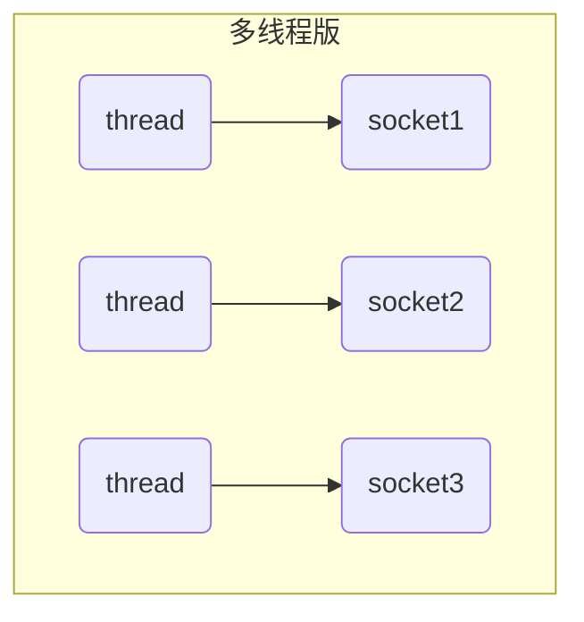

多线程版缺点：

- 内存占用高
- 线程上下文切换成本高
- 只适合连接数少的场景

**Selector版设计**

selector 的作用就是配合一个线程来管理多个 channel，获取这些 channel 上发生的事件，这些 channel 工作在非阻塞模式下，不会让线程吊死在一个 channel 上。适合连接数特别多，但流量低的场景（low traffic）

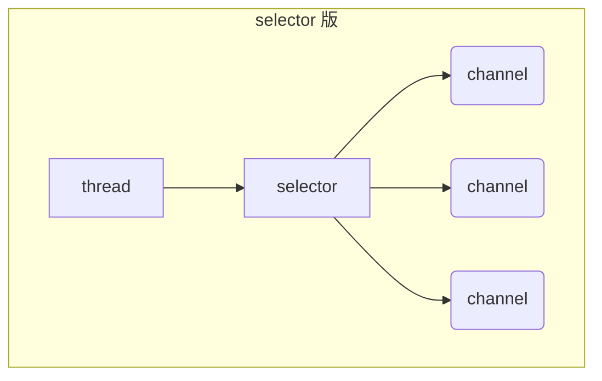

调用 selector 的 select() 会阻塞直到 channel 发生了读写就绪事件，这些事件发生，select 方法就会返回这些事件交给 thread 来处理

### 2. ByteBuffer

有一普通文本文件 data.txt，内容为

```
1234567890abcd
```

使用 FileChannel 来读取文件内容

1. 向 buffer 写入数据，例如调用 channel.read(buffer)
2. 调用 flip() 切换至**读模式**
3. 从 buffer 读取数据，例如调用 buffer.get()
4. 调用 clear() 或 compact() 切换至**写模式**
5. 重复 1~4 步骤

```
@Slf4j
public class ChannelDemo1 {
    public static void main(String[] args) {
        try (RandomAccessFile file = new RandomAccessFile("helloword/data.txt", "rw")) {
            FileChannel channel = file.getChannel();
            ByteBuffer buffer = ByteBuffer.allocate(10);
            do {
                // 向 buffer 写入
                int len = channel.read(buffer);
                log.debug("读到字节数：{}", len);
                if (len == -1) {
                    break;
                }
                // 切换 buffer 读模式
                buffer.flip();
                while(buffer.hasRemaining()) {
                    log.debug("{}", (char)buffer.get());
                }
                // 切换 buffer 写模式
                buffer.clear();
            } while (true);
        } catch (IOException e) {
            e.printStackTrace();
        }
    }
}
```

#### (1) 数据结构

limit     position  capacity

clear 切写模式  limit=0

compact 切写模式 ： 把未读完的部分向前压缩，然后切换至写模式   position=未读完部分的长度(limit-position)   limit=capacity

flip 切换读模式，动作发生后，position 切换为读取位置，limit 切换为读取限制

##### 例子 

```
public class TestByteBuffer {
    public static void main(String[] args) {
        ByteBuffer buffer = ByteBuffer.allocate(10);
        // 向buffer中写入1个字节的数据
        buffer.put((byte)97);
        // 使用工具类，查看buffer状态
        ByteBufferUtil.debugAll(buffer);

        // 向buffer中写入4个字节的数据
        buffer.put(new byte[]{98, 99, 100, 101});
        ByteBufferUtil.debugAll(buffer);

        // 获取数据
        buffer.flip();
        ByteBufferUtil.debugAll(buffer);
        System.out.println(buffer.get());
        System.out.println(buffer.get());
        ByteBufferUtil.debugAll(buffer);

        // 使用compact切换模式
        buffer.compact();
        ByteBufferUtil.debugAll(buffer);

        // 再次写入
        buffer.put((byte)102);
        buffer.put((byte)103);
        ByteBufferUtil.debugAll(buffer);
    }
}
```

```
import io.netty.util.internal.MathUtil;
import io.netty.util.internal.StringUtil;

import java.nio.ByteBuffer;

public class ByteBufferUtil {
    private static final char[] BYTE2CHAR = new char[256];
    private static final char[] HEXDUMP_TABLE = new char[256 * 4];
    private static final String[] HEXPADDING = new String[16];
    private static final String[] HEXDUMP_ROWPREFIXES = new String[65536 >>> 4];
    private static final String[] BYTE2HEX = new String[256];
    private static final String[] BYTEPADDING = new String[16];

    static {
        final char[] DIGITS = "0123456789abcdef".toCharArray();
        for (int i = 0; i < 256; i++) {
            HEXDUMP_TABLE[i << 1] = DIGITS[i >>> 4 & 0x0F];
            HEXDUMP_TABLE[(i << 1) + 1] = DIGITS[i & 0x0F];
        }

        int i;

        // Generate the lookup table for hex dump paddings
        for (i = 0; i < HEXPADDING.length; i++) {
            int padding = HEXPADDING.length - i;
            StringBuilder buf = new StringBuilder(padding * 3);
            for (int j = 0; j < padding; j++) {
                buf.append("   ");
            }
            HEXPADDING[i] = buf.toString();
        }

        // Generate the lookup table for the start-offset header in each row (up to 64KiB).
        for (i = 0; i < HEXDUMP_ROWPREFIXES.length; i++) {
            StringBuilder buf = new StringBuilder(12);
            buf.append(StringUtil.NEWLINE);
            buf.append(Long.toHexString(i << 4 & 0xFFFFFFFFL | 0x100000000L));
            buf.setCharAt(buf.length() - 9, '|');
            buf.append('|');
            HEXDUMP_ROWPREFIXES[i] = buf.toString();
        }

        // Generate the lookup table for byte-to-hex-dump conversion
        for (i = 0; i < BYTE2HEX.length; i++) {
            BYTE2HEX[i] = ' ' + StringUtil.byteToHexStringPadded(i);
        }

        // Generate the lookup table for byte dump paddings
        for (i = 0; i < BYTEPADDING.length; i++) {
            int padding = BYTEPADDING.length - i;
            StringBuilder buf = new StringBuilder(padding);
            for (int j = 0; j < padding; j++) {
                buf.append(' ');
            }
            BYTEPADDING[i] = buf.toString();
        }

        // Generate the lookup table for byte-to-char conversion
        for (i = 0; i < BYTE2CHAR.length; i++) {
            if (i <= 0x1f || i >= 0x7f) {
                BYTE2CHAR[i] = '.';
            } else {
                BYTE2CHAR[i] = (char) i;
            }
        }
    }

    /**
     * 打印所有内容
     * @param buffer
     */
    public static void debugAll(ByteBuffer buffer) {
        int oldlimit = buffer.limit();
        buffer.limit(buffer.capacity());
        StringBuilder origin = new StringBuilder(256);
        appendPrettyHexDump(origin, buffer, 0, buffer.capacity());
        System.out.println("+--------+-------------------- all ------------------------+----------------+");
        System.out.printf("position: [%d], limit: [%d]\n", buffer.position(), oldlimit);
        System.out.println(origin);
        buffer.limit(oldlimit);
    }

    /**
     * 打印可读取内容
     * @param buffer
     */
    public static void debugRead(ByteBuffer buffer) {
        StringBuilder builder = new StringBuilder(256);
        appendPrettyHexDump(builder, buffer, buffer.position(), buffer.limit() - buffer.position());
        System.out.println("+--------+-------------------- read -----------------------+----------------+");
        System.out.printf("position: [%d], limit: [%d]\n", buffer.position(), buffer.limit());
        System.out.println(builder);
    }

    private static void appendPrettyHexDump(StringBuilder dump, ByteBuffer buf, int offset, int length) {
        if (MathUtil.isOutOfBounds(offset, length, buf.capacity())) {
            throw new IndexOutOfBoundsException(
                "expected: " + "0 <= offset(" + offset + ") <= offset + length(" + length
                    + ") <= " + "buf.capacity(" + buf.capacity() + ')');
        }
        if (length == 0) {
            return;
        }
        dump.append(
            "         +-------------------------------------------------+" +
                StringUtil.NEWLINE + "         |  0  1  2  3  4  5  6  7  8  9  a  b  c  d  e  f |" +
                StringUtil.NEWLINE + "+--------+-------------------------------------------------+----------------+");

        final int startIndex = offset;
        final int fullRows = length >>> 4;
        final int remainder = length & 0xF;

        // Dump the rows which have 16 bytes.
        for (int row = 0; row < fullRows; row++) {
            int rowStartIndex = (row << 4) + startIndex;

            // Per-row prefix.
            appendHexDumpRowPrefix(dump, row, rowStartIndex);

            // Hex dump
            int rowEndIndex = rowStartIndex + 16;
            for (int j = rowStartIndex; j < rowEndIndex; j++) {
                dump.append(BYTE2HEX[getUnsignedByte(buf, j)]);
            }
            dump.append(" |");

            // ASCII dump
            for (int j = rowStartIndex; j < rowEndIndex; j++) {
                dump.append(BYTE2CHAR[getUnsignedByte(buf, j)]);
            }
            dump.append('|');
        }

        // Dump the last row which has less than 16 bytes.
        if (remainder != 0) {
            int rowStartIndex = (fullRows << 4) + startIndex;
            appendHexDumpRowPrefix(dump, fullRows, rowStartIndex);

            // Hex dump
            int rowEndIndex = rowStartIndex + remainder;
            for (int j = rowStartIndex; j < rowEndIndex; j++) {
                dump.append(BYTE2HEX[getUnsignedByte(buf, j)]);
            }
            dump.append(HEXPADDING[remainder]);
            dump.append(" |");

            // Ascii dump
            for (int j = rowStartIndex; j < rowEndIndex; j++) {
                dump.append(BYTE2CHAR[getUnsignedByte(buf, j)]);
            }
            dump.append(BYTEPADDING[remainder]);
            dump.append('|');
        }

        dump.append(StringUtil.NEWLINE +
            "+--------+-------------------------------------------------+----------------+");
    }

    private static void appendHexDumpRowPrefix(StringBuilder dump, int row, int rowStartIndex) {
        if (row < HEXDUMP_ROWPREFIXES.length) {
            dump.append(HEXDUMP_ROWPREFIXES[row]);
        } else {
            dump.append(StringUtil.NEWLINE);
            dump.append(Long.toHexString(rowStartIndex & 0xFFFFFFFFL | 0x100000000L));
            dump.setCharAt(dump.length() - 9, '|');
            dump.append('|');
        }
    }

    public static short getUnsignedByte(ByteBuffer buffer, int index) {
        return (short) (buffer.get(index) & 0xFF);
    }
}
```

#### (2) 写数据

- 调用 channel 的 read 方法
- 调用 buffer 自己的 put 方法

```java
int readBytes = channel.read(buf);
```

```java
buf.put((byte)127);
```

#### (3) 读取数据

- 调用 channel 的 write 方法

- 调用 buffer 自己的 get 方法

  ```java
  int writeBytes = channel.write(buf);
  ```

```java
byte b = buf.get();
```

注意 get(i)  position索引不会变

#### (4) mark和reset，rewind

mark 是在读取时，做一个标记，即使 position 改变，只要调用 reset 就能回到 mark 的位置

> **注意**
>
> rewind 和 flip 都会清除 mark 位置= -1

rewind: postition=0 下一次重新读

mark: 记录position位置

reset: 将postion位置重置到mark位置，可以重新读啥的

#### (5) 分配空间

```
// 堆内存,读写效率低,受到GC影响,GC的时候减少内存碎片时，数据需要移动，影响效率
ByteBuffer.allocate(10); 

// 直接内存，读写效率高，少一次数据拷贝，但是分配内存效率低，使用不当可能内存泄漏
ByteBuffer.allocateDirect(10); 
```

Buffer 是**非线程安全的**

#### (6) 字符串和bytebuffer互相转换

```
public class TestStringtoByteBuffer {
    public static void main(String[] args) {
        // 1. 字符串转buffer , 此时还处于写模式
        ByteBuffer buffer1 = ByteBuffer.allocate(16);
        buffer1.put("hello".getBytes());
        ByteBufferUtil.debugAll(buffer1);

        // 2. charset转buffer  自动切换到读模式
        ByteBuffer buffer2 = StandardCharsets.UTF_8.encode("hello");
        ByteBufferUtil.debugAll(buffer2);

        // 3. wrap  自动切换到读模式
        final ByteBuffer buffer3 = ByteBuffer.wrap("hello".getBytes());
        ByteBufferUtil.debugAll(buffer3);

        // 4. decode  能解析读模式的
        final String s = StandardCharsets.UTF_8.decode(buffer2).toString();
        System.out.println(s);

        // 5. decode  只能解析读模式的,buffer1还是写模式所以要手动切换
        buffer1.flip();
        final String s2 = StandardCharsets.UTF_8.decode(buffer1).toString();
        System.out.println(s2);
    }
}
```

#### (7) Scattering Reads - 分散读取

```
public class TestScatteringReads {
    public static void main(String[] args) {
        try (RandomAccessFile file = new RandomAccessFile("netty/helloword/data.txt", "rw")) {
            final FileChannel channel = file.getChannel();
            ByteBuffer buffer1 = ByteBuffer.allocate(3);
            ByteBuffer buffer2 = ByteBuffer.allocate(3);
            ByteBuffer buffer3 = ByteBuffer.allocate(5);
            channel.read(new ByteBuffer[]{buffer1, buffer2, buffer3});
            buffer1.flip();
            buffer2.flip();
            buffer3.flip();
            ByteBufferUtil.debugAll(buffer1);
            ByteBufferUtil.debugAll(buffer2);
            ByteBufferUtil.debugAll(buffer3);
        } catch (IOException e) {

        }
    }
}
```

#### (8) Gathering write - 集中读写

```
public class TestGatheringWrite {
    public static void main(String[] args) {
        ByteBuffer buffer1 = StandardCharsets.UTF_8.encode("hello");
        ByteBuffer buffer2 = StandardCharsets.UTF_8.encode("world");
        ByteBuffer buffer3 = StandardCharsets.UTF_8.encode("lin");
        try (FileChannel channel = new RandomAccessFile("netty/helloword/gather.txt", "rw").getChannel()) {
            channel.write(new ByteBuffer[]{buffer1, buffer2, buffer3});
        } catch (IOException e) {
            e.printStackTrace();
        }
    }
}
```

#### (9) 黏包半包分析

网络上有多条数据发送给服务端，数据之间使用 \n 进行分隔 但由于某种原因这些数据在接收时，被进行了重新组合，例如原始数据有3条为

- Hello,world\n
- I'm zhangsan\n
- How are you?\n

变成了下面的两个 byteBuffer (多条消息组合：**黏包**，截另一方：**半包**)

- Hello,world\nI'm zhangsan\nHo
- w are you?\n

```
public class TestPackage {
    public static void main(String[] args) {
        ByteBuffer source = ByteBuffer.allocate(32);
        source.put("Hello,world\nI'm zhangsan\nHo".getBytes());
        split(source);

        source.put("w are you?\nhaha!\n".getBytes());
        split(source);
    }

    /**
     * 拆成四个buffer 还原原始数据
     *
     * @param source
     */
    private static void split(ByteBuffer source) {
        source.flip();
        for (int i = 0; i < source.limit(); i++) {
            if (source.get(i) == '\n') {
                int length = i + 1 - source.position();
                ByteBuffer target = ByteBuffer.allocate(length);
                for (int j = 0; j < length; j++) {
                    target.put(source.get());
                }
                ByteBufferUtil.debugAll(target);
            }
        }
        source.compact();
    }
}
```

### 3. 文件编程-了解

#### 3.1 filechannel

> 只能工作在阻塞模式下

不能直接打开 FileChannel，必须通过 FileInputStream、FileOutputStream 或者 RandomAccessFile 来获取 FileChannel，它们都有 getChannel 方法

- 通过 FileInputStream 获取的 channel 只能读
- 通过 FileOutputStream 获取的 channel 只能写
- 通过 RandomAccessFile 是否能读写根据构造 RandomAccessFile 时的读写模式决定

**读取**

会从 channel 读取数据填充 ByteBuffer，返回值表示读到了多少字节，-1 表示到达了文件的末尾

```java
int readBytes = channel.read(buffer);Copy to clipboardErrorCopied
```

**写入**

写入的正确姿势如下， SocketChannel

```java
ByteBuffer buffer = ...;
buffer.put(...); // 存入数据
buffer.flip();   // 切换读模式

while(buffer.hasRemaining()) {
    channel.write(buffer);
}Copy to clipboardErrorCopied
```

在 while 中调用 channel.write 是因为 write 方法并不能保证一次将 buffer 中的内容全部写入 channel

**关闭**

channel 必须关闭，不过调用了 FileInputStream、FileOutputStream 或者 RandomAccessFile 的 close 方法会间接地调用 channel 的 close 方法

**size**

使用 size 方法获取文件的大小

**强制写入**

操作系统出于性能的考虑，会将数据缓存，不是立刻写入磁盘，只有关闭的时候写入。可以调用 force(true) 方法将文件内容和元数据（文件的权限等信息）立刻写入磁盘

**传输数据**

```
public class TestTransfer {
    public static void main(String[] args) {
        try (
            FileChannel from = new FileInputStream("netty/helloword/data.txt").getChannel();
            final FileChannel to = new FileOutputStream("netty/helloword/to.txt").getChannel();
        ) {
            // 效率高，底层利用操作系统零拷贝技术优化， 限制最大2g
//            from.transferTo(0, from.size(), to);
            long size = from.size();
            // left 变量代表还剩余多少字节
            for (long left = size; left > 0; ) {
                System.out.println("position:" + (size - left) + " left:" + left);
                left -= from.transferTo((size - left), left, to);
            }
        } catch (Exception e) {

        }
    }
}
```

**Path**

jdk7 引入了 Path 和 Paths 类

- Path 用来表示文件路径
- Paths 是工具类，用来获取 Path 实例

```
System.getProperty("user.dir");

Path source = Paths.get("1.txt"); // 相对路径 使用 user.dir 环境变量来定位 1.txt

Path source = Paths.get("d:\\1.txt"); // 绝对路径 代表了  d:\1.txt

Path source = Paths.get("d:/1.txt"); // 绝对路径 同样代表了  d:\1.txt

Path projects = Paths.get("d:\\data", "projects"); // 代表了  d:\data\projects

```

- `.` 代表了当前路径
- `..` 代表了上一级路径

```
Path path = Paths.get("d:\\data\\projects\\a\\..\\b");
System.out.println(path);
System.out.println(path.normalize()); // 正常化路径
```

输出

```
d:\data\projects\a\..\b
d:\data\projects\b
```

**Files**

```
Files.exists(path)
Files.createDirectory(path)
Files.createDirectories(path)
Files.copy(source, target)
Files.copy(source, target, StandardCopyOption.REPLACE_EXISTING);
Files.move(source, target, StandardCopyOption.ATOMIC_MOVE);
Files.delete(target); // 下层有文件啥的不删除
```

**遍历,统计,删除,拷贝**

```
public class TestFilesWalkFileTree {
    // 遍历目录文件
    public static void main(String[] args) throws IOException {
        Path path = Paths.get("D:\\software\\jdk8");
        AtomicInteger dirCount = new AtomicInteger();
        AtomicInteger fileCount = new AtomicInteger();
        Files.walkFileTree(path, new SimpleFileVisitor<Path>() {

            @Override
            public FileVisitResult preVisitDirectory(Path dir, BasicFileAttributes attrs)
                throws IOException {
                System.out.println(dir);
                dirCount.incrementAndGet();
                return super.preVisitDirectory(dir, attrs);
            }

            // 访问文件夹前
            @Override
            public FileVisitResult visitFile(Path file, BasicFileAttributes attrs)
                throws IOException {
                System.out.println(file);
                fileCount.incrementAndGet();
                return super.visitFile(file, attrs);
            }
        });
        System.out.println(dirCount); // 133
        System.out.println(fileCount); // 1479
        m();
//        delete();
    }

    // 统计有几个jar包
    private static void m() throws IOException {
        Path path = Paths.get("D:\\software\\jdk8");
        AtomicInteger fileCount = new AtomicInteger();
        Files.walkFileTree(path, new SimpleFileVisitor<Path>() {
            @Override
            public FileVisitResult visitFile(Path file, BasicFileAttributes attrs)
                throws IOException {
                if (file.toFile().getName().endsWith(".jar")) {
                    fileCount.incrementAndGet();
                }
                return super.visitFile(file, attrs);
            }
        });
        System.out.println(fileCount); // 724

    }

    // 删除多级目录-危险,会全删除，从底层开始删除
    private static void delete() throws IOException{
        Path path = Paths.get("d:\\lin");
        Files.walkFileTree(path, new SimpleFileVisitor<Path>() {
            @Override
            public FileVisitResult visitFile(Path file, BasicFileAttributes attrs)
                throws IOException {
                Files.delete(file);
                return super.visitFile(file, attrs);
            }

            // 访问完文件夹后
            @Override
            public FileVisitResult postVisitDirectory(Path dir, IOException exc)
                throws IOException {
                Files.delete(dir);
                return super.postVisitDirectory(dir, exc);
            }
        });
    }

    // 拷贝文件夹
    private static void copy() throws IOException {
        long start = System.currentTimeMillis();
        String source = "D:\\Snipaste-1.16.2-x64";
        String target = "D:\\Snipaste-1.16.2-x64aaa";

        Files.walk(Paths.get(source)).forEach(path -> {
            try {
                String targetName = path.toString().replace(source, target);
                // 是目录
                if (Files.isDirectory(path)) {
                    Files.createDirectory(Paths.get(targetName));
                }
                // 是普通文件
                else if (Files.isRegularFile(path)) {
                    Files.copy(path, Paths.get(targetName));
                }
            } catch (IOException e) {
                e.printStackTrace();
            }
        });
        long end = System.currentTimeMillis();
        System.out.println(end - start);
    }
}
```

### 4. 网络编程

#### 4.1 阻塞模式

- 阻塞模式下，相关方法都会导致线程暂停
  - ServerSocketChannel.accept 会在没有连接建立时让线程暂停
  - SocketChannel.read 会在没有数据可读时让线程暂停
  - 阻塞的表现其实就是线程暂停了，暂停期间不会占用 cpu，但线程相当于闲置
- 单线程下，阻塞方法之间相互影响，几乎不能正常工作，需要多线程支持
- 但多线程下，有新的问题，体现在以下方面
  - 32 位 jvm 一个线程 320k，64 位 jvm 一个线程 1024k，如果连接数过多，必然导致 OOM，并且线程太多，反而会因为频繁上下文切换导致性能降低
  - 可以采用线程池技术来减少线程数和线程上下文切换，但治标不治本，如果有很多连接建立，但长时间 inactive，会阻塞线程池中所有线程，因此不适合长连接，只适合短连接

**服务器端**

```
@Slf4j
public class Server {

    public static void main(String[] args) throws IOException {
        // 使用 nio 来理解阻塞模式, 单线程
        // 0. ByteBuffer
        ByteBuffer buffer = ByteBuffer.allocate(16);
        // 1. 创建了服务器
        ServerSocketChannel serverSocketChannel = ServerSocketChannel.open();

        // 2. 绑定监听端口
        serverSocketChannel.bind(new InetSocketAddress(8080));

        // 3. 连接集合
        List<SocketChannel> channels = new ArrayList<>();
        while (true) {
            // 4. accept 建立与客户端连接， SocketChannel 用来与客户端之间通信
            log.debug("connecting...");
            SocketChannel socketChannel = serverSocketChannel.accept();

            log.debug("connected... {}", socketChannel);
            channels.add(socketChannel);
            for (SocketChannel channel : channels) {
                // 5. 接收客户端发送的数据
                log.debug("before read... {}", channel);
                channel.read(buffer); // 阻塞方法，线程停止运行,等待对面线程输入
                buffer.flip();
                ByteBufferUtil.debugRead(buffer);
                buffer.clear();
                log.debug("after read...{}", channel);
            }
        }
    }
}
```

**客户端**

```
/**
 * debug启动server 可以开启多个客户端
 */
public class Client {

    public static void main(String[] args) throws IOException {
        SocketChannel sc = SocketChannel.open();
        sc.connect(new InetSocketAddress("localhost", 8080));
        // 输出那里打断点,输出表达式
        // sc.write(Charset.defaultCharset().encode("lin"))
        System.out.println("waiting...");
    }
}
```

#### 4.2 非阻塞模式

- 非阻塞模式下，相关方法都会不会让线程暂停
  - 在 ServerSocketChannel.accept 在没有连接建立时，会返回 null，继续运行
  - SocketChannel.read 在没有数据可读时，会返回 0，但线程不必阻塞，可以去执行其它 SocketChannel 的 read 或是去执行 ServerSocketChannel.accept
  - 写数据时，线程只是等待数据写入 Channel 即可，无需等 Channel 通过网络把数据发送出去
- 但非阻塞模式下，即使没有连接建立，和可读数据，线程仍然在不断运行，白白浪费了 cpu
- 数据复制过程中，线程实际还是阻塞的（AIO 改进的地方）

服务器端，客户端代码不变

```
@Slf4j
public class Server {

    public static void main(String[] args) throws IOException {
        // 使用 nio 来理解非阻塞模式, 单线程
        // 0. ByteBuffer
        ByteBuffer buffer = ByteBuffer.allocate(16);
        // 1. 创建了服务器
        ServerSocketChannel serverSocketChannel = ServerSocketChannel.open();
        // 打开非阻塞模式
        serverSocketChannel.configureBlocking(false);

        // 2. 绑定监听端口
        serverSocketChannel.bind(new InetSocketAddress(8080));

        // 3. 连接集合
        List<SocketChannel> channels = new ArrayList<>();

        // while(true)会一直执行，浪费资源
        while (true) {
            // 4. accept 建立与客户端连接， SocketChannel 用来与客户端之间通信
            // 非阻塞，线程还会继续运行，如果没有连接建立，但sc是null
            SocketChannel sc = serverSocketChannel.accept();

            if (sc != null) {
                log.debug("connected... {}", sc);
                sc.configureBlocking(false); // 非阻塞模式
                channels.add(sc);
            }
            for (SocketChannel channel : channels) {
                // 5. 接收客户端发送的数据
                int read = channel.read(buffer);// 非阻塞，线程仍然会继续运行，如果没有读到数据，read 返回 0
                if (read > 0) {
                    buffer.flip();
                    ByteBufferUtil.debugRead(buffer);
                    buffer.clear();
                    log.debug("after read...{}", channel);
                }
            }
        }
    }
}
```

#### 4.3 Selector - 多路复用

单线程可以配合 Selector 完成对多个 Channel 可读写事件的监控，这称之为多路复用

- 多路复用仅针对网络 IO、普通文件 IO 没法利用多路复用
- 如果不用 Selector 的非阻塞模式，线程大部分时间都在做无用功，而 Selector 能够保证
  - 有可连接事件时才去连接
  - 有可读事件才去读取
  - 有可写事件才去写入
    - 限于网络传输能力，Channel 未必时时可写，一旦 Channel 可写，会触发 Selector 的可写事件


好处

- 一个线程配合 selector 就可以监控多个 channel 的事件，事件发生线程才去处理。避免非阻塞模式下所做无用功
- 让这个线程能够被充分利用
- 节约了线程的数量
- 减少了线程上下文切换


方法1，阻塞直到绑定事件发生

```java
int count = selector.select();
```

方法2，阻塞直到绑定事件发生，或是超时（时间单位为 ms）

```java
int count = selector.select(long timeout);
```

方法3，不会阻塞，也就是不管有没有事件，立刻返回，自己根据返回值检查是否有事件

```java
int count = selector.selectNow();
```

```
/**
 * 先注册一个ServerSocketChannel进selector里专门获取连接生成SokertChannel的，然后生成的SokertChannel注册进selector里，有事件进来就迭代处理
 *
 * SelectorImpl 里的 publicSelectedKeys  publicKeys
 *
 *     // Public views of the key sets
 *     private Set<SelectionKey> publicKeys;             // Immutable    整个selector对应的事件，不会被移除  selector.keys()
 *     private Set<SelectionKey> publicSelectedKeys;     // Removal allowed, but not addition    selector.selectedKeys()
 *     需要移除的事件，不然下次获取上一次事件，而上次事件取不到值
 *
 */
@Slf4j
public class SelectorServer {

    public static void main(String[] args) throws IOException {
        ServerSocketChannel channel = ServerSocketChannel.open();
        channel.bind(new InetSocketAddress(8080));
        System.out.println(channel);
        Selector selector = Selector.open();
        channel.configureBlocking(false); // select模式 channel必须是非阻塞模式
        channel.register(selector, SelectionKey.OP_ACCEPT);

        while (true) {
            // 阻塞直到有绑定事件发生  根据 publicKeys 的监听事件处理
            int count = selector.select();
            log.debug("select count: {}", count);

            // 获取所有事件  publicSelectedKeys
            Set<SelectionKey> keys = selector.selectedKeys();

            // 遍历所有事件，逐一处理
            Iterator<SelectionKey> iter = keys.iterator();
            while (iter.hasNext()) {
                SelectionKey key = iter.next();
                log.debug("key= "+key);
                // 判断事件类型
                if (key.isAcceptable()) {
                    ServerSocketChannel c = (ServerSocketChannel) key.channel();
                    // 必须处理,如果不处理事件，会一直循环；因为selectors的accpet事件不会删除，
                    // 如果不处理，虽然下面的publicSelectedKeys删除了，但是select()时又会加入新的publicSelectedKeys
                    SocketChannel sc = c.accept();
                    sc.configureBlocking(false);
                    sc.register(selector, SelectionKey.OP_READ);
                    log.debug("连接已建立: {}", sc);
                } else if (key.isReadable()) {
                    try {
                        SocketChannel sc = (SocketChannel) key.channel();
                        ByteBuffer buffer = ByteBuffer.allocate(4);
                        int read = sc.read(buffer);
                        if (read == -1) { // 正常断开 read 方法返回值-1 ， 如果buffer没有读完也会继续读
                            key.cancel(); // 标识下次不再处理这种事件， select()
                        } else {
                            buffer.flip();
                            ByteBufferUtil.debugRead(buffer);
                            System.out.println(Charset.defaultCharset().decode(buffer)); // buffer 4个字节只能输出半个数字
                        }
                    } catch (IOException e) {
                        // 如果客户端异常断开，需要取消掉，否则造成服务端出现异常 sc.read(buffer);
                        e.printStackTrace();
                        // 如果不处理这个key， 客户端断开，会产生一个读事件,不断循环
                        key.cancel();
                    }
                }
                // 处理完毕，必须将事件移除  Set<SelectionKey> publicSelectedKeys
                iter.remove();
            }
        }
    }
}

```

#### 4.4 问题

💡 事件发生后能否不处理

> 事件发生后，要么处理，要么取消（cancel），不能什么都不做，否则下次该事件仍会触发，这是因为 nio 底层使用的是水平触发

💡 为何要 iter.remove()

> 因为 select 在事件发生后，就会将相关的 key 放入 selectedKeys 集合，但不会在处理完后从 selectedKeys 集合中移除，需要我们自己编码删除。例如
>
> - 第一次触发了 ssckey 上的 accept 事件，没有移除 ssckey
> - 第二次触发了 sckey 上的 read 事件，但这时 selectedKeys 中还有上次的 ssckey ，在处理时因为没有真正的 serverSocket 连上了，就会导致空指针异常

💡 cancel 的作用

> cancel 会取消注册在 selector 上的 channel，并从 keys 集合中删除 key 后续不会再监听事件

💡 select 何时不阻塞

> - 事件发生时
>   - 客户端发起连接请求，会触发 accept 事件
>   - 客户端发送数据过来，客户端正常、异常关闭时，都会触发 read 事件，另外如果发送的数据大于 buffer 缓冲区，会触发多次读取事件
>   - channel 可写，会触发 write 事件
>   - 在 linux 下 nio bug 发生时
> - 调用 selector.wakeup()  // 唤醒
> - 调用 selector.close()
> - selector 所在线程 interrupt

#### 4.4 消息边界处理

- 一种思路是固定消息长度，数据包大小一样，服务器按预定长度读取，缺点是浪费带宽
- 另一种思路是按分隔符拆分，缺点是效率低
- TLV 格式，即 Type 类型、Length 长度、Value 数据，类型和长度已知的情况下，就可以方便获取消息大小，分配合适的 buffer，缺点是 buffer 需要提前分配，如果内容过大，则影响 server 吞吐量
  - Http 1.1 是 TLV 格式
  - Http 2.0 是 LTV 格式

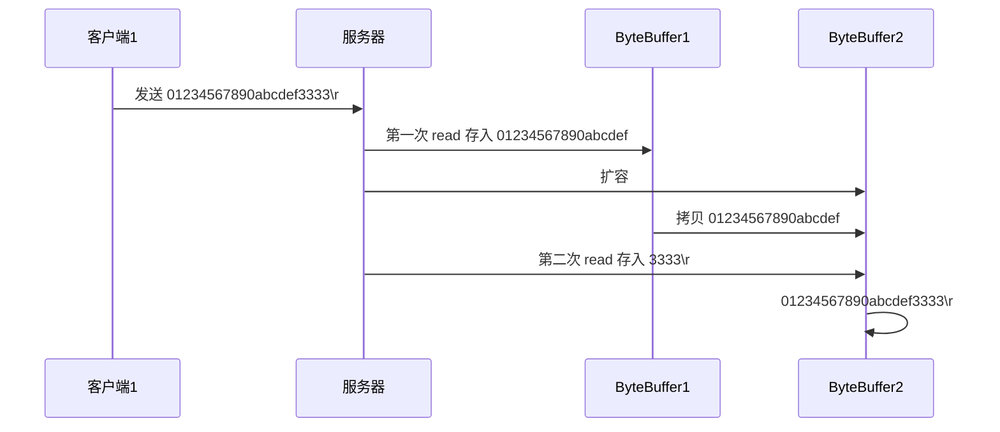

客户端

```
public class BorderClient {
    public static void main(String[] args) throws IOException {
        SocketChannel sc = SocketChannel.open();
        sc.connect(new InetSocketAddress("localhost", 8080));
        // 输出那里打断点,输出表达式
        sc.write(Charset.defaultCharset().encode("hello1234678world\n")); // 超过buffer长度的

        // 第二条消息
        sc.write(Charset.defaultCharset().encode("hello65r65r6564e"));
        sc.write(Charset.defaultCharset().encode("second65r65r6564e\n")); // 两个消息,换行符一个字节

        // 阻塞先别结束，等待输入
        System.in.read();
    }
}
```

服务端

```
/**
 * 处理消息边界 4
 */
@Slf4j
public class BorderServer {
    private static void split(ByteBuffer source) {
        source.flip();
        for (int i = 0; i < source.limit(); i++) {
            if (source.get(i) == '\n') {
                int length = i + 1 - source.position();
                ByteBuffer target = ByteBuffer.allocate(length);
                for (int j = 0; j < length; j++) {
                    target.put(source.get());
                }
                ByteBufferUtil.debugAll(target);
            }
        }
        // 如果没遇到 \n就不会读
        source.compact();
    }

    public static void main(String[] args) throws IOException {
        ServerSocketChannel channel = ServerSocketChannel.open();
        channel.bind(new InetSocketAddress(8080));
        System.out.println(channel);
        Selector selector = Selector.open();
        channel.configureBlocking(false);
        channel.register(selector, SelectionKey.OP_ACCEPT);

        while (true) {
            int count = selector.select();
            log.debug("select count: {}", count);

            Set<SelectionKey> keys = selector.selectedKeys();

            Iterator<SelectionKey> iter = keys.iterator();

            while (iter.hasNext()) {
                SelectionKey key = iter.next();
                log.debug("key= " + key);
                iter.remove();
                if (key.isAcceptable()) {
                    ServerSocketChannel c = (ServerSocketChannel) key.channel();
                    SocketChannel sc = c.accept();
                    sc.configureBlocking(false);
                    ByteBuffer buffer = ByteBuffer.allocate(10); // 附件attachment
                    final SelectionKey selectionKey = sc.register(selector, SelectionKey.OP_READ, buffer);
                    // selectionKey.interestOps( SelectionKey.OP_READ);  register已经绑定了
                    log.debug("连接已建立: {}", sc);
                } else if (key.isReadable()) {
                    try {
                        SocketChannel sc = (SocketChannel) key.channel();
                        // 获取selectionKey上关联的附件
                        ByteBuffer buffer = (ByteBuffer) key.attachment();
                        int read = sc.read(buffer);
                        if (read == -1) {
                            key.cancel();
                        } else {
                            split(buffer);
                            if (buffer.position() == buffer.limit()) {
                                ByteBuffer newBuffer = ByteBuffer.allocate(buffer.capacity()*2); // 新buffer扩容
                                buffer.flip();
                                newBuffer.put(buffer);
                                key.attach(newBuffer);
                            }
                        }
                    } catch (IOException e) {
                        e.printStackTrace();
                        key.cancel();
                    }
                }
            }
        }
    }
}
```

#### 4.5 ByteBuffer 大小分配

- 每个 channel 都需要记录可能被切分的消息，因为 ByteBuffer 不能被多个 channel 共同使用，因此需要为每个 channel 维护一个独立的 ByteBuffer
- ByteBuffer 不能太大，比如一个 ByteBuffer 1Mb 的话，要支持百万连接就要 1Tb 内存，因此需要设计大小可变的 ByteBuffer
  - 一种思路是首先分配一个较小的 buffer，例如 4k，如果发现数据不够，再分配 8k 的 buffer，将 4k buffer 内容拷贝至 8k buffer，优点是消息连续容易处理，缺点是数据拷贝耗费性能，参考实现 http://tutorials.jenkov.com/java-performance/resizable-array.html
  - 另一种思路是用多个数组组成 buffer，一个数组不够，把多出来的内容写入新的数组，与前面的区别是消息存储不连续解析复杂，优点是避免了拷贝引起的性能损耗

#### 4.6 处理写事件

```
/**
 * 写服务 5
 */
public class WriteServer {
    public static void main(String[] args) throws IOException {
        ServerSocketChannel ssc = ServerSocketChannel.open();
        ssc.configureBlocking(false);
        ssc.bind(new InetSocketAddress(8080));

        Selector selector = Selector.open();
        ssc.register(selector, SelectionKey.OP_ACCEPT);

        while (true) {
            selector.select();
            Iterator<SelectionKey> iter = selector.selectedKeys().iterator();
            while (iter.hasNext()) {
                SelectionKey key = iter.next();
                iter.remove();
                if (key.isAcceptable()) {
                    final SocketChannel sc = ssc.accept();
                    sc.configureBlocking(false);
                    final SelectionKey scKey = sc.register(selector, 0);
                    scKey.interestOps(SelectionKey.OP_READ);

                    // 1. 向客户端发送大量数据，由于数据过大，不会一次性发完
                    StringBuilder sb = new StringBuilder();
                    for (int i = 0; i < 7000000; i++) {
                        sb.append('a');
                    }
                    ByteBuffer buffer = Charset.defaultCharset().encode(sb.toString());

                    // 2. 返回代表实际写入的字节数
                    int write = sc.write(buffer);
                    System.out.println(write);

                    // 3. 判断是否有剩余内容，不用while循环写，因为可能系统缓存区满了，写为0，
                    // 下面逻辑监听写事件，等缓存区够时再写，此时可以处理其他时间
                    if (buffer.hasRemaining()) {
                        // 4. 关注可写事件 避免影响原来的事件，所以加上原来的
                        scKey.interestOps(scKey.interestOps() + SelectionKey.OP_WRITE);
                        // scKey.interestOps(scKey.interestOps() | SelectionKey.OP_WRITE);
                        // 5.未写完的数据挂到scKey上
                        scKey.attach(buffer);
                    }
                } else if (key.isWritable()) {
                    ByteBuffer buffer = (ByteBuffer) key.attachment();
                    SocketChannel sc = (SocketChannel) key.channel();
                    int write = sc.write(buffer);
                    System.out.println(write);
                    // 6.清理操作
                    if (!buffer.hasRemaining()) {
                        key.attach(null);
                        // 7. 不需再关注写事件
                        key.interestOps(key.interestOps() - SelectionKey.OP_WRITE);
                    }
                }
            }
        }
    }
}
```

```
public class WriterClient {
    public static void main(String[] args) throws IOException {
        SocketChannel sc = SocketChannel.open();
        sc.connect(new InetSocketAddress("localhost", 8080));

        // 接收数据
        int count = 0;
        while (true) {
            ByteBuffer buffer = ByteBuffer.allocate(1024 * 1024); // 1m
            count += sc.read(buffer);
            System.out.println(count);
            buffer.clear();
        }
    }
}
```

#### 4.7 多线程版NIO

💡 利用多线程优化

> 现在都是多核 cpu，设计时要充分考虑别让 cpu 的力量被白白浪费

前面的代码只有一个选择器，没有充分利用多核 cpu，如何改进呢？

分两组选择器

- 单线程配一个选择器，专门处理 accept 事件   ，  BOSS线程
- 创建 cpu 核心数的线程，每个线程配一个选择器，轮流处理 读写事件 ，  Worker 线程

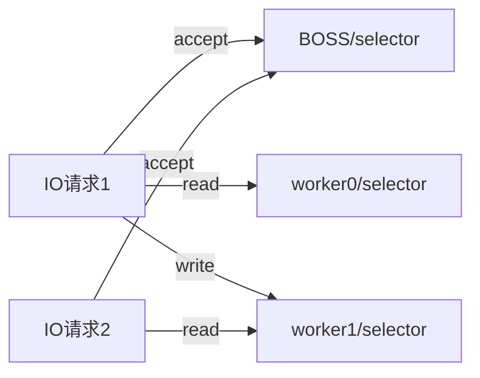


```
/**
 * 多线程版本 nio
 * <p>
 * selector 注册事件需要等select()方法不阻塞
 * 单个Boss负责 接收连接
 * 多个Worker 负责读写事件
 */
@Slf4j
public class MultiThreadServer {

    public static void main(String[] args) throws IOException {
        Thread.currentThread().setName("boss");
        ServerSocketChannel ssc = ServerSocketChannel.open();
        ssc.configureBlocking(false);
        ssc.bind(new InetSocketAddress(8080));

        Selector selector = Selector.open();
        ssc.register(selector, SelectionKey.OP_ACCEPT);

        // 创建多个Worker
        Worker[] workers = new Worker[2];
        for (int i = 0; i < 2; i++) {
            workers[i] = new Worker("worker" + i);
        }
        AtomicInteger index = new AtomicInteger(0);
        while (true) {
            selector.select();
            Set<SelectionKey> keys = selector.selectedKeys();
            Iterator<SelectionKey> iter = keys.iterator();

            while (iter.hasNext()) {
                SelectionKey key = iter.next();
                if (key.isAcceptable()) {
                    key.channel();
                    SocketChannel sc = ssc.accept();
                    sc.configureBlocking(false);
                    // 注册到Worker的Selector
                    log.debug("connected {}", sc.getRemoteAddress());
                    log.debug("before register...{}", sc.getRemoteAddress());
                    workers[index.getAndIncrement() % workers.length].register(sc);
                    log.debug("after register...{}", sc.getRemoteAddress());
                }
            }

        }
    }

    static class Worker implements Runnable {
        private Selector selector;

        private volatile boolean start = false;

        private String name;

        private final ConcurrentLinkedQueue<Runnable> tasks = new ConcurrentLinkedQueue<>();

        public Worker(String name) {
            this.name = name;
        }

        public void register(SocketChannel sc) throws IOException {
            if (!start) {
                selector = Selector.open();
                new Thread(this, name).start();
                start = true;
            }
            // 消息队列方法 添加队列后wakeup selector
            //            tasks.add(() -> {
            //                try {
            //                    sc.register(selector, SelectionKey.OP_READ);
            //                } catch (IOException e) {
            //                    e.printStackTrace();
            //                }
            //            });
            // wake面up给selector一个信号量，相当于select()方法执行时，检查如果有信号量就不阻塞，所以下能注册成功
            selector.wakeup();
            sc.register(selector, SelectionKey.OP_READ);
        }

        @Override
        public void run() {
            while (true) {
                try {
                    // sc.register(selector, SelectionKey.OP_READ); 注册时间需要在select不阻塞的时候才能注册上去
                    selector.select();
                    // 消息队列方法 , 也可以使用消息队列来解决
                    //                    Runnable task = tasks.poll();
                    //                    if (task != null) {
                    //                        task.run();
                    //                    }
                    Set<SelectionKey> selectionKeys = selector.selectedKeys();
                    Iterator<SelectionKey> iter = selectionKeys.iterator();
                    while (iter.hasNext()) {
                        SelectionKey key = iter.next();
                        iter.remove();
                        if (key.isReadable()) {
                            SocketChannel sc = (SocketChannel) key.channel();
                            ByteBuffer buffer = ByteBuffer.allocate(1024);
                            sc.read(buffer);
                            buffer.flip();
                            ByteBufferUtil.debugRead(buffer);
                        }
                    }
                } catch (IOException e) {
                    e.printStackTrace();
                }
            }
        }
    }
}
```

### 5. NIO vs BIO

#### 5.1 stream vs channel

- stream 不会自动缓冲数据，channel 会利用系统提供的发送缓冲区、接收缓冲区（更为底层）
- stream 仅支持阻塞 API，channel 同时支持阻塞、非阻塞 API，网络 channel 可配合 selector 实现多路复用
- 二者均为全双工，即读写可以同时进行

#### 5.2 IO 模型

从网络中读取数据是操作系统干的活，不是java干的

同步阻塞、同步非阻塞、同步多路复用、异步阻塞（没有此情况）、异步非阻塞

- 同步：线程自己去获取结果（一个线程）
- 异步：线程自己不去获取结果，而是由其它线程送结果（至少两个线程）

当调用一次 channel.read 或 stream.read 后，会切换至操作系统内核态来完成真正数据读取，而读取又分为两个阶段，分别为：

- 等待数据阶段     等待网络接收到数据
- 复制数据阶段     从网卡复制到系统

- 阻塞IO

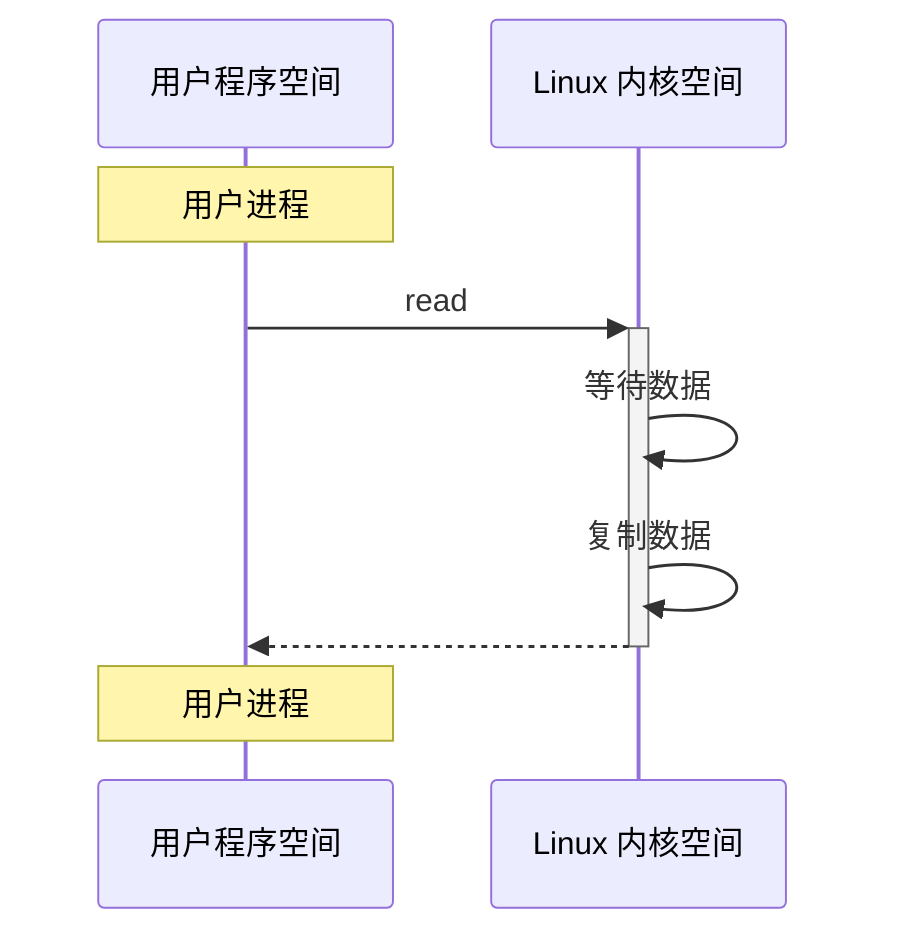

- 非阻塞IO

多次read等待数据，有数据后，阻塞复制数据阶段，然后返回数据。    多次用户空间和内核空间切换

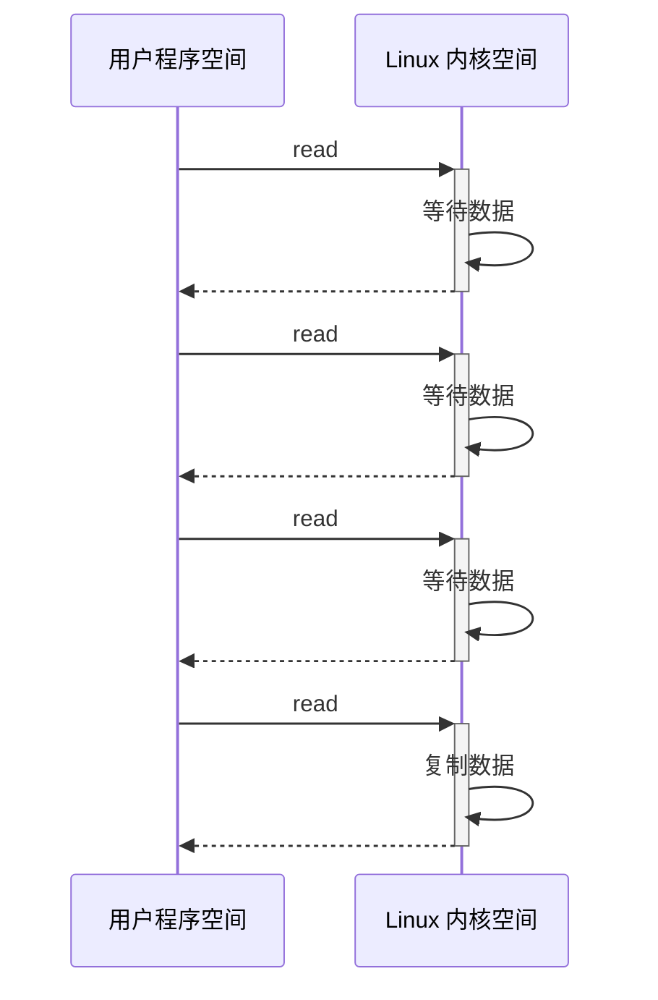

- 多路复用

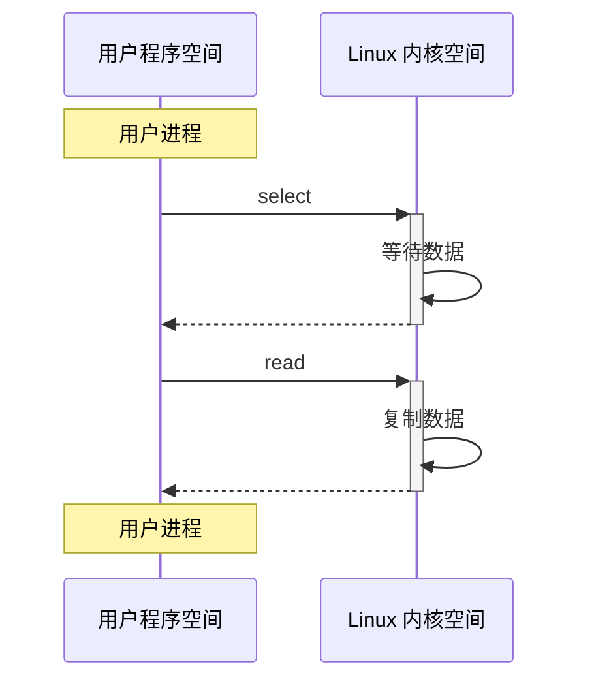

- 异步IO

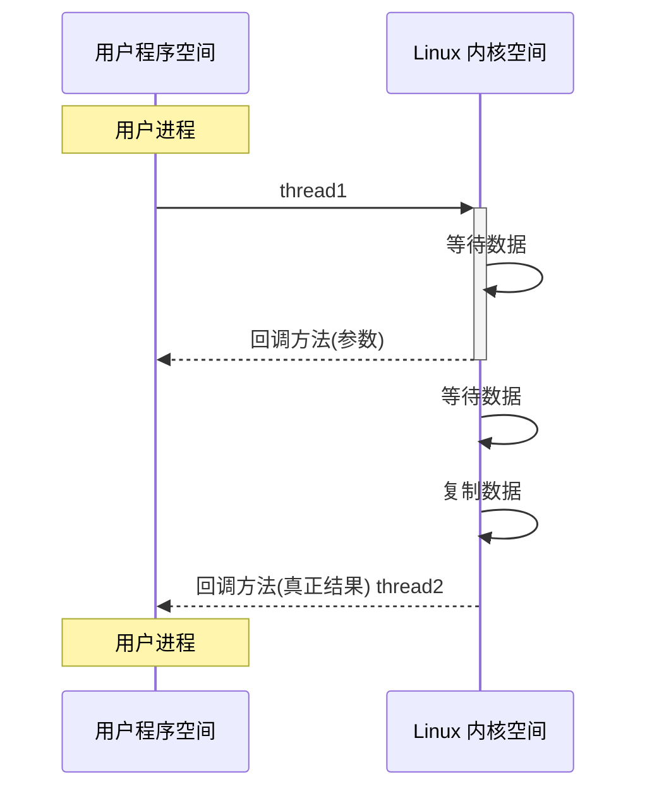

- 阻塞 IO 多channel 

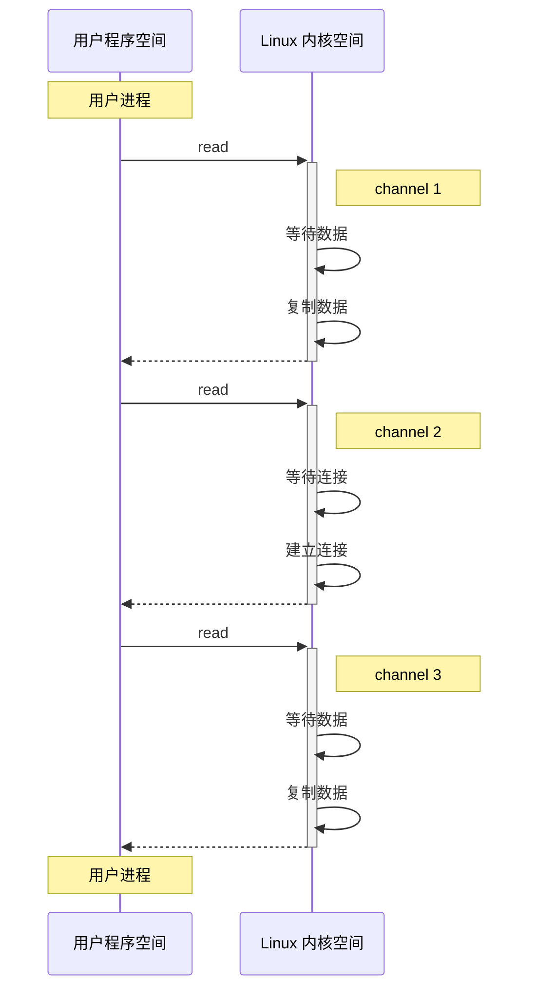

- 多路复用  多channel

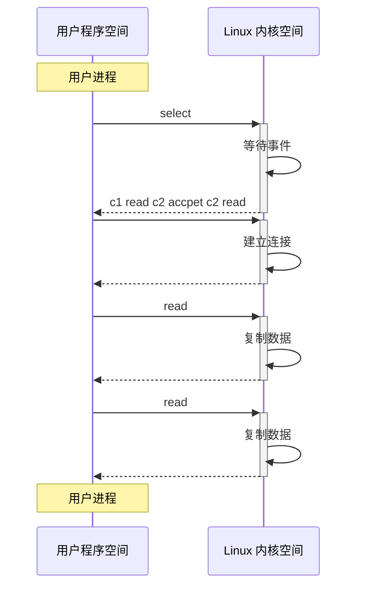

#### 5.3 零拷贝

##### 5.3.1 传统IO问题

传统的 IO 将一个文件通过 socket 写出

```java
File f = new File("helloword/data.txt");
RandomAccessFile file = new RandomAccessFile(file, "r");

byte[] buf = new byte[(int)f.length()];
file.read(buf);

Socket socket = ...;
socket.getOutputStream().write(buf);
```

内部工作流程：


1. java 本身并不具备 IO 读写能力，因此 read 方法调用后，要从 java 程序的**用户态**切换至**内核态**，去调用操作系统（Kernel）的读能力，将数据读入**内核缓冲区**。这期间用户线程阻塞，操作系统使用 DMA（Direct Memory Access）来实现文件读，其间也不会使用 cpu

   > DMA 也可以理解为硬件单元，用来解放 cpu 完成文件 IO

2. 从**内核态**切换回**用户态**，将数据从**内核缓冲区**读入**用户缓冲区**（即 byte[] buf），这期间 cpu 会参与拷贝，无法利用 DMA

3. 调用 write 方法，这时将数据从**用户缓冲区**（byte[] buf）写入 **socket 缓冲区**，cpu 会参与拷贝

4. 接下来要向网卡写数据，这项能力 java 又不具备，因此又得从**用户态**切换至**内核态**，调用操作系统的写能力，使用 DMA 将 **socket 缓冲区**的数据写入网卡，不会使用 cpu

可以看到中间环节较多，java 的 IO 实际不是物理设备级别的读写，而是缓存的复制，底层的真正读写是操作系统来完成的

- 用户态与内核态的切换发生了 3 次，这个操作比较重量级
- 数据拷贝了共 4 次

##### 5.3.2 NIO优化

1. 通过 DirectByteBuf

- ByteBuffer.allocate(10) HeapByteBuffer 使用的还是 java 内存
- ByteBuffer.allocateDirect(10) DirectByteBuffer 使用的是操作系统内存 ，java能访问


大部分步骤与优化前相同，不再赘述。唯有一点：java 可以使用 DirectByteBuf 将堆外内存映射到 jvm 内存中来直接访问使用

- 这块内存不受 jvm 垃圾回收的影响，因此内存地址固定，有助于 IO 读写
- java 中的 DirectByteBuf 对象仅维护了此内存的虚引用，内存回收分成两步
  - DirectByteBuf 对象被垃圾回收，将虚引用加入引用队列
  - 通过专门线程访问引用队列，根据虚引用释放堆外内存
- 减少了一次数据拷贝，用户态与内核态的切换次数没有减少


2. 进一步优化（底层采用了 linux 2.1 后提供的 sendFile 方法），

java 中对应着两个(file) channel 调用 transferTo/transferFrom 方法拷贝数据


1. java 调用 transferTo 方法后，要从 java 程序的**用户态**切换至**内核态**，使用 DMA将数据读入**内核缓冲区**，不会使用 cpu
2. 数据从**内核缓冲区**传输到 **socket 缓冲区**，cpu 会参与拷贝
3. 最后使用 DMA 将 **socket 缓冲区**的数据写入网卡，不会使用 cpu

- 只发生了一次用户态与内核态的切换
- 数据拷贝了 3 次


3. 进一步优化（linux 2.4

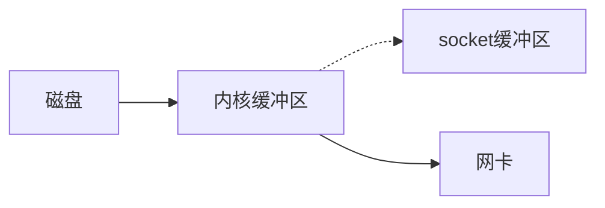

1. java 调用 transferTo 方法后，要从 java 程序的**用户态**切换至**内核态**，使用 DMA将数据读入**内核缓冲区**，不会使用 cpu
2. 只会将一些 offset 和 length 信息拷入 **socket 缓冲区**，几乎无消耗
3. 使用 DMA 将 **内核缓冲区**的数据写入网卡，不会使用 cpu

整个过程仅只发生了一次用户态与内核态的切换，数据拷贝了 2 次。所谓的**【零拷贝】**，并不是真正无拷贝，而是在不会拷贝重复数据到 jvm 内存中，零拷贝的优点有

- 更少的用户态与内核态的切换
- 不利用 cpu 计算，减少 cpu 缓存伪共享
- 零拷贝适合小文件传输

##### 5.3.3 文件AIO

AsynchronousFileChannel

```
@Slf4j
public class AioDemo {

    public static void main(String[] args) throws IOException {
        try {
            AsynchronousFileChannel s =
                AsynchronousFileChannel.open(
                    Paths.get("netty/helloword/data.txt"), StandardOpenOption.READ);
            ByteBuffer buffer = ByteBuffer.allocate(2);
            log.debug("begin...");
            s.read(buffer, 0, buffer, new CompletionHandler<Integer, ByteBuffer>() {
                @Override
                public void completed(Integer result, ByteBuffer attachment) {
                    log.debug("read completed...{}", result);
                    log.debug("isDaemon {}", Thread.currentThread().isDaemon()); // 主线程结束守护线程也结束
                    attachment.flip();
                    ByteBufferUtil.debugRead(attachment);
                }

                @Override
                public void failed(Throwable exc, ByteBuffer attachment) {
                    log.debug("read failed...");
                }
            });

        } catch (IOException e) {
            e.printStackTrace();
        }
        log.debug("end...");
        System.in.read();
    }
}
```

- 响应文件读取成功的是另一个线程 Thread-5
- 主线程并没有 IO 操作阻塞

默认文件 AIO 使用的线程都是守护线程，所以最后要执行 `System.in.read()` 以避免守护线程意外结束

**网络AIO-了解****

```
public class AioServer {
        public static void main(String[] args) throws IOException {
            AsynchronousServerSocketChannel ssc = AsynchronousServerSocketChannel.open();
            ssc.bind(new InetSocketAddress(8080));
            ssc.accept(null, new AcceptHandler(ssc));
            System.in.read();
        }

        private static void closeChannel(AsynchronousSocketChannel sc) {
            try {
                System.out.printf("[%s] %s close\n", Thread.currentThread().getName(), sc.getRemoteAddress());
                sc.close();
            } catch (IOException e) {
                e.printStackTrace();
            }
        }

        private static class ReadHandler implements CompletionHandler<Integer, ByteBuffer> {
            private final AsynchronousSocketChannel sc;

            public ReadHandler(AsynchronousSocketChannel sc) {
                this.sc = sc;
            }

            @Override
            public void completed(Integer result, ByteBuffer attachment) {
                try {
                    if (result == -1) {
                        closeChannel(sc);
                        return;
                    }
                    System.out.printf("[%s] %s read\n", Thread.currentThread().getName(), sc.getRemoteAddress());
                    attachment.flip();
                    System.out.println(Charset.defaultCharset().decode(attachment));
                    attachment.clear();
                    // 处理完第一个 read 时，需要再次调用 read 方法来处理下一个 read 事件
                    sc.read(attachment, attachment, this);
                } catch (IOException e) {
                    e.printStackTrace();
                }
            }

            @Override
            public void failed(Throwable exc, ByteBuffer attachment) {
                closeChannel(sc);
                exc.printStackTrace();
            }
        }

        private static class WriteHandler implements CompletionHandler<Integer, ByteBuffer> {
            private final AsynchronousSocketChannel sc;

            private WriteHandler(AsynchronousSocketChannel sc) {
                this.sc = sc;
            }

            @Override
            public void completed(Integer result, ByteBuffer attachment) {
                // 如果作为附件的 buffer 还有内容，需要再次 write 写出剩余内容
                if (attachment.hasRemaining()) {
                    sc.write(attachment);
                }
            }

            @Override
            public void failed(Throwable exc, ByteBuffer attachment) {
                exc.printStackTrace();
                closeChannel(sc);
            }
        }

        private static class AcceptHandler implements CompletionHandler<AsynchronousSocketChannel, Object> {
            private final AsynchronousServerSocketChannel ssc;

            public AcceptHandler(AsynchronousServerSocketChannel ssc) {
                this.ssc = ssc;
            }

            @Override
            public void completed(AsynchronousSocketChannel sc, Object attachment) {
                try {
                    System.out.printf("[%s] %s connected\n", Thread.currentThread().getName(), sc.getRemoteAddress());
                } catch (IOException e) {
                    e.printStackTrace();
                }
                ByteBuffer buffer = ByteBuffer.allocate(16);
                // 读事件由 ReadHandler 处理
                sc.read(buffer, buffer, new ReadHandler(sc));
                // 写事件由 WriteHandler 处理
                sc.write(Charset.defaultCharset().encode("server hello!"), ByteBuffer.allocate(16), new WriteHandler(sc));
                // 处理完第一个 accpet 时，需要再次调用 accept 方法来处理下一个 accept 事件
                ssc.accept(null, this);
            }

            @Override
            public void failed(Throwable exc, Object attachment) {
                exc.printStackTrace();
            }
        }
}
```

