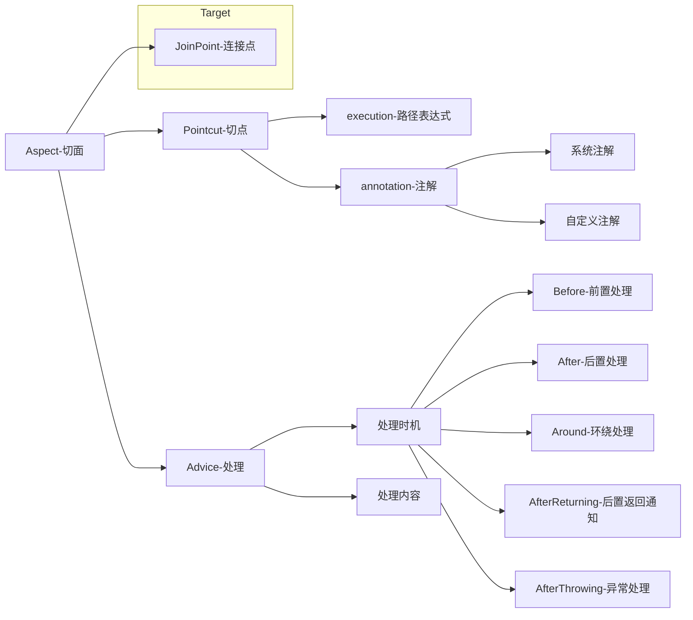

spring-aop

# 一、体系结构

## 1.1 五大核心




Pointcut：切点，决定处理如权限校验、日志记录等在何处切入业务代码中（即织入切面）。切点分为execution方式和annotation方式。前者可以用路径表达式指定哪些类织入切面，后者可以指定被哪些注解修饰的代码织入切面。

Advice：处理，包括处理时机和处理内容。处理内容就是要做什么事，比如校验权限和记录日志。处理时机就是在什么时机执行处理内容，分为前置处理（即业务代码执行前）、后置处理（业务代码执行后）等。

Aspect：切面，即Pointcut和Advice。

Joint point：连接点，是程序执行的一个点。例如，一个方法的执行或者一个异常的处理。在 Spring AOP 中，一个连接点总是代表一个方法执行。

Weaving：织入，就是通过动态代理，在目标对象方法中执行处理内容的过程。

### 1.1.1 处理类型

```
try{
    try{
        //@Around start
        //@Before
        method.invoke(..);
        //@Around end
    }finally{
        //@AfterReturning
    }
    //@After
}catch(){
    //@AfterThrowing
```

### 1.1.4 依赖

```
        <dependency>
            <groupId>org.springframework</groupId>
            <artifactId>spring-aop</artifactId>
        </dependency>
        <dependency>
            <groupId>org.aspectj</groupId>
            <artifactId>aspectjweaver</artifactId>
        </dependency>
```

### 1.1.5 execute表达式

**spring aop中9种切入点表达式的写法**

1. **execute**

2. **within**

3. **this**

4. **target**

5. **args**

6. **@target**

7. **@within**

8. **@annotation**

9. @args

   execute最常用

   https://www.cnblogs.com/itsoku123/p/10744244.html

https://blog.csdn.net/xhaimail/article/details/94619092

**拦截包或者子包中定义的方法**

```
execution (* com.lin.service..*. *(..))

拦截com.lin.service包或者子包中定义的所有方法。

1.execution()：表达式主体。
2.第一个*号：表示返回类型， 号表示所有的类型。
3.包名：表示需要拦截的包名，后面的 “..” 表示当前包和当前包的所有子包，com.xh.service包、子孙包下所有类的方法。
4.第二个*号：表示类名，*号表示所有的类。
5.(..)：最后这个星号表示方法名，*号表示所有的方法，括号表示方法的参数，两个句点表示任何参数类型。
```

**拦截类或者接口中的方法**

```
execution(* com.lin.service.UserService.*(..))
```

**拦截包中定义的方法，不包含子包中的方法**

```
execution(* com.lin.service.*.*(..))
```

拦截com.lin.service包中所有类中任意方法，不包含子包中的类。

## 1.2 实现例子

### 1.2.1 注解版本

这个配置不写也行，看项目

```
@Configuration
@ComponentScan("com.lin.spring.aop")
@EnableAspectJAutoProxy // 默认是jdk动态代理
public class AopConfig {
}
```

```
@Retention(RetentionPolicy.RUNTIME)
@Target({ElementType.METHOD})
@Documented
public @interface SentinelAop {
    String[] limitParams();

    String resourceName() default "";
}
```

```
@RestController
public class SentinelController {

    @SentinelAop(limitParams = {"sceneCode"}, resourceName = "sentinel")
    public String test(String name){
        System.out.println(name);
        return "SentinelController end";
    }
}
```

```
/**
 * 切面
 */
@Component
@Aspect
public class SentinelAspect {

    /**
     * 方法是通知/增强
     *
     * @param joinPoint 切点
     * @param SentinelAop 获取注解 SentinelAop必须和@annotation 里的名称一致
     */
    @Around(value = "@annotation(SentinelAop)")
    public Object doExeAdvice(ProceedingJoinPoint joinPoint, SentinelAop SentinelAop) throws Throwable {
        System.out.println("===================开始增强处理===================");

        // 获取签名 利用签名可以获取请求的包名、方法名，包括参数（通过 joinPoint.getArgs()获取）
        Signature signature = joinPoint.getSignature();

        // 获取注解
        String[] limitParams = SentinelAop.limitParams();

        //获取请求参数，详见接口类
        Object[] objects = joinPoint.getArgs();
        String name = objects[0].toString();
        System.out.println("name1->>>>>>>>>>>>>>>>>>>>>>" + name);

        // 修改入参
        objects[0] = "linAdvice";

        // 将修改后的参数传入, 下面会先执行controller切点里的方法
        final Object proceed = joinPoint.proceed(objects);

        // 修改返回结果
        String result = proceed.toString();
        result="SentinelController end change";

        // controller结束才会到这里
        System.out.println("around end =======================");
        // 修改后的返回结果返回
        return result;
    }
}
```

```
@SpringBootTest(classes = AopApplication.class)
@RunWith(SpringRunner.class)
public class AopTest {

    @Autowired
    private SentinelController sentinelController;

    @Autowired
    private NormalController normalController;

    @Test
    public void testAnnoDemo() {
        final String result = sentinelController.test("lin");
        System.out.println(result);
    }

    @Test
    public void testNormalDemo() {
        NormalController.Request request = new NormalController.Request();
        request.setName("lin");
        final String result = normalController.test(request);
        System.out.println("result=" + result);
    }
}
```

### 1.2.2 常规版本

```
@RestController
public class NormalController {

    public String test(Request request) {
        System.out.println("NormalController proccess");
        return request.getName();
    }

    @Data
    public static class Request {
        private String name;
    }
}
```

```
@Component
@Aspect
public class NromalAspect {

    // 拦截NormalController的所有方法
    @Pointcut("execution(* com.lin.spring.aop.nromalDemo.NormalController.*(..))")
    public void pointCut1() {}

    @Before("pointCut1()")
    public Object run(JoinPoint joinPoint) {
        Object[] args = joinPoint.getArgs();
        NormalController.Request request = (NormalController.Request) args[0];
        System.out.println("Before params = " + request);
        return request;
    }

    @After("pointCut1()")
    public Object runAfter(JoinPoint joinPoint) {
        Object[] args = joinPoint.getArgs();
        NormalController.Request request = (NormalController.Request) args[0];
        System.out.println("After params = " + request);
        return request;
    }

    @AfterReturning(pointcut = "pointCut1()", returning = "result")
    public void doAfterReturning(JoinPoint joinPoint, Object result) throws Throwable {
        System.out.println("返回参数为：" + result);
        // 实际项目中可以根据业务做具体的返回值增强，但是已经返回了，要想修改返回结果，只能@Around
        String result1 = (String) result;
        System.out.println("doAfterReturning 对返回参数进行业务上的增强：{}" + result + "增强版");
    }
}
```

# 二、实现原理

## 2.1 静态代理

例如下面的

https://blog.csdn.net/qq_46097208/article/details/122621889

角色分析

- 抽象角色：一般会使用接口或抽象类来解决
- 真实角色：被代理的角色
- 代理角色：代理真实角色，代理真实角色后，我们一般会做一些附属操作
- 客户端：访问代理对象

抽象角色/接口：

```
public interface BuyPhoneService {
    void buyPhone();
}
```

```
public class BuyPhoneServiceImpl implements BuyPhoneService{
    @Override
    public void buyPhone() {
        System.out.println("买手机");
    }
}
```

```
public class BuyPhoneProxy implements BuyPhoneService{
 
    private final BuyPhoneService buyPhoneService;
 
    public BuyPhoneProxy(BuyPhoneService buyPhoneService) {
        this.buyPhoneService = buyPhoneService;
    }
 
    @Override
    public void buyPhone() {
        System.out.println("内部优惠打八折");
        buyPhoneService.buyPhone();
        System.out.println("送手机大礼包！！！");
    }
}
```

```
public class Buy {
    public static void main(String[] args) {
        BuyPhoneService buyPhoneService = new BuyPhoneServiceImpl();
        System.out.println("使用代理前");
        System.out.println("----------------------");
        buyPhoneService.buyPhone();
        System.out.println("----------------------");
        System.out.println("使用代理后");
        System.out.println("----------------------");
        BuyPhoneProxy buyPhoneProxy = new BuyPhoneProxy(buyPhoneService);
        buyPhoneProxy.buyPhone();
    }
}
```

代理模式的好处

- 可以使真实角色的操作更加纯粹，不用去关注一些公共的业务
- 公共业务交给大力角色，实现了业务的分工
- 公共业务扩展的时候，方便集中管理
  缺点
- 缺点是每一个被代理的类都需要编写一个代理类，如果被代理的类较多，会导致代码冗余  例如上面代理类需要实现BuyPhoneService，如果又来一个又得实现

## 2.2 JDK动态代理

spring aop默认使用JDK动态代理

```
@EnableAspectJAutoProxy
```

如果开发者设置了 spring.aop.proxy-target-class 为 false，则使用 JDK 代理。
如果开发者设置了 spring.aop.proxy-target-class 为 true，则使用 Cglib 代理。
如果开发者一开始就没配置 spring.aop.proxy-target-class 属性，则使用 JDK 代理。

#### 特点

动态代理和静态代理角色一样
动态代理的动态类是动态生成的，不是我们直接写好的
动态代理分为两大类：基于接口的动态代理，基于类的动态代理
 基于接口----JDK动态代理【我们在这里使用的】
 基于类----cglib

需要了解的两个类：Proxy：代理，InvocationHandler：调用处理程序

#### 代码实现

抽象角色和真实角色和 静态代理一样

```
/**
 * 房东 真实角色
 */
public class Host implements Rent{
    @Override
    public void rent() {

    }
}
```

```
// 抽象角色/接口
public interface Rent {
    void rent();
}
```

```
public class ProxyInvocationHandler implements InvocationHandler {

    //被代理的接口
    private Rent rent;

    public void setRent(Rent rent) {
        this.rent = rent;
    }

    //生成得到代理类
    // 1.类加载器 2.接口实现类 3.当前类
    public Object getProxy() {
        return Proxy.newProxyInstance(this.getClass().getClassLoader(), rent.getClass().getInterfaces(), this);
    }

    //处理代理实例，并返回结果
    public Object invoke(Object proxy, Method method, Object[] args) throws Throwable {
        //动态代理的本质就是使用反射机制实现
        seeHouse();
        Object invoke = method.invoke(rent, args);
        contract();
        fare();
        return invoke;
    }

    public void seeHouse() {
        System.out.println("客户看房子");
    }

    public void fare() {
        System.out.println("收中介费");
    }

    //合同
    public void contract(){
        System.out.println("租赁合同");
    }
}
```

```
public class Client {
    public static void main(String[] args) {
        //真实角色
        Host host = new Host();

        //代理角色：现在没有
        ProxyInvocationHandler pih = new ProxyInvocationHandler();

        //通过调用程序处理角色来处理我们要调用的接口对象
        pih.setRent(host);
        Rent proxyHost = (Rent) pih.getProxy();//这里的Proxy就是动态生成的，我们没有写
        proxyHost.rent();

        System.out.println("=======================");

        //真实角色2
        Company company = new Company();

        //代理角色：现在没有
        ProxyInvocationHandler proxyInvocationHandler = new ProxyInvocationHandler();

        //通过调用程序处理角色来处理我们要调用的接口对象
        proxyInvocationHandler.setRent(company);
        Rent proxyCompany = (Rent) proxyInvocationHandler.getProxy();//这里的Proxy就是动态生成的，我们没有写
        proxyCompany.rent();
    }
}
```

## 2.3 cglib动态代理-了解