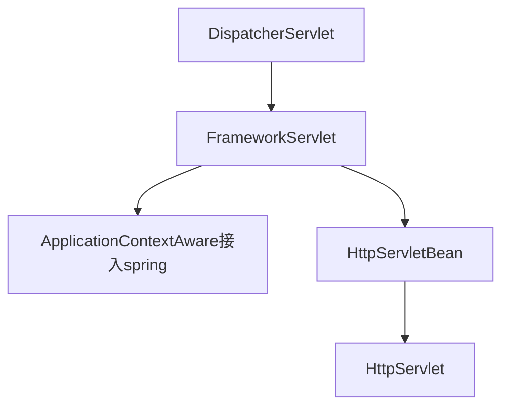
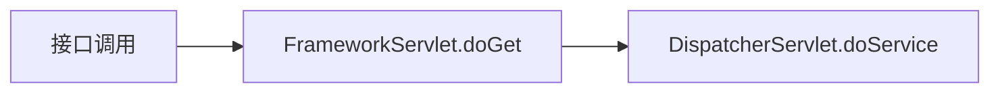

## 书籍spring源码

## 设计模式

工厂 单例 原型 代理 委派 策略 模板 适配器 装饰者 观察者

## Spring核心容器类图

### 1.BeanFactory  

Spring中Bean的创建是典型的工厂模式，这一系列的Bean工厂，即IoC容器，为开发者管理对象之间的依赖关系提供了很多便利和基础服务

BeanFactory作为最顶层的一个接口类，定义了IoC容器的基本功能规范， BeanFactory有三个重要的子类： **ListableBeanFactory、**
**HierarchicalBeanFactory和AutowireCapableBeanFactory**。但是从类图中我们可以发现最终的默认实现类是DefaultListableBeanFactory，它实现
了所有的接口。那么为何要定义这么多层次的接口呢？查阅这些接口的源码和说明发现，每个接口都有它的使用场合，主要是为了区分在
Spring内部操作过程中对象的传递和转化，对对象的数据访问所做的限制。例如， **ListableBeanFactory接口表示这些Bean可列表化**，而
**HierarchicalBeanFactory表示这些Bean 是有继承关系的**，也就是每个Bean 可能有父 Bean。 **AutowireCapableBeanFactory 接口定义Bean的自动**
**装配规则**。这三个接口共同定义了Bean的集合、 Bean之间的关系及Bean行为。最基本的IoC容器接口是BeanFactor

要知道工厂是如何产生对象的，我们需要看具体的IoC容器实现，Spring提供了许多IoC容器实现，比如GenericApplicationContext、ClasspathXmlApplicationContext等

ApplicationContext是Spring提供的一个高级的IoC容器，它除了能够提供IoC容器的基本功能，还为用户提供了以下附加服务
（1）支持信息源，可以实现国际化（实现MessageSource接口）。
（2）访问资源（实现ResourcePatternResolver接口，后面章节会讲
到）。
（3）支持应用事件（实现ApplicationEventPublisher接口）。   

### 2.BeanDefinition

Spring IoC容器管理我们定义的各种Bean对象及其相互关系， Bean对象在Spring实现中是以BeanDefinition来描述的，其继承体系如下图所示。  

### 3.BeanDefinitionReader

Bean的解析过程非常复杂，功能被分得很细，因为这里需要被扩展的地方很多，必须保证足够的灵活性，以应对可能的变化。 Bean的解析
主要就是对Spring配置文件的解析。这个解析过程主要通过BeanDefinitionReader来完成


## IOC源码

### 1.入口

configAndRefreshWebApplicationContext（）方法中调用了 refresh（）方 法，这是真正启动 IoC 容器的入口

**AbstractApplicationContext  refresh()** 方法启动容器   见**开始启动**模块

### 2.获得配置路径  

通过分析 ClassPathXmlApplicationContext 的 源 代 码 可 以 知 道，在创建ClassPathXmlApplicationContext容器时，构造方法做了以下两项重要工作。
首先，调用父容器的构造方法super（ parent）为容器设置好Bean资源加载器。
然后，调用父类AbstractRefreshableConfigApplicationContext的setConfigLocations（ configLocations）方法设置Bean配置信息的定位路径。
通过追踪ClassPathXmlApplicationContext的继承体系，发现其父类的父类AbstractApplicationContext中初始化IoC容器


在AbstractApplicationContext的默认构造方法中调用
**PathMatchingResourcePatternResolver**的构造方法创建Spring资源加载器：  


在设置容器的资源加载器之后，接下来ClassPathXmlApplicationContext执行setConfigLocations（）方法，通过
调用其父类**AbstractRefreshableConfigApplicationContext**的方法进行Bean配置信息的定位  


从这两个方法的源码可以看出，我们既可以使用一个字符串来配置多个Spring Bean信息，也可以使用字符串数组来配置。多个资源文件路径之间可以是用“，； \t\n”等分隔。
至此， Spring IoC容器在初始化时将配置的Bean信息定位为Spring封装的Resource。  

### 3.开始启动-重要

refresh（）方法是一个模板方法，规定了 IoC 容器的启动流程，有些逻辑要交给其子类实现。它对 Bean 配置资源进行载入，ClassPathXmlApplicationContext通过调用其父类**AbstractApplicationContext的refresh**（）方法启动整个IoC容器对Bean定义的载入过程  

```
public void refresh() throws BeansException, IllegalStateException {
    synchronized(this.startupShutdownMonitor) {
    	// 1.调用容器准备刷新的方法，获取容器当前时间，给容器设置同步标识
        this.prepareRefresh();
        // 2.告诉子类启动refreshBeanFactory()方法，Bean定义资源文件的载入从子类的refreshBeanFactory()方法启动
        ConfigurableListableBeanFactory beanFactory = this.obtainFreshBeanFactory();
        // 3.为BeanFactory 配置容器特性，例如类加载器，事件处理器
        this.prepareBeanFactory(beanFactory);

        try {
        	// 4.为容器某些子类指定特殊的POST时间处理器
            this.postProcessBeanFactory(beanFactory);
            // 5.调用所在注册的BeanFactoryPostProcessor的Bean
            this.invokeBeanFactoryPostProcessors(beanFactory);
            // 6.为u=
            this.registerBeanPostProcessors(beanFactory);
            // 7.初始化国际化信息源
            this.initMessageSource();
            // 8.初始化容器事件传播器
            this.initApplicationEventMulticaster();
            // 9.调用子类某些特殊Bean的初始化方法
            this.onRefresh();
            // 10.为事件床勃起注册时间监听器
            this.registerListeners();
            // 11.初始化所有剩余的单例Bean
            this.finishBeanFactoryInitialization(beanFactory);
            // 12. 初始化容器的
            this.finishRefresh();
        } catch (BeansException var9) {
            if (this.logger.isWarnEnabled()) {
                this.logger.warn("Exception encountered during context initialization - cancelling refresh attempt: " + var9);
            }

            this.destroyBeans();
            this.cancelRefresh(var9);
            throw var9;
        } finally {
            this.resetCommonCaches();
        }

    }
}
```

**ConfigurableListableBeanFactory beanFactory=obtainFreshBeanFactory（）**

以后的代码都是在注册容器
的信息源和生命周期事件，我们前面说的载入就通过这句代码启动  

refresh（）方法的主要作用是：在创建IoC容器前，如果已经有容器存在，需要把已有的容器销毁和关闭，以保证在refresh（）方法之后
使用的是新创建的IoC容器。它类似于对IoC容器的重启，在新创建的容器中对容器进行初始化，对Bean配置资源进行载入  

### 4.创建容器

obtainFreshBeanFactory（）方法调用子类容器的 **refreshBeanFactory（）**方法  

AbstractApplicationContext类中只抽象定义了refreshBeanFactory（）
方法，容器真正调用的是其子类**AbstractRefreshableApplicationContext实现的refreshBeanFactory**（）  

在这个方法中，先判断beanFactory是否存在，如果存在则先销毁Bean并关闭beanFactory，接着创建**DefaultListableBeanFactory**，并调用**loadBeanDefinitions**（）方法装载Bean定义  

### 5.载入配置路径

在AbstractRefreshableApplicationContext 中只定义了抽象父类的**loadBeanDefinitions**（）方法，容器真正调用的是其子类
**AbstractXmlApplicationContext** 对该方法的实现

### 6.分配路径处理策略

抽象父类**AbstractBeanDefinitionReader  loadBeanDefinitions（**）  中定义了载入过程。
从AbstractBeanDefinitionReader的loadBeanDefinitions（）方法的源码分析可以看出，该方法就做了两件事：首先，调用资源加载器的获取
资源方法resourceLoader.getResource（location），获取要加载的资源；其次，真正执行加载功能，由其子类XmlBeanDefinitionReader的loadBeanDefinitions（）方法完成  

在 loadBeanDefinitions（）方法中调用了 AbstractApplicationContext的 getResources（）方法， getResources（）方法其实在ResourcePatternResolver 中定义  

从图中可以看到ResourceLoader与ApplicationContext的继承关系，实际上调用DefaultResourceLoader中的 getSource（）方法 定 位Resource，因为 ClassPathXmlApplicationContext 本身就 是DefaultResourceLoader的实现类，所以此时又回到了ClassPathXmlApplicationContext中  

### 7.解析配置文件路径  

XmlBeanDefinitionReader通过调用ClassPathXmlApplicationContext的父类**DefaultResourceLoader的getResource（）方法**获取要加载的资源  

### 8.开始读取配置内容  

**XmlBeanDefinitionReader的loadBeanDefinitions（）**方法，看之后的载入过程：  

过源码分析可知，载入Bean配置信息的最后一步是将Bean配置信息转换为**文档对象，该过程由documentLoader（）**方法实现

### 9.准备文档对象  

DocumentLoader将Bean配置信息转换成文档对象  

上面的解析过程是调用Java EE的JAXP标准进行处理的。至此Spring IoC容器根据定位的Bean配置信息将其读入并转换成为文档对象完成。接下来我们要继续分析Spring IoC容器将载入的Bean配置信息转换为文档对象之后，是如何将其解析为Spring IoC管理的Bean对象并将其注册到容器中的  

### 10.分配解析策略  -Bean对象开始注册到容器中  

调用**XmlBeanDefinitionReader** 类  **registerBeanDefinitions**（）方法启动Spring IoC容器对Bean定义的解析过程

Bean配置信息的载入和解析过程如下。首先，通过调用XML解析器将Bean配置信息转换为文档对象，但是这些文档对象并没有按照Spring的Bean规则进行解析。这一步是载入的过程。其次，在完成通用的XML解析之后，按照Spring Bean的定义规则对文档对象进行解析，其解析过程在接口BeanDefinitionDocumentReader的实现类DefaultBeanDefinitionDocumentReader中实现  

### 11.将配置载入内存  

**BeanDefinitionDocumentReader 接口通过registerBeanDefinitions（）**方法调用其实现类DefaultBeanDefinitionDocumentReader对文档对象进行解析  

过上述Spring IoC容器对载入的Bean定义的文档解析可以看出，在Spring配置文件中可以使用＜import＞元素来导入IoC容器所需要的其他资源， Spring IoC容器在解析时首先将指定的资源加载到容器中。使用＜alias＞别名时， Spring IoC容器首先将别名元素所定义的别名注册到容器中。对于既不是＜import＞元素又不是＜alias＞元素的元素，即Spring配置文件中普通的＜bean＞元素，由BeanDefinitionParserDelegate类的parseBeanDefinitionElement（）方法实现解析。这个解析过程非常复杂，我们在Mini版本中用properties文件代替了  

### 12.载入＜bean＞元素  

Bean 配置信息中的＜import＞和＜alias＞元素解析在DefaultBeanDefinitionDocumentReader 中已经完成， Bean配置信息中使用最多的＜bean＞元素交由**BeanDefinitionParserDelegate**来解析  

注意： 在解析＜bean＞元素的过程中没有创建和实例化Bean对象，**只是创建了Bean对象的定义类BeanDefinition**，将＜bean＞元素中的配置信息设置到BeanDefinition中作为记录，当依赖注入时才使用这些记录信息创建和实例化具体的Bean对象  

### 13.载入＜property＞元素  

BeanDefinitionParserDelegate 在解析＜bean＞时调用**parsePropertyElements**（）方法解析＜bean＞元素中的＜property＞元素  

通过上述源码分析，我们了解了Spring配置文件中＜bean＞元素中
＜property＞子元素的相关配置是如何处理的，注意以下三点：
（1） ref被封装为指向依赖对象的一个引用。
（2） value被封装成一个字符串类型的对象。
（3） ref和value都通过“解析的数据类型属性
值.setSource（extractSource（ele））； ”方法将属性值（或引用）与所引用的属性关联起来  

最后＜property＞元素的子元素通过 **parsePropertySubElement**  方法解析

### 14.载入＜property＞子元素  

BeanDefinitionParserDelegate类中的parsePropertySubElement（）方法用于对＜property＞元素中的子元素进行解析

通过上述源码分析可知，在Spring配置文件中，对＜property＞元素中配置的＜array＞、＜list＞、＜set＞、＜map＞、＜props＞等各种集合子元素都通过上述方法解析，生成对应的数据对象，比如ManagedList、 ManagedArray、 ManagedSet等。这些Managed类是Spring对象BeanDefinition的数据封装，对集合数据类型的具体解析由各自的解析方法实现

### 15.载入＜list＞子元素

BeanDefinitionParserDelegate类中的**parseListElement**（）方法用于解析＜property＞元素中的＜list＞集合子元素  

经过对Spring Bean配置信息转换文档对象中的元素的层层解析，Spring IoC现在已经将XML形式定义的Bean配置信息转换为Spring IoC所识别的数据结构—BeanDefinition。它是Bean配置信息中配置的POJO对象在Spring IoC容器中的映射，我们可以通过AbstractBeanDefinition入口，看到如何对Spring IoC容器进行索引、查询和其他操作。通过Spring IoC容器对Bean配置信息的解析， Spring IoC容器大致完成了管理Bean对象的准备工作，即初始化过程。但是最重要的依赖注入还没有发生，在Spring IoC容器中BeanDefinition存储的还只是一些静态信息，接下来需要向容器注册Bean定义信息，才能真正完成Spring IoC容器的初始化  

### 16.分配注册策略  

DefaultBeanDefinitionDocumentReader对Bean定义转换的文档对象解析的流程中，在parseDefaultElement（）方法中完成对文档对象的解析后得到封装BeanDefinition 的 BeanDefinitionHold 对象，然后调用**BeanDefinitionReaderUtils** 的registerBeanDefinition（）方法向Spring IoC容器注册解析的Bean  

当调用BeanDefinitionReaderUtils向Spring IoC容器注册解析的BeanDefinition时，真正完成注册功能的是DefaultListableBeanFactory  

### 17.向容器注册  

DefaultListableBeanFactory中使用一个HashMap的集合对象存放Spring IoC容器中注册解析的BeanDefinition    **registerBeanDefinition**方法注册

```
private final Map<String, BeanDefinition> beanDefinitionMap = new ConcurrentHashMap(256);
```

Bean配置信息中配置的Bean被解析后已经注册到Spring IoC容器中，被容器管理起来，真正完成了Spring IoC容器初始化的全部工作。现在Spring IoC容器中已经建立了所有Bean的配置信息， Bean定义信息已经可以使用，并且可以被检索。 Spring IoC容器的作用就是对这些注册的Bean定义信息进行处理和维护。注册的Bean定义信息是SpringIoC容器控制反转的基础，正是有了这些信息，容器才可以进行依赖注入  

### 基于注解的IO从初始化

#### 1.定位Bean扫描路径  

在 Spring 中管理注解的 Bean 定义的容器有两个：AnnotationConfigApplicationContext 和AnnotationConfigWebApplicationContex。这两个是专门处理 Spring 注解方式配置的容器，直接依赖于将注解作为容器配置信息来源的 IoC 容器。 AnnotationConfigWebApplicationContext 是AnnotationConfigApplicationContext的Web版本，两者的用法及对注解的处理方式几乎没有差别。我们以**AnnotationConfigApplicationContext**  为例

Spring对注解的处理分为以下两种方式。
（1）直接将注解Bean注册到容器中：可以在初始化容器时注册；也可以在容器创建之后手动调用注册方法向容器注册，然后通过手动刷新容器使容器对注册的注解Bean进行处理。
（2）通过扫描指定的包及其子包下的所有类处理：在初始化注解容器时指定要自动扫描的路径，如果容器创建以后向给定路径动态添加了注解Bean，则需要手动调用容器扫描的方法手动刷新容器，使容器对所注册的注解Bean进行处理  

#### 2.读取注解的元数据  

1.AnnotationConfigAppIicationContext通过调用注解Bean定义读取器注册注解BeanAnnotatedBeanDefinitionReader的register（）方法向容器注册指定的
注解Bean  

从上面的源码可以看出，注册注解Bean定义类的基本步骤如下：
（1）使用注解元数据解析器解析注解Bean中关于作用域的配置。
（2）使用AnnotationConfigUtils的processCommonDefinitionAnnotations（）方法处理注解Bean定义类中通用的注解。
（3）使用AnnotationConfigUtils的applyScopedProxyMode（）方法创建作用域的代理对象。
（4）通过BeanDefinitionReaderUtils向容器注册Bean。  

2.AnnotationScopeMetadataResoIver解析作用域元信息AnnotationScopeMetadataResolver通过**resolveScopeMetadata**（）方法解析注解Bean定义类的作用域元信息，即判断注册的Bean是原生类型（prototype）还是单态（singleton）类型  

**annDef.getMetadata（）**方法用于获取对象中指定类型的注解的值  

3.AnnotationConfigUtiIs处理注解Bean定义类中的通用注解AnnotationConfigUtils的processCommonDefinitionAnnotations（）方法在向容器注册Bean之前，首先对注解Bean定义类中的通用注解进行处理  

4.AnnotationConfigUtiIs根据注解Bean定义类中配置的作用域为其应用相应的代理策略**AnnotationConfigUtils 的applyScopedProxyMode（）**方法根据注解Bean定义类中配置的作用域@Scope注解的值，为Bean定义应用相应的代理模式，主要在Spring面向切面编程（AOP）中使用  

5.BeanDefinitionReaderUtiIs向容器注册BeanBeanDefinitionReaderUtils主要校验BeanDefinition信息，然后将Bean添加到容器中一个管理BeanDefinition的HashMap中  

#### 3.扫描指定包并解析为BeanDefinition

当创建注解处理容器时，如果传入的初始参数是注解Bean定义类所在的包，注解容器将扫描给定的包及其子包，将扫描到的注解Bean定义载入并进行注册。

1.CIassPathBeanDefinitionScanner扫描给定的包及其子包AnnotationConfigApplicationContext通过调用类路径Bean定义扫描器**ClassPathBeanDefinitionScanner**扫描给定包及其子包下的所有类    

类路径Bean定义扫描器ClassPathBeanDefinitionScanner主要通过**findCandidateComponents**（）方法调用其父类ClassPathScanningCandidateComponentProvider来扫描获取给定包及其子包的类  

2.CIassPathScanningCandidateComponentProvider扫描给定包及其子包的类ClassPathScanningCandidateComponentProvider 类的findCandidateComponents（）  

#### 4.注册注解BeanDefinition  

AnnotationConfigWebApplicationContext是AnnotationConfigApplicationContext的Web版，它们对于注解Bean的注和扫描是基本相同的，但是AnnotationConfigWebApplicationContext对注解Bean定义的载入稍有不同。 **AnnotationConfigWebApplicationContext**注入注解Bean定义源码如下：  

### IoC容器初始化小结  

下面总结一下IoC容器初始化的基本步骤：
（1）初始化的入口由容器实现中的refresh（）方法调用来完成。
（2）对Bean定义载入IoC容器使用的方法是loadBeanDefinition（）    

	大致过程如下：通过 ResourceLoader 来完成资源文件的定位，DefaultResourceLoader 是默认的实现，同时上下文本身就给出了ResourceLoader的实现，可以通过类路径、文件系统、 URL等方式来定位资源。如果是XmlBeanFactory作为IoC容器，那么需要为它指定Bean定义的资源，也就是说Bean定义文件时通过抽象成Resource来被IoC容器处理，容器通过BeanDefinitionReader来完成定义信息的解析和 Bean信息的注册，往往使用 XmlBeanDefinitionReader 来解析 Bean 的XML定义文件—实际的处理过程是委托给 BeanDefinitionParserDelegate 来完成的，从而得到Bean的定义信息，这些信息在Spring中使用BeanDefinition来表示—这个名字可以让我们想到loadBeanDefinition（）、 registerBeanDefinition（）这些相关方法。它们都是为处理BeanDefinition服务的，容器解析得到BeanDefinition以后，需要在IoC容器中注册，这由IoC实现BeanDefinitionRegistry接口来实现。注册过程就是在IoC容器内部维护的一个HashMap来保存得到的BeanDefinition的过程。这个HashMap是IoC容器持有Bean信息的场所，以后对Bean的操作都是围绕这个HashMap来实现的。
	
	之后我们就可以通过BeanFactory和ApplicationContext来享受SpringIoC的服务了。在使用IoC 容器的时候我们注意到，除了少量黏合代码，绝大多数以正确 IoC 风格编写的应用程序代码完全不用关心如何到达工厂，因为容器将把这些对象与容器管理的其他对象钩在一起了。基本的策略是把工厂放到已知的地方，最好放在对预期使用的上下文有意义的地方，以及代码将实际需要访问工厂的地方。 Spring本身提供了对声明式载入Web应用程序用法的应用程序上下文，并将其存储在ServletContext的框架实现中  

## DI源码

### 1.依赖注入发生的时间

当Spring loC容器完成了 Bean定义资源的定位、载入和解析注册以后,loC容器中已经管理类Bean 定义的相关数据，但是此时loC容器还没有对所管理的Bean进行依赖注入，依赖注入在以下两种情况 发生：

1. 、用户第一次调用getBean()方法时，loC容器触发依赖注入。 

2. 、当用户在配置文件中将＜bean＞元素配置了 lazy-init二false属性,即让容器在解析注册Bean定义 时进行预实例化，触发依赖注入。 

   

### 2.寻找获取Bean的入口

AbstractBeanFactory的 getBean()相关方法

在Spring中 ，如果Bean定义的单例 模式(Singleton), 则容器在创建之前先从缓存中查找，以确保整个容器中只存在一个实例对象。如果 Bean定义的是原型模式(Prototype)，则容器每次都会创建一个新的实例。除此之外,Bean定义 还可以扩展为指定其生命周期范围。

上面的源码只是定义了根据Bean定义的模式采取的不同创建Bean实例对象的策略 具体的Bean 实例对象的创建过程由实现了 ObjectFactory接口的匿名内部类的createBean()方 法 完 成 ， Object Factory使 用 委 派 模 式 , 具 体 的 Bean实 例 创 建 过 程 交 由 其 实 现 类 AbstractAutowireCapableBeanFactory完 成 ，我们继续分析 **AbstractAutowireCapableBeanFactory 的 createBean**。方法的源码，理解其创建Bean实例的具体实现过程。

### 3.开始实例化

AbstractAutowireCapableBeanFactory 类实现了 ObjectFactory 接口，创建容器指定的 Bean 实 例对象，同时还对创建的Bean实例对象进行初始化处理。

通过上面的源码注释，我们看至IJ具体的依赖注入实现其实就在以下两个方法中：

1.  、**createBeanlnstance**()方 法 ,生 成 Bean所包含的java对象实例。 
2.  、**populateBean**()方 法 ,对 Bean属性的依赖注入进行处理。 

下面继续分析这两个方法的代码实现。

### 4.选择Bean实例化策略

在createBeanlnstance方法中，根据指定的初始化策略，使用简单工厂、工厂方法或者容器的自 动装配特性生成Java实例对象

对使用工厂方法和自动装配特性的Bean的实例化相当比较清 楚 ，调用相应的工厂方法或者参数匹配的构造方法即可完成实例化对象的工作，但是对于我们最常使用 的默认无参构造方法就需要使用相应的初始化策略(JDK的反射机制或者CGLib)来进行初始化了 ,在方 法 **getlnstantiationStrategy().instantiate()**中就具体实现类使用初始策略实例化对象。

### 5.执行Bean实例化

在 使 用 默 认 的 无 参 构 造 方 法 创 建 Bean的 实 例 化 对 象 时 ， 方 法 getlnstantiationStrategy().instantiate()调用了 **SimplelnstantiationStrategy** 类中的实例化 Bean 的 方法

如果Bean有方法被覆盖了，则使用JDK的反射机制进行实例化, 否则,使用CGLib进行实例化。 instantiateWithMethodInjection()方 法 调 用 SimplelnstantiationStrategy 的 子 类 CGLibSubclassinglnstantiationStrategy 使用 CGLib 来进行初始化

CGLib是一个常用的字节码生成器的类库，它提供了一系列API实现Java字节码的生成和转换功 能。我们在学习JDK的动态代理时都知道，JDK的动态代理只能针对接口，如果一个类没有实现任何接 口 ,要对其进行动态代理只能使用CGLib。

### 6.准备依赖注入

在前面的分析中我们已经了解到Bean的 依 赖 注 入 主 要 分 为 两 个 步 骤 ，首先调用 createBeanlnstance。方法生成Bean所包含的Java对象实例。然后,调用populateBean()方法，对 Bean属性的依赖注入进行处理。

上面我们已经分析了容器初始化生成Bean所包含的Java实例对象的过程，现在我们继续分析生成 对象后，Spring loC容器是如何将Bean的属性依赖关系注入Bean实例对象中并设置好的，回到 **AbstractAutowireCapableBeanFactory 的 populateBean**方法，对属性依赖注入

分析上述代码，我们可以看出，对属性的注入过程分以下两种情况:

1 )、属性值类型不需要强制转换时，不需要解析属性值，直接准备进行依赖注入。

2)、属性值需要进行类型强制转换时,如对其他对象的引用等，首先需要解析属性值，然后对解析后的 属性值进行依赖注入。

对属性值的解析是在 BeanDefinitionValueResolver 类中的 resolveValuelfNecessary()方法中进 行 的 ，对属性值的依赖注入是通过bw.setPropertyValues方法实现的，在分析属性值的依赖注入之前, 我们先分析一下对属性值的解析过程。

### 7.解析属性注入规则

当容器在对属性进行依赖注入时，如果发现属性值需要进行类型转换，如属性值是容器中另一个 Bean实例对象的引用,则容器首先需要根据属性值解析出所引用的对象,然后才能将该引用对象注入 到目标实例对象的属性上去，对属性进行解析的由resolveValuelfNecessary。

Spring是如何将引用类型，内部类以及集合类型等属性进行解析 的 ，属性值解析完成后就可以进行依赖注入了，依赖注入的过程就是Bean对象实例设置到它所依赖的 Bean对象属性上去。而真正的依赖注入是通过bw.setPropertyValues。方法实现的，该方法也使用了 委托模式,在 BeanWrapper接口中至少定义了方法声明，依赖注入的具体实现交由其实现类 BeanWrapperlmpI来完成，下面我们就分析依BeanWrapperlmpI中赖注入相关的源码。

### 8.注入赋值

BeanWrapperlmpI类主要是对容器中完成初始化的Bean实例对象进行属性的依赖注入，即把 Bean对象设置到它所依赖的另一个Bean的属性中去。然而，BeanWrapperlmpI中的注入方法实际 上由**AbstractNestablePropertyAccessor**来实现的

通过对上面注入依赖代码的分析，我们已经明白了 Spring loC容器是如何将属性的值注入到Bean 实例对象中去的:

1）、对于集合类型的属性，将其属性值解析为目标类型的集合后直接赋值给属性。

2）、对于非集合类型的属性，大量使用了 JDK的反射机制，通过属性的getter方法获取指定属性注入 以前的值，同时调用属性的setter。方法为属性设置注入后的值。看到这里相信很多人都明白了 Spring 的 setter注入原理。

至此Spring loC容器对Bean定义资源文件的定位，载入、解析和依赖注入已经全部分析完毕，现 在 Spring loC容器中管理了一系列靠依赖关系联系起来的Bean，程序不需要应用自己手动创建所需的 对象，Spring loC容器会在我们使用的时候自动为我们创建，并且为我们注入好相关的依赖，这就是 Spring核心功能的控制反转和依赖注入的相关功能。

### 9.loC容器中那些鲜为人知的细节

通过前面章节中对Spring loC容器的源码分析，我们已经基本上了解了 Spring loC容器对Bean 定义资源的定位、载入和注册过程,同时也清楚了当用户通过getBean()方法向loC容器获取被管理的 Bean时 ，loC容器对Bean进行的初始化和依赖注入过程,这些是Spring loC容器的基本功能特性。 Spring loC容器还有一些高级特性,如使用lazy-init属性对Bean预初始化、FactoryBean产生或者 修饰Bean对象的生成、loC容器初始化Bean过程中使用BeanPostProcessor后置处理器对Bean声 明周期事件管理等。

### 10.关于延时加载

通过前面我们对loC容器的实现和工作原理分析 我们已经知道loC容器的初始化过程就是对Bean 定义资源的定位、载入和注册，此时容器对Bean的依赖注入并没有发生,依赖注入主要是在应用程序 第一次向容器索取Bean时 ，通过getBean()方法的调用完成。

当 Bean定义资源的＜Bean＞元素中配置了 lazy-init=faIse属性时，容器将会在初始化的时候对所配置 的 Bean进行预实例化，Bean的依赖注入在容器初始化的时候就已经完成。这样，当应用程序第一次 向容器索取被管理的Bean时 ，就不用再初始化和对Bean进行依赖注入了，直接从容器中获取已经完 成依赖注入的现成Bean , 可以提高应用第一次向容器获取Bean的性能。

**refresh ()方法**

先从loC容器的初始化过程开始，我们知道loC容器读入已经定位的Bean定义资源是从refresh方法 开始的，我们首先从AbstractApplicationContext类的refresh。

在 refresh。方法中 ConfigurableListableBeanFactorybeanFactory=obtainFreshBeanFactory(); 启动了 Bean定义资源的载入、注册过程，而 finishBeanFactorylnitialization方法是对注册后的Bean 定义中的预实例化(lazy-init=false,Spring默认就是预实例化即为true)的 Bean进行处理的地方。

**finishBeanFactorylnitialization 处理预实例化 Bean**

当 Bean定义资源被载入loC容器之后，容器将Bean定义资源解析为容器内部的数据结构 BeanDefinition注册到容器中 AbstractApplicationContext类中的finishBeanFactorylnitialization方法对配置了预实例化属性的Bean进行预初始化过程

ConfigurableListableBeanFactory 是一个接口 , 其 prelnstantiateSingletons方法由其子类 DefaultListableBeanFactory 提供。

**DefaultListableBeanFactory 对配置 lazy-init 属性单态 Bean的预实例化**

通过对lazy-init处理源码的分析，我们可以看出，如果设置了 lazy-init属性，则容器在完成Bean 定义的注册之后，会通过getBean方法,触发对指定Bean的初始化和依赖注入过程，这样当应用第一 次向容器索取所需的Bean时 ，容器不再需要对Bean进行初始化和依赖注入，直接从已经完成实例化 和依赖注入的Bean中取一个现成的Bean ,这样就提高了第一次获取Bean的性能。

### 11.关于 FactoryBean 和 BeanFactory

在 Spring中 ,有两个很容易混淆的类：BeanFactory和 FactoryBean。 BeanFactory : Bean工厂 , 是一个工厂(Factory), 我 们 Spring loC容器的最顶层接口就是这个BeanFactory , 它的作用是管理Bean , 即实例化、定位、配置应用程序中的对象及建立这些对象间的 依赖。

FactoryBean : 工厂Bean , 是一个Bean , 作用是产生其他bean实例。通常情况下，这 种 Bean 没有什么特别的要求，仅需要提供一个工厂方法，该方法用来返回其他Bean实例。通常情况下，Bean 无须自己实现工厂模式，Spring容器担任工厂角色；但少数情况下,容器中的Bean本身就是工厂，其 作用是产生其它Bean实例。

当用户使用容器本身时可以使用转义字符来得到FactoryBean本身以区别通过FactoryBean 产生的实例对象和FactoryBean对象本身。在 BeanFactory中通过如下代码定义了该转义字符： String FACTORY BEAN PREFIX ="&";

如果 myJndiObject是一个 FactoryBean ,则使用 &myJndiObject 得到的是 myJndiObject 对 象 , 而不是myJndiObject产生出来的对象。

**FactoryBean 源 码 **

**AbstractBeanFactory 的 getBean()方法调用 FactoryBean **

在前面我们分析Spring loC容器实例化Bean并进行依赖注入过程的源码时，提到在getBean方法触发容器实例化Bean的时候会调用AbstractBeanFactory的 doGetBean()方法来进行实例化的过 程

在 上 面 获 取 给 定 Bean的 实 例 对 象 的 getObjectForBeanlnstance()方 法 中 ，会 调 用 FactoryBeanRegistrySupport 类的 getObjectFromFactoryBean()方 法 ,该方法实现了 Bean 工厂生 产 Bean实例对象。

Dereference(解引用):一个在C/C+ +中应用比较多的术语，在 C+ +中 ,” *“是解引用符号,而” & ”是引用符号，解引用是指变量指向的是所引用对象的本身数据，而不是引用对象的内存地址。

**AbstractBeanFactory 生产 Bean 实例对象**

BeanFactory接口调用其实现类的getObject方法来实现创 建 Bean实例对象的功能

**工厂Bean的实现类getObject方法创建Bean实例对象 **

Factory Bea n 的实现类有非常多，比 如 ：Proxy、RMI、JNDI、ServletContextFactoryBean 等等 FactoryBean接口为Spring容器提供了一个很好的封装机制，具体的getObject有不同的实现类根 据不同的实现策略来具体提供,我们分析一个最简单的AnnotationTestFactoryBean的实现源码

其他的Proxy , RMI , JNDI等 等 ,都是根据相应的策II略提供getObjectQ的实现。这里不做一一分 析 ,这已经不是Spring的核心功能，感兴趣的小伙可以再去深入研究。

### 12.再述 autowiring

Spring loC容器提供了两种管理Bean依赖关系的方式:

1)、显式管理:通过BeanDefinition的属性值和构造方法实现Bean依赖关系管理。

2)、autowiring :Spring loC容器的依赖自动装配功能，不需要对Bean属性的依赖关系做显式的声明，

只需要在配置好autowiring属性,loC容器会自动使用反射查找属性的类型和名称，然后基于属性 的类型或者名称来自动匹配容器中管理的Bean,从而自动地完成依赖注入。

通过对autowiring自动装配特性的理解，我们知道容器对Bean的自动装配发生在容器对Bean依 赖注入的过程中。在前面对Spring loC容器的依赖注入过程源码分析中，我们已经知道了容器对Bean 实例对象的属性注入的处理发生在AbstractAutoWireCapableBeanFactory类中的populateBean() 方法中，我们通过程序流程分析autowiring的实现原理:

**AbstractAutoWireCapableBeanFactory 对 Bean 实例进行属性依赖注入**

应用第一次通过getBean方法(配置了 lazy-init预实例化属性的除外)向loC容器索取Bean时 ， 容 器 创 建 Bean实 例 对 象 ，并 且 对 Bean实 例 对 象 进 行 属 性 依 赖 注 入 ， AbstractAutoWireCapableBeanFactory 的 populateBean()方法就是实现 Bean 属性依赖注入的功 能

**Spring loC容器根据Bean名称或者类型进行autowiring自动依赖注入**

通过属性名进行自动依赖注入的相对比通过属性类型进行自 动依赖注入要稍微简单一些，但是真正实现属性注入的是DefaultSingletonBeanRegistry类的 registerDependentBean方法。

**DefaultSingletonBeanRegistry 的 registerDependentBean()方法对属性注入**

通过对autowiring的源码分析，我们可以看出，autowiring的实现过程:

a、对 Bean的属性代调用getBean()方法,完成依赖Bean的初始化和依赖注入。

b、 将依赖Bean的属性引用设置到被依赖的Bean属性上。

c、将依赖Bean的名称和被依赖Bean的名称存储在loC容器的集合中。

Spring loC容器的autowiring属性自动依赖注入是一个很方便的特性，可以简化开发时的配置, 但是凡是都有两面性，自动属性依赖注入也有不足,首先，Bean的依赖关系在配置文件中无法很清楚 地看出来，对于维护造成一定困难。其次,由于自动依赖注入是Spring容器自动执行的,容器是不会 智能判断的，如果配置不当，将会带来无法预料的后果，所以自动依赖注入特性在使用时还是综合考虑。

@Autoware

容器对 Bean
实例对象的依赖属性注入发生在AbstractAutoWireCapableBeanFactory类
的populateBean（）  

真正实现属性注入的是 DefaultSingletonBeanRegistry 类的registerDependentBean（）方法  

## AOP源码

Spring AOP是由接入BeanPostProcessor后置处理器开始的  

### BeanPostProcessor  

这个Bean后置处理器是一个监听
器，可以监听容器触发的Bean声明周期事件。向容器注册后置处理器以后，容器中管理的Bean就具备了接收IoC容器回调事件的能力  

**2.AbstractAutowireCapabIeBeanFactory类的doCreateBean（）**方
法
BeanPostProcessor后置处理器的调用发生在Spring IoC容器完成Bean
实例对象的创建和属性的依赖注入之后，在对Spring依赖注入的源码分
析中我们知道，当应用程序第一次调用getBean（）方法（lazy-init预实
例化除外）向Spring IoC容器索取指定Bean时，触发Spring IoC容器创建
Bean实例对象并进行依赖注入。其实真正实现创建 Bean 对象并进行依
赖注入的方法是

**Bean 实例对象添加 BeanPostProcessor 后置处理器的入口是initializeBean（）  **方法

**3.initiaIizeBean（）方法**  

在AbstractAutowireCapableBeanFactory类中initializeBean（）方法实
现为容器创建的Bean实例对象添加BeanPostProcessor后置处理器  

4.一个创建AOP代理对象的子类AbstractAutoProxyCreator，该类重写了postProcessAfterInitialization（）  

一个创建AOP代理对象的子类AbstractAutoProxyCreator，该类重写了
postProcessAfterInitialization（） 

选择代理策略postProcessAfterInitialization（）方法，它调用了一个非常核心的方法—wrapIfNecessary（）  

5.整个过程最终调用的是proxyFactory.getProxy（）方法。到这里，
proxyFactory有JDK和CGLib两种，我们该如何选择呢？使用
DefaultAopProxyFactory的createAopProxy（）方法：  默认是JDK动态代理，这个在JDK8后也比CGLIB更快

### AOP - JDK 代理

JdkDynamicAopProxy    -> 

InvocationHandler 是 JDK 动态代理的核心，生成的代理对象的方法
调用都会委派到 invoke（）方法。  

主要实现思路为：先获取应用到此方法上的拦截器链（Interceptor
Chain）。如果有拦截器，则应用拦截器，并执行连接点（JoinPoint）；
如果没有拦截器，则直接反射执行连接点。这里的关键是拦截器链是如
何获取的，以及它又是如何执行的。下面来逐一分析。  

**拦截器链是通过Advised.getInterceptorsAndDynamicInterceptionAdvice（）  获得**

可以看到，获取拦截器其实是由AdvisorChainFactory的
**getInterceptorsAndDynamicInterception-Advice（）**方法  

Advised中配置的能够应用到连接点
（JoinPoint）或者目标对象（Target Object）的Advisor全部被转化成 MethodInterceptor

如果得到的拦截器链为空，则直接反射调用目标方法，否则创建MethodInvocation，调用其proceed（）方法，触发拦截器链的执行  

### 触发通知

在为AopProxy代理对象配置拦截器的实现中，有一个取得拦截器的
配置过程，这个过程是由DefaultAdvisorChainFactory 实现的。这个工厂
类负责生成拦截器链，在它的 **getInterceptorsAndDynamicInterceptionAdvice（）**方法中，有一个适配和注册过程，通过配置Spring 预先设计好的拦截器，加入了AOP实现  

GlobalAdvisorAdapterRegistry类起到了适配器和单例模式的作用，
提供了一个DefaultAdvisor-AdapterRegistry类来完成各种通知的适配和注册过程

Spring AOP为了实现Advice的织入，设计了特定的拦截器对这些功能进行封装。我们接着看**MethodBeforeAdviceInterceptor**类是如何完成封装的

对目标对象的增强是通过拦截器实现的  

### AOP示例

扫描对外网关请求，记录日志

```
import lombok.extern.slf4j.Slf4j;
import org.aspectj.lang.ProceedingJoinPoint;
import org.aspectj.lang.annotation.Around;
import org.aspectj.lang.annotation.Aspect;
import org.springframework.beans.factory.annotation.Autowired;
import org.springframework.stereotype.Component;

/**
 * @author Ethan
 * @since 2021/5/17
 */
@Component
@Aspect
@Slf4j
public class CallLogAopAspect {

    @Autowired
    private CallLogRepository callLogRepository;


    private static final String FINEEX_CONTROLLER_POINT = "execution (* com.coolpad.ecark.order.fulfillment.controller.FineexwmsController.*(..))";
    public static final String FINEEX_GATEWAY_POINT = "execution (* com.coolpad.ecark.order.fulfillment.gateway.FineexwmsGateway.*(..))";

    @Around(FINEEX_CONTROLLER_POINT)
    public Object fineexControllerAroundLog(ProceedingJoinPoint joinPoint) throws Throwable {
        long startTime = System.currentTimeMillis();

        String requestData = "";
        for (Object arg : joinPoint.getArgs()) {
            if (arg instanceof String) {
                requestData = (String) arg;
            }
        }
        String serviceName = joinPoint.toShortString();

        return proceed(joinPoint, startTime, requestData, serviceName);
    }

    @Around(FINEEX_GATEWAY_POINT)
    public Object fineexGatewayAroundLog(ProceedingJoinPoint joinPoint) throws Throwable {
        long startTime = System.currentTimeMillis();

        String requestData = "";
        if (joinPoint.getArgs() != null && joinPoint.getArgs().length > 0) {
            requestData = JsonUtils.objToJson(joinPoint.getArgs()[0]);
        }

        String serviceName = joinPoint.toShortString();

        return proceed(joinPoint, startTime, requestData, serviceName);
    }

    private Object proceed(ProceedingJoinPoint joinPoint, long startTime, String requestData, String serviceName) throws Throwable {
        Object proceed = null;
        try {
            proceed = joinPoint.proceed(joinPoint.getArgs());

        } catch (Throwable throwable) {
            throw throwable;
        } finally {
            // 日志打印
            saveCallLog(startTime, requestData, serviceName, proceed);
        }
        return proceed;
    }

    private void saveCallLog(long startTime, String requestData, String serviceName, Object proceed) {
        CallLog callLog = new CallLog();
        callLog.setServiceName(serviceName);
        callLog.setRequestData(requestData);
        callLog.setResponseData(JsonUtils.objToJson(proceed));
        callLog.setTimeConsuming(System.currentTimeMillis() - startTime);
        callLogRepository.save(callLog);
    }
}
```

```
@Aspect
@Component
public class CheckW3NameAspect {
    @Autowired
    private ProxyConfigMemberRepository proxyConfigMemberRepository;

    /**
     * 切面
     */
    @Pointcut("@annotation(CheckW3Name)")
    public void checkW3Name() {
    }

    /**
     * 前切
     */
    @Before("checkW3Name()")
    public void checkPermission() {
        String w3Name = RequestHolderUtil.getRequestW3Name();
        if (!proxyConfigMemberRepository.findByW3Name(w3Name).isPresent()) {
            throw new CommonException(HttpStatus.FORBIDDEN, "no permission");
        }
    }
}
```

## spring MVC源码

容器初始化时会建立所有URL和Controller中方法的对应关系，保存
到Handler Mapping中，用户请求时根据请求的 URL 快速定位到
Controller 中的某个方法。

在 Spring 中先将 URL 和Controller的对应关系
保存到Map＜url， Controller＞中。

 Web容器启动时会通知Spring初始化
容器（加载Bean的定义信息和初始化所有单例Bean），然后Spring
MVC会遍历容器中的Bean，获取每一个Controller中的所有方法访问的
URL，将URL和Controller保存到一个Map中  

### 官方文档

中文：https://www.w3cschool.cn/spring_mvc_documentation_linesh_translation/spring_mvc_documentation_linesh_translation-vtxk27ra.html

### Spring源码

Spring英文官方：https://docs.spring.io/spring-framework/reference/core/beans/factory-scopes.html

Spring源码下载：https://github.com/spring-projects/spring-framework/tree/main/spring-webmvc   包含AOP等

### 源码下载搭建

gradle的下载安装参考spring-boot 源码搭建

（1）根目录setting.gradle配置

```
pluginManagement {
	repositories {
		maven { url 'https://maven.aliyun.com/repository/central'}
		maven { url 'https://maven.aliyun.com/repository/public' }
		mavenCentral()
		gradlePluginPortal()
		maven { url "https://repo.spring.io/release" }
	}
}
```

（2）build.gradle repositores配置项中，也需要添加阿里云仓库的配置

```
	repositories {
			maven { url 'https://maven.aliyun.com/repository/central'}
			maven { url 'https://maven.aliyun.com/repository/public' }
			mavenCentral()
			maven { url "https://repo.spring.io/libs-spring-framework-build" }
		}
```

(3) buildSrc下也修改阿里云仓库

(4) 如果idea右侧没有gradle选项，鼠标右键build.gradle文件，选择improt gradleProject

(5) gradle-wrapper.properties 修改路径未本地下载的gradle

```
#distributionUrl=https\://services.gradle.org/distributions/gradle-7.5.1-bin.zip
distributionUrl=file:///D:/ideaProject/source-code/gradle-7.6.1-all.zip
```

(6) gradle build --refresh-dependencies 刷新依赖

### 九大组件

#### HandlerMapping

HandlerMapping 是用来查找 Handler 的，也就是处理器，具体的表现形式可以是类，也可以是方法。比如，标注了@RequestMapping的每
个方法都可以看成一个Handler。 Handler负责实际的请求处理，在请求到达后， HandlerMapping 的作用便是找到请求相应的处理器 Handler 和Interceptor。

#### HandlerAdapter

从名字上看， HandlerAdapter是一个适配器。因为Spring MVC中Handler可以是任意形式的，只要能够处理请求便可。但是把请求交给
Servlet 的时候，由于 Servlet 的方法结构都是doService（HttpServletRequest req， HttpServletResponse resp）形式的，
要让固定的Servlet处理方法调用Handler来进行处理，这一步工作便是HandlerAdapter要做的事。

#### HandlerExceptionResolver

从组件的名字上看， HandlerExceptionResolver 是用来处理 Handler产生的异常情况的组件。具体来说，此组件的作用是根据异常设置
ModelAndView，之后交给渲染方法进行渲染，渲染方法会将ModelAndView渲染成页面。不过要注意， HandlerExceptionResolver只
用于解析对请求做处理阶段产生的异常，渲染阶段的异常不归它管，这也是Spring MVC 组件设计的一大原则—分工明确、互不干涉。

#### ViewResolver

ViewResolver即视图解析器，相信大家对这个组件应该很熟悉了。通常在Spring MVC的配置文件中，都会配上一个实现类来进行视图解
析。这个组件的主要作用是将 String 类型的视图名和Locale 解析为View 类型的视图，只有一个 resolveViewName（）方法。从方法的定义
可以看出， Controller层返回的String类型的视图名viewName最终会在这里被解析成为View。 View是用来渲染页面的，也就是说，它会将程序
返回的参数和数据填入模板中，生成HTML文件。 ViewResolver在这个过程中主要做两件大事： ViewResolver 会找到渲染所用的模板（第一件
大事）和所用的技术（第二件大事，其实也就是找到视图的类型，如JSP）并填入参数。默认情况下， Spring MVC会为我们自动配置一个
InternalResourceViewResolver，是针对JSP类型视图的。

 视图类型包括 HTML、JSON、PDF等等，我们前后端分离的情况一般返回是json

#### RequestToViewNameTranslator

RequestToViewNameTranslator组件的作用是从请求中获取ViewName。因为ViewResolver根据ViewName查找View，但有的
Handler处理完成之后，没有设置View，也没有设置ViewName，便要通过这个组件来从请求中查找ViewName。

#### LocaleResolver

ViewResolver组件的resolveViewName（）方法需要两个参数，一个是视图名，另一个就是Locale。参数Locale是从哪来的呢？这就是LocaleResolver组件要做的事。 LocaleResolver用于从请求中解析出Locale，比如在中国Locale当然就是zh-CN，用来表示一个区域。这个组件也是i18n的基础。

#### ThemeResolver

从名字便可看出， ThemeResolver组件是用来解析主题的。主题就是样式、图片及它们所形成的显示效果的集合。 Spring MVC中一套主题对应一个properties文件，里面存放着与当前主题相关的所有资源，如图片、 CSS 样式等。创建主题非常简单，只需准备好资源，然后新建一个“主题名.properties”并将资源设置进去，放在classpath下，之后便可以在页面中使用了。 Spring MVC中与主题有关的类有ThemeResolver、ThemeSource和Theme。 ThemeResolver负责从请求中解析出主题名，ThemeSource 则根据主题名找到具体的主题，其抽象也就是 Theme，可以通过 Theme来获取主题和具体的资源。

#### MultipartResolver

MultipartResolver 是一个大家很熟悉的组件，用于处理上传请求，通过将普通的请求包装成MultipartHttpServletRequest来实现。MultipartHttpServletRequest可以通过getFile（）方法直接获得文件。如果上传多个文件，还可以调用 getFileMap（）方法得到 Map＜FileName， File＞ 这样的结构。 MultipartResolver的作用就是封装普通的请求，使其拥有文件上传的功能。

#### FlashMapManager

说到FlashMapManager组件，得先说一下FlashMap。FlashMap用于重定向时的参数传递，比如在处理用户订单时，为了避免重复提交，可以处理完post请求后重定向到一个get请求，这个get请求可以用来显示订单详情之类的信息。这样做虽然可以规避用户重新提交订单的问题，但是在这个页面上要显示订单的信息，这些数据从哪里获取呢？因为重定向是没有传递参数这一功能的，如果不想把参数写进URL（其实也不推荐这么做，除了URL有长度限制，把参数都直接暴露也不安全），那么就可以通过FlashMap来传递。只需要在重定向之前将要传递的数据写入请求（可以通过ServletRequestAttributes.getRequest（）方法获得）的属性OUTPUT_FLASH_MAP_ATTRIBUTE中，这样在重定向之后的Handler中Spring就会自动将其设置到Model中，在显示订单信息的页面上就可

### 初始化

**新版本spring-boot不会初始化DispatcherServlet，只会在第一次调用的时候才refresh()**


首先找到DispatcherServlet类，寻找init（）方法。我们发现init（）方法其实在父类HttpServletBean中 -> initServletBean（）  

第一次初始化DispatcherServlet需要接口调用
	接口调用 --> HttpServletBean.init;
    HttpServletBean.init --> FrameworkServlet.initServletBean.initWebApplicationContext.onRefresh;
    FrameworkServlet.initServletBean.initWebApplicationContext.onRefresh --> DispatcherServlet.initStrategies;
    


上面这段代码主要就是初始化IoC容器，最终会调用refresh（）方法
在IoC容器初始化之后，又调用了onRefresh（）方法，它是在DisptcherServlet类中实现的，来看源码：  

```
// 九大组件的初始化
protected void initStrategies(ApplicationContext context) {
		initMultipartResolver(context);
		initLocaleResolver(context);
		initThemeResolver(context);
		initHandlerMappings(context);
		initHandlerAdapters(context);
		initHandlerExceptionResolvers(context);
		initRequestToViewNameTranslator(context);
		initViewResolvers(context);
		initFlashMapManager(context);
	}
```

（1）URL和Controller的关系是如何建立的？ 

HandlerMapping 的子类**AbstractDetectingUrlHandlerMapping 实现了initApplicationContext**（）方法，而这个方法会在spring启动时调用

（2）mapping信息存放在哪里?

**DispatcherServlet.handlerMappings.mappingRegistry**存放了所有的mapping信息

determineUrlsForHandler（ String beanName）方法的作用是获取每个Controller中的URL，不同的子类有不同的实现，这是典型的模板模
式。因为开发中用得最多的就是用注解来配置Controller中的URL，BeanNameUrlHandlerMapping是AbstractDetectingUrlHandlerMapping的子
类，用于处理注解形式的URL映射。我们这里以BeanNameUrlHandlerMapping为例来进行分析，看看如何查找beanName上所有映射的URL。

到这里HandlerMapping组件已经建立了所有URL和Controller的对应关系。  

### 运行调用阶段  

继承关系 

    DispatcherServlet --> FrameworkServlet;
    FrameworkServlet --> ApplicationContextAware接入spring;
    FrameworkServlet --> HttpServletBean;
    HttpServletBean --> HttpServlet;



**接口调用流程**




运行调用是由请求触发的，所以入口为**DispatcherServlet的核心方法doService（）**， doService（）中的核心由**doDispatch（）**实现  

**getHandler（processedRequest）**->AbstractHandlerMapping.getHandler()->AbstractHandlerMethodMapping.lookupHandlerMethod()

**AbstractHandlerMethodMapping.this.mappingRegistry.getRegistrations() 这个属性里也包含了所有的注册信息**

方法实际上从HandlerMapping中找到URL和Controller的对应关系，也就是Map＜url， Controller＞。
最终处理请求的是Controller中的方法，现在只是知道了Controller，如何确认Controller中处理请求的方法呢？
从 Map＜urls， beanName＞中取得 Controller 后，经过拦截器的预处理方法，再通过反射获取该方法上的注解和参数，解析方法和参数上
的注解，然后反射调用方法获取 ModelAndView结果视图。最后调用RequestMappingHandlerAdapter的handle（）中的核心代码，由
handleInternal （request， response， handler）实现：  


invocableMethod.invokeAndHandle（）最终要实现的目的是：完成请求中的参数和方法参数上数据的绑定。 Spring MVC中提供两种从请求
参数到方法中参数的绑定方式：
（ 1）通过注解进行绑定， @RequestParam。
（ 2）通过参数名称进行绑定。
通过注解进行绑定，只要在方法的参数前面声明@RequestParam（＂ name＂），就可以将请求中参数name的值绑定到方法的该参数上。
通过参数名称进行绑定的前提是必须获取方法中参数的名称， Java反射只提供了获取方法参数类型的方法，并没有提供获取参数名称的方
法。 Spring MVC解决这个问题的方法是用asm框架读取字节码文件。asm 框架是一个字节码操作框架，更多介绍可以参考其官网。个人建议
通过注解进行绑定，如下代码所示，这样就可以省去asm框架的读取字节码的操作。  

### springmvc的拦截

源码：HandlerExecutionChain.applyPreHandle  循环每一个Interceptor

AsyncHandlerInterceptor 是继承HandlerInterceptor的

```
......    implements AsyncHandlerInterceptor
    public boolean preHandle(HttpServletRequest request, HttpServletResponse response, Object handler)
{校验jwt等}
```

### restTemplate的拦截

RestTemplate 是 spring-web 模块提供的一个执行同步http请求的客户端，底层依赖的是 JDK HttpURLConnection, Apache HttpComponents 和 OkHttp3 等，在将请求提交给这些底层模块之前，提供了扩展点：通过ClientHttpRequestInterceptor接口的实现类对请求进行拦截处理。

```
public class JWTInterceptor implements ClientHttpRequestInterceptor {

    @Override
    public ClientHttpResponse intercept(HttpRequest request, byte[] body, ClientHttpRequestExecution execution)
            throws IOException {
		......调用其他接口时，请求头加入jwt
        return execution.execute(request, body);
    }
}

```

### 拦截器和过滤器区别

[Java过滤器(Filter)与SpringMVC拦截器(Interceptor)之间的关系与区别](https://www.cnblogs.com/austinspark-jessylu/p/7699133.html)

过滤器和拦截器的区别：

　　**①拦截器是基于java的反射机制的，而过滤器是基于函数回调。
　　②拦截器不依赖与servlet容器，过滤器依赖与servlet容器。
　　③拦截器只能对action请求起作用，而过滤器则可以对几乎所有的请求起作用。
　　④拦截器可以访问action上下文、值栈里的对象，而过滤器不能访问。
　　⑤在action的生命周期中，拦截器可以多次被调用，而过滤器只能在容器初始化时被调用一次。**

　　**⑥拦截器可以获取IOC容器中的各个bean，而过滤器就不行，这点很重要，在拦截器里注入一个service，可以调用业务逻辑。**

JAVA 过滤器实现

```
@Component
public class RequestRealPathFilter implements Filter {
    @Override
    public void doFilter(ServletRequest servletRequest, ServletResponse servletResponse, FilterChain filterChain)
            throws ServletException, IOException {
        if (servletRequest instanceof RequestFacade) {
           ... 处理业务，使用ThreadLocal能够让访问的线程能访问到这里设置的值
        }
        filterChain.doFilter(servletRequest, servletResponse);
    }
}
```

### 异常处理

@ControllerAdvice  和 @ExceptionHandler 一起用

### 验证支持

@Valid (参数上) 和 @Validated (Controller上)

### 基础配置

extends WebMvcConfigurerAdapter 

```
public void addInterceptors(InterceptorRegistry registry) // 配置拦截器
public void addFormatters(FormatterRegistry registry) // 配置数字类型和日期类型的默认格式化

```

### 设计模式-责任链模式

Spring MVC中 HandlerExecutionChain

SpringMVC中实际上是基于Servlet的框架，当客户端发送请求到web时，都会进入DispatcherServlet中，然后根据Servlet的生命周期去执行doService方法，在doService方法中有一个关键方法doDispatch，其中就运用到得了责任链模式来对进来的请求进行处理。

```
	protected void doDispatch(HttpServletRequest request, HttpServletResponse response) throws Exception {
		HttpServletRequest processedRequest = request;
		//处理执行链
		HandlerExecutionChain mappedHandler = null;
		boolean multipartRequestParsed = false;
		WebAsyncManager asyncManager = WebAsyncUtils.getAsyncManager(request);
		try {
			ModelAndView mv = null;
			Exception dispatchException = null;
			try {
				processedRequest = checkMultipart(request);
				multipartRequestParsed = (processedRequest != request);
				//获取处理对象
				mappedHandler = getHandler(processedRequest);
				if (mappedHandler == null) {
					noHandlerFound(processedRequest, response);
					return;
				}
				HandlerAdapter ha = getHandlerAdapter(mappedHandler.getHandler());
				String method = request.getMethod();
				boolean isGet = HttpMethod.GET.matches(method);
				if (isGet || HttpMethod.HEAD.matches(method)) {
					long lastModified = ha.getLastModified(request, mappedHandler.getHandler());
					if (new ServletWebRequest(request, response).checkNotModified(lastModified) && isGet) {
						return;
					}
				}
				//责任链模式实现一：执行调用链的前置处理
				if (!mappedHandler.applyPreHandle(processedRequest, response)) {
					return;
				}
				//处理请求
				mv = ha.handle(processedRequest, response, mappedHandler.getHandler());
				if (asyncManager.isConcurrentHandlingStarted()) {
					return;
				}
				applyDefaultViewName(processedRequest, mv);
				//责任链模式实现二：执行调用链的前置处理
				mappedHandler.applyPostHandle(processedRequest, response, mv);
			}
			catch (Exception ex) {
				dispatchException = ex;
			}
			catch (Throwable err) {
				dispatchException = new NestedServletException("Handler dispatch failed", err);
			}
			processDispatchResult(processedRequest, response, mappedHandler, mv, dispatchException);
		}
		catch (Exception ex) {
			triggerAfterCompletion(processedRequest, response, mappedHandler, ex);
		}
		catch (Throwable err) {
			triggerAfterCompletion(processedRequest, response, mappedHandler,
					new NestedServletException("Handler processing failed", err));
		}
		finally {
			if (asyncManager.isConcurrentHandlingStarted()) {
				if (mappedHandler != null) {
					mappedHandler.applyAfterConcurrentHandlingStarted(processedRequest, response);
				}
			}
			else {
				if (multipartRequestParsed) {
					cleanupMultipart(processedRequest);
				}
			}
		}
	}
```

HandlerExecutionChain的责任链模式，将需要执行的HandlerInterceptor拦截器，添加在HandlerExecutionChain责任链的interceptorList集合中，然后依次执行HandlerInterceptor相应的处理方法。以preHandle方法为例，在处理方法中，根据返回的处理boolean判断是否要继续进行下面的HandlerInterceptor对象的处理，最终完成整个调用链的拦截处理。HandlerExecutionChain的实现实际上是责任链模式的一种变性用法，它减少了不同处理对象的引用依赖，采用集合的方式来存放处理链对象，降低了耦合度。

```
	//HandlerExecutionChain的applyPreHandle方法
	//责任链模式，将处理对象给接收者，并不关心内部如何处理与调用
	boolean applyPreHandle(HttpServletRequest request, HttpServletResponse response) throws Exception {
			for (int i = 0; i < this.interceptorList.size(); i++) {
				HandlerInterceptor interceptor = this.interceptorList.get(i);
				//调用拦截器的preHandle方法，执行所有拦截器的preHandle处理方法
				if (!interceptor.preHandle(request, response, this.handler)) {
					triggerAfterCompletion(request, response, null);
					return false;
				}
				this.interceptorIndex = i;
			}
			return true;
	}
```

### 积累点

#### 1.restTemplate获取InputStream

```
ResponseEntity<Resource> entity = rest.postForEntity(url, paramObject, Resource.class);
InputStream in = entity.getBody().getInputStream();
byte[] bytes = body == null ? null : StreamUtils.copyToByteArray(in);
```

## **SpringBoot 源码启动解析**

### 官方文档

中文推荐文档： https://www.springcloud.cc/spring-boot.html#howto-embedded-web-servers

官方文档：https://docs.spring.io/spring-boot/docs/current/reference/html/index.html

源码下载：https://github.com/spring-projects/spring-boot/tree/2.7.x

### 源码下载搭建

#### 1. gradle下载配置

导入源码后，使用idea的grade构建

gradle下载失败，所以手动安装gradle  https://blog.csdn.net/IAIMY/article/details/128455277

到gradle-wrapper.properties 下查看当前要下载的版本https://services.gradle.org/distributions/  下载-all.zip

配置GRADLE_HOME 系统变量

配置 PATH    %GRADLE_HOME %\bin

#### 2. 修改源码的gradle路径代码

使用阿里云镜像

```
repositories{
    //加上阿里云镜像
    maven { url 'https://maven.aliyun.com/repository/central'}
    maven { url 'https://maven.aliyun.com/repository/public' }
}
```

（1）找到解压的修改springboot项目，修改在项目根路径下的build.gradle

首行添加

```
buildscript{
	repositories{
		maven { url 'https://maven.aliyun.com/repository/central'}
		maven { url 'https://maven.aliyun.com/repository/public' }
	}
}
```

allprojects下面添加

```
allprojects {
	group "org.springframework.boot"

	repositories {
		maven { url 'https://maven.aliyun.com/repository/central'}
		maven { url 'https://maven.aliyun.com/repository/public' }
		mavenCentral()
```

（2）修改项目根路径下的settings.gradle

首行

```
pluginManagement {
	repositories {
		maven { url 'https://maven.aliyun.com/repository/central'}
		maven { url 'https://maven.aliyun.com/repository/public' }
```

注释下面一行

```
plugins {
	id "com.gradle.enterprise" version "3.12.5"
//	id "io.spring.ge.conventions" version "0.0.13"
}
```

（3）修改项目buildSrc下的build.gradle

```
plugins {
	id "java-gradle-plugin"
//	id "io.spring.javaformat" version "${javaFormatVersion}"
	id "checkstyle"
}

repositories {
	maven { url 'https://maven.aliyun.com/repository/central'}
	maven { url 'https://maven.aliyun.com/repository/public' }
	mavenCentral()
	gradlePluginPortal()
}

```

（4）修改buildSrc路径下的settings.gradle

```\
pluginManagement {
	repositories {
		maven { url 'https://maven.aliyun.com/repository/central'}
		maven { url 'https://maven.aliyun.com/repository/public' }
		mavenCentral()
		gradlePluginPortal()
	}
}
```

（5）修改gradle/wrapper/gradle-wrapper.properties

这里后面的路径是你的压缩包，位置要和gradle解压包一致

```
distributionBase=GRADLE_USER_HOME
distributionPath=wrapper/dists
#distributionUrl=https\://services.gradle.org/distributions/gradle-7.6.1-bin.zip
distributionUrl=file:///D:/ideaProject/source-code/gradle-7.6.1-all.zip
networkTimeout=10000
zipStoreBase=GRADLE_USER_HOME
zipStorePath=wrapper/dists
```

（6）IDEA中设置gradle下载文件路径

#### 3. 刷新依赖

如果idea右侧没有gradle选项，鼠标右键build.gradle文件，选择improt gradleProject

执行命令   gradle build --refresh-dependencies  下载依赖等待很久很久

然后点击刷新按钮，继续刷新

#### 4. 启动流程

运行 Hibernate52Application 

### SpringApplicaiton对象

```
SpringApplication.run(Application.class, args);
```

```
	public SpringApplication(ResourceLoader resourceLoader, Class<?>... primarySources) {
		this.resourceLoader = resourceLoader;
		Assert.notNull(primarySources, "PrimarySources must not be null");
		// 把SpringDemoApplication作为primarySources属性存储起来
		this.primarySources = new LinkedHashSet<>(Arrays.asList(primarySources));
		// 从classpath中推断是否为web应用
		this.webApplicationType = WebApplicationType.deduceFromClasspath();
		// 获取启动加载器
		this.bootstrappers = new ArrayList<>(getSpringFactoriesInstances(Bootstrapper.class));
		// 设置初始化器（Initializer），最后会调用这些功能
		setInitializers((Collection) getSpringFactoriesInstances(ApplicationContextInitializer.class));
		// 设置监听器（Listener）
		setListeners((Collection) getSpringFactoriesInstances(ApplicationListener.class));
		// 获取main方法所在的类
		this.mainApplicationClass = deduceMainApplicationClass();
	}
```

基本就是做如下几件事情：

1. 配置primarySources
2. 配置环境是否为web环境
3. 创建初始化构造器setInitializers
4. 创建应用监听器
5. 配置应用主方法所在类（就是main方法所在类）

### deduceFromClasspath-设置应用程序的类型

设置应用程序的类型，这里应用程序的类型总的会有三种

```
if (ClassUtils.isPresent("org.springframework.web.reactive.DispatcherHandler", (ClassLoader)null) && !ClassUtils.isPresent("org.springframework.web.servlet.DispatcherServlet", (ClassLoader)null) && !ClassUtils.isPresent("org.glassfish.jersey.servlet.ServletContainer", (ClassLoader)null)) {
```

### this.setInitializers-设置初始化器

```
this.setInitializers(this.getSpringFactoriesInstances(ApplicationContextInitializer.class));
```

```
Set<String> names = new LinkedHashSet(SpringFactoriesLoader.loadFactoryNames(type, classLoader));
```

```
return (List)loadSpringFactories(classLoader).getOrDefault(factoryClassName, Collections.emptyList());
```

```
private static Map<String, List<String>> loadSpringFactories(@Nullable ClassLoader classLoader) {
    MultiValueMap<String, String> result = (MultiValueMap)cache.get(classLoader);
    if (result != null) {
        return result;
    } else {
        try {
            Enumeration<URL> urls = classLoader != null ? classLoader.getResources("META-INF/spring.factories") : ClassLoader.getSystemResources("META-INF/spring.factories");
            LinkedMultiValueMap result = new LinkedMultiValueMap();

            while(urls.hasMoreElements()) {
                URL url = (URL)urls.nextElement();
                UrlResource resource = new UrlResource(url);
                Properties properties = PropertiesLoaderUtils.loadProperties(resource);
                Iterator var6 = properties.entrySet().iterator();

                while(var6.hasNext()) {
                    Entry<?, ?> entry = (Entry)var6.next();
                    String factoryClassName = ((String)entry.getKey()).trim();
                    String[] var9 = StringUtils.commaDelimitedListToStringArray((String)entry.getValue());
                    int var10 = var9.length;

                    for(int var11 = 0; var11 < var10; ++var11) {
                        String factoryName = var9[var11];
                        result.add(factoryClassName, factoryName.trim());
                    }
                }
            }

            cache.put(classLoader, result);
            return result; // 这步读取spring的配置文件
        } catch (IOException var13) {
            throw new IllegalArgumentException("Unable to load factories from location [META-INF/spring.factories]", var13);
        }
    }
}
```

总结下来就是去读取了spring.factories 配置的监听器和初始化器，初始化器一共7个，监听器11个，注意：这里这是取出了类的完全限定名(包名+类名)，并不是对象，可以方便以后通过反射获取到对象。

```
private <T> List<T> createSpringFactoriesInstances(Class<T> type, Class<?>[] parameterTypes, ClassLoader classLoader, Object[] args, Set<String> names) {
    List<T> instances = new ArrayList(names.size());
    Iterator var7 = names.iterator();

    while(var7.hasNext()) {
        String name = (String)var7.next();

        try {
            Class<?> instanceClass = ClassUtils.forName(name, classLoader);
            Assert.isAssignable(type, instanceClass);
            Constructor<?> constructor = instanceClass.getDeclaredConstructor(parameterTypes);
            
            T instance = BeanUtils.instantiateClass(constructor, args); //到这里就已经把全限类名实例化了，这里有一个点需要注意，如果你的项目里面也有spring.factories 文件，那项目启动的时候也会去读你的配置文件
            
            instances.add(instance);
        } catch (Throwable var12) {
            throw new IllegalArgumentException("Cannot instantiate " + type + " : " + name, var12);
        }
    }
    return instances;
}
```

### deduceMainApplicationClass

判断当前是否一个web应用，从多个配置类中找到有main方法的主配置类，然后进行启动

```
private Class<?> deduceMainApplicationClass() {
    try {
        StackTraceElement[] stackTrace = (new RuntimeException()).getStackTrace();
        StackTraceElement[] var2 = stackTrace;
        int var3 = stackTrace.length;

        for(int var4 = 0; var4 < var3; ++var4) {
            StackTraceElement stackTraceElement = var2[var4];
            if ("main".equals(stackTraceElement.getMethodName())) {
                return Class.forName(stackTraceElement.getClassName()); 
            }
        }
    } catch (ClassNotFoundException var6) {
    }

    return null;
}
```

至此完成

### SpringApplicaiton初始化完成后run方法-重要

1.计时操作

2.启动监听器，监听自己负责的事件，发布了一个事件，所有监听器判断是否自己需要处理，需要就处理自己对应的逻辑

```
	/**
	 * 运行spring应用程序，创建并刷新一个新的 {@link ApplicationContext}.
	 *
	 * @param args the application arguments (usually passed from a Java main method)
	 * @return a running {@link ApplicationContext}
	 */
	public ConfigurableApplicationContext run(String... args) {
		// 计时工具
		StopWatch stopWatch = new StopWatch();
		stopWatch.start();
		// 创建启动上下文对象
		DefaultBootstrapContext bootstrapContext = createBootstrapContext();
		ConfigurableApplicationContext context = null;
		configureHeadlessProperty();
		// 第一步：获取并启动监听器
		SpringApplicationRunListeners listeners = getRunListeners(args);
		listeners.starting(bootstrapContext, this.mainApplicationClass);
		try {
			ApplicationArguments applicationArguments = new DefaultApplicationArguments(args);
			// 第二步：准备环境
			ConfigurableEnvironment environment = prepareEnvironment(listeners, bootstrapContext, applicationArguments);
			// 忽略环境因素
			configureIgnoreBeanInfo(environment);
			// 第三步：打印banner，就是启动的时候在console的spring图案
			Banner printedBanner = printBanner(environment);
			// 第四步：创建spring容器 - 接上spring的 refresh()方法
			context = createApplicationContext();
			context.setApplicationStartup(this.applicationStartup);
			// 第五步：spring容器前置处理
			prepareContext(bootstrapContext, context, environment, listeners, applicationArguments, printedBanner);
			// 第六步：刷新容器
			refreshContext(context);
			// 第七步：spring容器后置处理
			afterRefresh(context, applicationArguments);
			stopWatch.stop(); // 结束计时器并打印，这就是我们启动后console的显示的时间
			if (this.logStartupInfo) {
				new StartupInfoLogger(this.mainApplicationClass).logStarted(getApplicationLog(), stopWatch);
			}
			// 发出启动结束事件
			listeners.started(context);
			// 执行runner的run方法
			callRunners(context, applicationArguments);
		} catch (Throwable ex) {
			// 异常处理，如果run过程发生异常
			handleRunFailure(context, ex, listeners);
			throw new IllegalStateException(ex);
		}

		try {
			listeners.running(context);
		} catch (Throwable ex) {
			// 异常处理，如果run过程发生异常
			handleRunFailure(context, ex, null);
			throw new IllegalStateException(ex);
		}
		// 返回最终构建的容器对象
		return context;
	}
```

3.**读取所有的环境变量**

configurationProperties

servletContextInitParams

systemProperties

systemEnvironment

random

applicationConfig: [classpath:/application.yml]

#### 获取并启动监听器

public interface SpringApplicationRunListener {

	/**
	 * 当调用run方法后会立即调用，可以用于非常早期的初始化
	 */
	default void starting(ConfigurableBootstrapContext bootstrapContext) {
		starting();
	}
	
	/**
	 * 环境准备好之后调用
	 */
	default void environmentPrepared(ConfigurableBootstrapContext bootstrapContext,
									 ConfigurableEnvironment environment) {
		environmentPrepared(environment);
	}
	
	/**
	 * 在加载资源之前，ApplicationContex准备好之后调用
	 */
	default void contextPrepared(ConfigurableApplicationContext context) {
	}
	
	/**
	 * 在加载应用程序上下文但在其刷新之前调用
	 */
	default void contextLoaded(ConfigurableApplicationContext context) {
	}
	
	/**
	 * 上下文已经刷新且应用程序已启动且所有{@link CommandLineRunner commandLineRunner}
	 * 和{@link ApplicationRunner ApplicationRunners}未调用之前调用
	 */
	default void started(ConfigurableApplicationContext context) {
	}
	
	/**
	 * 当应用程序上下文被刷新并且所有{@link CommandLineRunner commandLineRunner}
	 * 和{@link ApplicationRunner ApplicationRunners}都已被调用时，在run方法结束之前立即调用。
	 */
	default void running(ConfigurableApplicationContext context) {
	}
	
	/**
	 * 在启动过程发生失败时调用
	 */
	default void failed(ConfigurableApplicationContext context, Throwable exception) {
	}

#### 准备环境

	/**
	 * 创建并配置SpringBooty应用j将要使用的Environment
	 *
	 * @param listeners
	 * @param bootstrapContext
	 * @param applicationArguments
	 * @return
	 */
	private ConfigurableEnvironment prepareEnvironment(SpringApplicationRunListeners listeners,
													   DefaultBootstrapContext bootstrapContext, ApplicationArguments applicationArguments) {
		// 根据不同的web类型创建不同实现的Environment对象
		ConfigurableEnvironment environment = getOrCreateEnvironment();
		// 配置环境
		configureEnvironment(environment, applicationArguments.getSourceArgs());
		ConfigurationPropertySources.attach(environment);
		// 发送环境已准备完成事件
		listeners.environmentPrepared(bootstrapContext, environment);
		DefaultPropertiesPropertySource.moveToEnd(environment);
		// 根据命令行参数中spring.profiles.active属性配置Environment对象中的activeProfile（比如dev、prod、test）
		configureAdditionalProfiles(environment);
		// 绑定环境中spring.main属性绑定到SpringApplication对象中
		bindToSpringApplication(environment);
		// 如果用户使用spring.main.web-application-type属性手动设置了webApplicationType
		if (!this.isCustomEnvironment) {
			// 将环境对象转换成用户设置的webApplicationType相关类型，他们是继承同一个父类，直接强转
			environment = new EnvironmentConverter(getClassLoader()).convertEnvironmentIfNecessary(environment,
					deduceEnvironmentClass());
		}
		ConfigurationPropertySources.attach(environment);
		return environment;
	}

这里主要有如下过程：

1. 创建配置环境 ConfigurableEnvironment
2. 加载属性文件资源
3. 配置监听

#### **忽略环境因素**

   this.configureIgnoreBeanInfo(environment)

```
private void configureIgnoreBeanInfo(ConfigurableEnvironment environment) {
    if (System.getProperty("spring.beaninfo.ignore") == null) {
    // 如果配置了这个就忽略对应的环境属性
        Boolean ignore = (Boolean)environment.getProperty("spring.beaninfo.ignore", Boolean.class, Boolean.TRUE);
        System.setProperty("spring.beaninfo.ignore", ignore.toString());
    }
}
```

#### 打印banner

spring启动的图案

#### 创建spring容器 -IOC

```
/**
	 * Spring容器准备
	 */
	private void prepareContext(DefaultBootstrapContext bootstrapContext, ConfigurableApplicationContext context,
								ConfigurableEnvironment environment, SpringApplicationRunListeners listeners,
								ApplicationArguments applicationArguments, Banner printedBanner) {
		// 设置上下文环境  
		context.setEnvironment(environment);
		// 获取到bean工厂
		postProcessApplicationContext(context);
		// 执行所有ApplicationContextInitializer对象的initialize方法（这些对象是通过读取spring.factories加载）
		applyInitializers(context);
		// 发布上下文准备完成事件到所有监听器
		listeners.contextPrepared(context);
		bootstrapContext.close(context);
		if (this.logStartupInfo) {
			logStartupInfo(context.getParent() == null);
			logStartupProfileInfo(context);
		}
		 // 创建DefaultListableBeanFactory bean工厂
		ConfigurableListableBeanFactory beanFactory = context.getBeanFactory();
		beanFactory.registerSingleton("springApplicationArguments", applicationArguments);
		if (printedBanner != null) {
			beanFactory.registerSingleton("springBootBanner", printedBanner);
		}
		if (beanFactory instanceof DefaultListableBeanFactory) {
			((DefaultListableBeanFactory) beanFactory)
					.setAllowBeanDefinitionOverriding(this.allowBeanDefinitionOverriding);
		}
		if (this.lazyInitialization) {
			context.addBeanFactoryPostProcessor(new LazyInitializationBeanFactoryPostProcessor());
		}
		// Load the sources
		Set<Object> sources = getAllSources();
		Assert.notEmpty(sources, "Sources must not be empty");
		// 加载bean到上下文    // load扫描加载@controller @component这些注解的类
		load(context, sources.toArray(new Object[0]));
		// 发送上下文加载完成事件
		listeners.contextLoaded(context);
	}
```

#### 刷新容器【关键】 - IOC

refreshContext()这个会刷新其他嵌入的插件，比如elasticJob，sharding-jdbc，hikariDataSource，springdata-jpa

		/**
		 * 刷新应用程序上下文
		 *
		 * @param context
		 */
		private void refreshContext(ConfigurableApplicationContext context) {
			// 注册一个关闭钩子，在jvm停止时会触发，然后退出时执行一定的退出逻辑
			if (this.registerShutdownHook) {
				try {
					// 添加：Runtime.getRuntime().addShutdownHook()
					// 移除：Runtime.getRuntime().removeShutdownHook(this.shutdownHook)
					context.registerShutdownHook();
				} catch (AccessControlException ex) {
					// Not allowed in some environments.
				}
			}
			// ApplicationContext真正开始初始化容器和创建bean的阶段
			refresh((ApplicationContext) context);
		}

调用应用上下文对象的refresh()方法，接下来我i门到ConfigurableApplicationContext类中去看下这个方法

```
 * Refresh the underlying {@link ApplicationContext}.
 * @param applicationContext the application context to refresh
 */
protected void refresh(ApplicationContext applicationContext) {
   Assert.isInstanceOf(AbstractApplicationContext.class, applicationContext);
   ((AbstractApplicationContext) applicationContext).refresh();
}

```

```
protected void refresh(ApplicationContext applicationContext) {
		Assert.isInstanceOf(AbstractApplicationContext.class, applicationContext);
		((AbstractApplicationContext) applicationContext).refresh();
	}
```

 AbstractApplicationContext 是一个抽象类，其余两个类都继承了它，我们来看看这个抽象类的代码

	@Override
	public void refresh() throws BeansException, IllegalStateException {
		synchronized (this.startupShutdownMonitor) {
			StartupStep contextRefresh = this.applicationStartup.start("spring.context.refresh");
	
			// 第一步：准备更新上下时的预备工作
			prepareRefresh();
	
			// 第二步：获取上下文内部BeanFactory
			ConfigurableListableBeanFactory beanFactory = obtainFreshBeanFactory();
	
			// 第三步：对BeanFactory做预备工作
			prepareBeanFactory(beanFactory);
	
			try {
				// 第四步：允许在上下文子类中对bean工厂进行post-processing
				postProcessBeanFactory(beanFactory);
	
				StartupStep beanPostProcess = this.applicationStartup.start("spring.context.beans.post-process");
				// 第五步：调用上下文中注册为bean的工厂 BeanFactoryPostProcessor
				invokeBeanFactoryPostProcessors(beanFactory);
	
				// 第六步：注册拦截bean创建的拦截器
				registerBeanPostProcessors(beanFactory);
				beanPostProcess.end();
	
				// 第七步：初始化MessageSource(国际化相关)
				initMessageSource();
	
				// 第八步：初始化容器事件广播器(用来发布事件)
				initApplicationEventMulticaster();
	
				// 第九步：初始化一些特殊的bean
				onRefresh();
	
				// 第十步：将所有监听器注册到前两步创建的事件广播器中
				registerListeners();
	
				// 第十一步：结束bean的初始化工作（主要将所有单例BeanDefinition实例化）
				finishBeanFactoryInitialization(beanFactory);
	
				// 第十二步：afterRefresh（上下文刷新完毕，发布相应事件）
				finishRefresh();
			} catch (BeansException ex) {
				if (logger.isWarnEnabled()) {
					logger.warn("Exception encountered during context initialization - " +
							"cancelling refresh attempt: " + ex);
				}
	
				// Destroy already created singletons to avoid dangling resources.
				destroyBeans();
	
				// Reset 'active' flag.
				cancelRefresh(ex);
	
				// Propagate exception to caller.
				throw ex;
			} finally {
				// Reset common introspection caches in Spring's core, since we
				// might not ever need metadata for singleton beans anymore...
				resetCommonCaches();
				contextRefresh.end();
			}
		}
	}

其中，我们这里是web应用，所以实现类是ServletWebServerApplicationContext，我们看下这个类refresh()的代码：

6.**创建上下文**：**首先判断需要创建什么类型的上下文**

```
protected ConfigurableApplicationContext createApplicationContext() {
    Class<?> contextClass = this.applicationContextClass;
    if (contextClass == null) {
        try {
            switch(this.webApplicationType) {
            case SERVLET:
                contextClass = Class.forName("org.springframework.boot.web.servlet.context.AnnotationConfigServletWebServerApplicationContext");
                break;
            case REACTIVE:
                contextClass = Class.forName("org.springframework.boot.web.reactive.context.AnnotationConfigReactiveWebServerApplicationContext");
                break;
            default:
                contextClass = Class.forName("org.springframework.context.annotation.AnnotationConfigApplicationContext");
            }
        } catch (ClassNotFoundException var3) {
            throw new IllegalStateException("Unable create a default ApplicationContext, please specify an ApplicationContextClass", var3);
        }
    }
    return (ConfigurableApplicationContext)BeanUtils.instantiateClass(contextClass);
}
```

获取到对应上下文环境的属性值、也可以往上下文中设置属性和参数

### 源码积累点

#### 1. 加载到容器 beanFactory里的bean查看在哪里？

```
ConfigurableApplicationContext context = SpringApplication.run(Application.class, args);
String[] beanDefinitionNames = context.getBeanDefinitionNames();
Arrays.stream(beanDefinitionNames).forEach(System.out::println);
```

DefaultListableBeanFactory.getBeanDefinitionNames

#### 2. 容器循环依赖

SpringBootApplication.refreshContext()  ->

AbstractApplicationContext.refresh()  -> finishBeanFactoryInitialization  -> beanFactory.preInstantiateSingletons()

@Lazy加载bean即可

#### 3. 获取项目的环境变量并打印

```
        System.getenv().forEach((k, v) -> {
            System.out.println(k + ":" + v);
        });
```

#### 4. 加入的依赖bean**实例化时机**

以加入shardingjdbc5.1.2 为例，查看spring-boot实例化shardingjdbc相关bean的过程

会依次创建两个bean，

断点打在  ShardingSphereAutoConfiguration.shardingSphereDataSource  ->

ShardingRuleSpringBootConfiguration.shardingRuleConfiguration

```
SpringApplication.run() -> this.refreshContext(context);
AbstractApplicationContext.refresh()  ->  this.finishBeanFactoryInitialization(beanFactory);

getBean:1156, AbstractApplicationContext
getBean:208, AbstractBeanFactory     bean    &entityManagerFactory  spring自带的bean
doGetBean:322, AbstractBeanFactory     bean    &entityManagerFactory

getBean:208, AbstractBeanFactory      bean  dataSourceScriptDatabaseInitializer      spring自带的bean
doGetBean:333, AbstractBeanFactory           bean  dataSourceScriptDatabaseInitializer
getSingleton:234, DefaultSingletonBeanRegistry        bean  dataSourceScriptDatabaseInitializer
createBean:542, AbstractAutowireCapableBeanFactory
doCreateBean:582, AbstractAutowireCapableBeanFactory
createBeanInstance:1195, AbstractAutowireCapableBeanFactory
instantiateUsingFactoryMethod:1352, AbstractAutowireCapableBeanFactory
instantiateUsingFactoryMethod:541, ConstructorResolver
createArgumentArray:791, ConstructorResolver
resolveAutowiredArgument:887, ConstructorResolver
resolveDependency:1311, DefaultListableBeanFactory        dataSourceScriptDatabaseInitializer 
doResolveDependency:1391, DefaultListableBeanFactory      dataSourceScriptDatabaseInitializer  依赖了shardingSphereDataSource

resolveCandidate:276, DependencyDescriptor         shardingSphereDataSource
getBean:208, AbstractBeanFactory      shardingSphereDataSource
doGetBean:333, AbstractBeanFactory     shardingSphereDataSource
getSingleton:234, DefaultSingletonBeanRegistry     shardingSphereDataSource
lambda$doGetBean$0:335, AbstractBeanFactory            shardingSphereDataSource
createBean:542, AbstractAutowireCapableBeanFactory
doCreateBean:582, AbstractAutowireCapableBeanFactory
createBeanInstance:1195, AbstractAutowireCapableBeanFactory
instantiateUsingFactoryMethod:1352, AbstractAutowireCapableBeanFactory
instantiateUsingFactoryMethod:638, ConstructorResolver
instantiate:653, ConstructorResolver
instantiate:154, SimpleInstantiationStrategy              factoryMethod.invoke(factoryBean, args)
invoke:498, Method      return ma.invoke(obj, args)     obj=shardingSphereAutoConfiguration
invoke:43, DelegatingMethodAccessorImpl				这里是cglib的反射，如果是AOP默认是JDK反射
invoke:62, NativeMethodAccessorImpl
invoke0:-1, NativeMethodAccessorImpl
shardingSphereDataSource:-1, ShardingSphereAutoConfiguration$$EnhancerBySpringCGLIB$$c59aed68      
最终到达ShardingSphereAutoConfiguration初始化shardingSphereDataSource的方法
```

#### 
