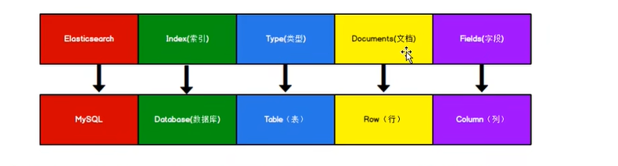

### 一、入门操作

下载地址：https://www.elastic.co/cn/downloads/



elasticsearch 8.x 需要jdk更高级>1.8，      7.x 可以用1.8

bin目录下 elasticsearch.bat  启动后  http://localhost:9200/ 有json格式表明启动成功

表的概念被弱化去掉了

#### 1.HTTP基本操作

##### 1.索引

```
创建索引   put
http://127.0.0.1:9200/shoping

查询信息   get
http://127.0.0.1:9200/_cat/indices?v
```

##### 2.文档

```
文档添加修改  put
http://127.0.0.1:9200/shoping/_doc/1001
{
    "title": "小米手机",
    "category": "小米",
    "price": 3999.00
}
```

```
文档查询    get
http://127.0.0.1:9200/shoping/_doc/1001

全量查询  get
http://127.0.0.1:9200/shoping/_search

条件查询  post
http://127.0.0.1:9200/shoping/_search

{
    "query": {
        "match": {
            "category": "小米"
        }
    },
    "from": 0,
    "size": 2,
    "sort": {
        "price": {
            "order": "desc"
        }
    }
}
```

```
多条件查询 post
http://127.0.0.1:9200/shoping/_search

{
	"query":{
		"bool":{
			"must":[{
				"match":{
					"category":"小米"
				}
			},{
				"match":{
					"price":3999.00
				}
			}],
            "filter":{
            	"range":{
                	"price":{
                    	"gt":2000
                	}
	            }
    	    }
		}
	}
}
```

```
全文检索  post
http://127.0.0.1:9200/shoping/_search
{
	"query":{
		"match_phrase":{
			"category" : "小米"
		}
	},
    "highlight":{
        "fields":{
            "category":{}//<----高亮这字段
        }
    }
}
```

```
聚合查询  post
http://127.0.0.1:9200/shoping/_search
{
    "aggs": { //聚合操作
        "price_group": { //名称，随意起名
            "terms": { //分组
                "field": "price" //分组字段
            }
        }
    },
    "size": 0 // 不要原始数据展示出来
}
```

```
文档-映射关系-创建 （规定文档里的字段）  put
http://127.0.0.1:9200/user/_mapping    
{
    "properties": {
        "name":{
        	"type": "text", // text可以分词
        	"index": true  // 可以被索引查询
        },
        "sex":{
        	"type": "keyword", // 要精确匹配，不分词
        	"index": true
        },
        "tel":{
        	"type": "keyword",
        	"index": false  // 不支持索引查询
        }
    }
}

查询 get
http://127.0.0.1:9200/user/_mapping
```

#### 2.客户端IDEA操作

pom依赖

```
    <dependencies>
        <dependency>
            <groupId>org.elasticsearch</groupId>
            <artifactId>elasticsearch</artifactId>
            <version>7.1.0</version>
        </dependency>
        <!-- elasticsearch 的客户端 -->
        <dependency>
            <groupId>org.elasticsearch.client</groupId>
            <artifactId>elasticsearch-rest-high-level-client</artifactId>
            <version>7.1.0</version>
        </dependency>
        <!-- elasticsearch 依赖 2.x 的 log4j -->
        <dependency>
            <groupId>org.apache.logging.log4j</groupId>
            <artifactId>log4j-api</artifactId>
            <version>2.8.2</version>
        </dependency>
        <dependency>
            <groupId>org.apache.logging.log4j</groupId>
            <artifactId>log4j-core</artifactId>
            <version>2.8.2</version>
        </dependency>
        <dependency>
            <groupId>com.fasterxml.jackson.core</groupId>
            <artifactId>jackson-databind</artifactId>
            <version>2.9.9</version>
        </dependency>
    </dependencies>

```

##### 1.索引操作

```
	public static void main(String[] args) throws IOException {
        RestHighLevelClient esClient = new RestHighLevelClient(
            RestClient.builder(new HttpHost("127.0.0.1", 9200))
        );

        // 创建索引
        CreateIndexRequest request=new CreateIndexRequest("product");
        CreateIndexResponse response=esClient.indices().create(request, RequestOptions.DEFAULT);

        // 响应状态
        boolean acknowledged = response.isAcknowledged();
        System.out.println("创建索引：" + acknowledged);
        esClient.close();
    }
    
    public static void main(String[] args) throws IOException {
        RestHighLevelClient esClient = new RestHighLevelClient(
            RestClient.builder(new HttpHost("127.0.0.1", 9200))
        );

        // 查询索引
        GetIndexRequest request = new GetIndexRequest("user");
        GetIndexResponse response = esClient.indices().get(request, RequestOptions.DEFAULT);

        System.out.println("查询索引：" + response.getAliases());
        System.out.println("查询索引：" + response.getMappings());
        System.out.println("查询索引：" + response.getSettings());
        esClient.close();
    }
    
    public static void main(String[] args) throws IOException {
        RestHighLevelClient esClient = new RestHighLevelClient(
            RestClient.builder(new HttpHost("127.0.0.1", 9200))
        );

        // 删除索引
        DeleteIndexRequest request = new DeleteIndexRequest("product");
        AcknowledgedResponse response = esClient.indices().delete(request, RequestOptions.DEFAULT);

        System.out.println("删除索引：" + response.isAcknowledged());
        esClient.close();
    }
```

##### 2.文档操作

```
    public static void main(String[] args) throws IOException {
        RestHighLevelClient esClient = new RestHighLevelClient(
            RestClient.builder(new HttpHost("127.0.0.1", 9200))
        );

        // 查询数据
        GetRequest request = new GetRequest();
        request.index("user").id("1001");

        GetResponse response = esClient.get(request, RequestOptions.DEFAULT);
        System.out.println(response.getSourceAsString());

        esClient.close();
    }
    
    public static void main(String[] args) throws IOException {
        RestHighLevelClient esClient = new RestHighLevelClient(
            RestClient.builder(new HttpHost("127.0.0.1", 9200))
        );

        // 修改文档
        UpdateRequest request = new UpdateRequest();
        request.index("user").id("1001");
        request.doc(XContentType.JSON,"sex","女","age","24");

        UpdateResponse response = esClient.update(request, RequestOptions.DEFAULT);
        System.out.println(response.getResult());

        esClient.close();
    }
    
    public static void main(String[] args) throws IOException {
        RestHighLevelClient esClient = new RestHighLevelClient(
            RestClient.builder(new HttpHost("127.0.0.1", 9200))
        );

        // 插入文档
        IndexRequest request = new IndexRequest();
        request.index("user").id("1001");

        User user = new User();
        user.setName("lin");
        user.setAge(25);
        user.setSex("男");

        // 数据必须转换JSON格式
        ObjectMapper mapper = new ObjectMapper();
        final String userJSON = mapper.writeValueAsString(user);

        request.source(userJSON, XContentType.JSON);

        IndexResponse response = esClient.index(request, RequestOptions.DEFAULT);
        System.out.println(response.getResult());

        esClient.close();
    }
    
    public static void main(String[] args) throws IOException {
        RestHighLevelClient esClient = new RestHighLevelClient(
            RestClient.builder(new HttpHost("127.0.0.1", 9200))
        );

        // 查询数据
        DeleteRequest request = new DeleteRequest();
        request.index("user").id("1001");

        final DeleteResponse response = esClient.delete(request, RequestOptions.DEFAULT);
        System.out.println(response.toString());

        esClient.close();
    }
    
    public static void main(String[] args) throws IOException {
        RestHighLevelClient esClient = new RestHighLevelClient(
            RestClient.builder(new HttpHost("127.0.0.1", 9200))
        );

        // 批量插入文档
        BulkRequest request = new BulkRequest();
        request.add(new IndexRequest().index("user").id("1005").source(XContentType.JSON, "name", "lin5","age","30",
            "sex","男"));
        request.add(new IndexRequest().index("user").id("1006").source(XContentType.JSON, "name", "lin6","age","20",
            "sex","女"));
        request.add(new IndexRequest().index("user").id("1007").source(XContentType.JSON, "name", "lin7","age","10",
            "sex","女"));
        request.add(new IndexRequest().index("user").id("1008").source(XContentType.JSON, "name", "lin8","age","40",
            "sex","男"));

        final BulkResponse response = esClient.bulk(request, RequestOptions.DEFAULT);
        System.out.println(response.getTook());
        System.out.println(response.getItems());

        esClient.close();
    }
    
    public static void main(String[] args) throws IOException {
        RestHighLevelClient esClient = new RestHighLevelClient(
            RestClient.builder(new HttpHost("127.0.0.1", 9200))
        );

        // 批量插入文档
        BulkRequest request = new BulkRequest();
        request.add(new DeleteRequest().index("user").id("1001"));
        request.add(new DeleteRequest().index("user").id("1002"));

        final BulkResponse response = esClient.bulk(request, RequestOptions.DEFAULT);
        System.out.println(response.getTook());
        System.out.println(response.getItems());

        esClient.close();
    }
```

搜索操作

```
    public static void main(String[] args) throws IOException {
        RestHighLevelClient esClient = new RestHighLevelClient(
            RestClient.builder(new HttpHost("127.0.0.1", 9200))
        );

        // 全量查询
        SearchRequest request = new SearchRequest();
        request.indices("user");

        request.source(new SearchSourceBuilder().query(QueryBuilders.matchAllQuery()));

        SearchResponse response = esClient.search(request, RequestOptions.DEFAULT);

        SearchHits hits = response.getHits();

        System.out.println("count=" + hits.getTotalHits());
        System.out.println("times=" + response.getTook());
        for (SearchHit hit : hits) {
            System.out.println("=" + hit.getSourceAsString());
        }
        esClient.close();
    }
    public static void main(String[] args) throws IOException {
        RestHighLevelClient esClient = new RestHighLevelClient(
            RestClient.builder(new HttpHost("127.0.0.1", 9200))
        );

        // 1.条件查询
//        SearchRequest request = new SearchRequest();
//        request.indices("user");
//
//        request.source(new SearchSourceBuilder().query(QueryBuilders.termQuery("age","30")));
//
//        SearchResponse response = esClient.search(request, RequestOptions.DEFAULT);
//
//        SearchHits hits = response.getHits();
//
//        System.out.println("count=" + hits.getTotalHits());
//        System.out.println("times=" + response.getTook());
//        for (SearchHit hit : hits) {
//            System.out.println("=" + hit.getSourceAsString());
//        }

        // 2.分页查询
//        SearchRequest request = new SearchRequest();
//        request.indices("user");
//        SearchSourceBuilder builder = new SearchSourceBuilder().query(QueryBuilders.matchAllQuery());
//        builder.from(4); // （当前页码-1）* 每页的数据条数
//        builder.size(2);
//        request.source(builder);
//
//        SearchResponse response = esClient.search(request, RequestOptions.DEFAULT);
//
//        SearchHits hits = response.getHits();
//
//        System.out.println("count=" + hits.getTotalHits());
//        System.out.println("times=" + response.getTook());
//        for (SearchHit hit : hits) {
//            System.out.println("=" + hit.getSourceAsString());
//        }

        // 3.查询排序
//        SearchRequest request = new SearchRequest();
//        request.indices("user");
//        SearchSourceBuilder builder = new SearchSourceBuilder().query(QueryBuilders.matchAllQuery());
//        builder.sort("age", SortOrder.ASC);
//        request.source(builder);
//
//        SearchResponse response = esClient.search(request, RequestOptions.DEFAULT);
//
//        SearchHits hits = response.getHits();
//
//        System.out.println("count=" + hits.getTotalHits());
//        System.out.println("times=" + response.getTook());
//        for (SearchHit hit : hits) {
//            System.out.println("=" + hit.getSourceAsString());
//        }

        // 4.过滤字段
//        SearchRequest request = new SearchRequest();
//        request.indices("user");
//        SearchSourceBuilder builder = new SearchSourceBuilder().query(QueryBuilders.matchAllQuery());
//
//        String[] excludes={"name"};
//        String[] includes={};
//        builder.fetchSource(includes,excludes);
//        request.source(builder);
//
//        SearchResponse response = esClient.search(request, RequestOptions.DEFAULT);
//
//        SearchHits hits = response.getHits();
//
//        System.out.println("count=" + hits.getTotalHits());
//        System.out.println("times=" + response.getTook());
//        for (SearchHit hit : hits) {
//            System.out.println("=" + hit.getSourceAsString());
//        }

//        // 5.组合查询
//        SearchRequest request = new SearchRequest();
//        request.indices("user");
//        BoolQueryBuilder boolQuery = QueryBuilders.boolQuery();
//        boolQuery.must().add(QueryBuilders.matchQuery("age",30));
//        boolQuery.must().add(QueryBuilders.matchQuery("set","男"));
//        boolQuery.mustNot().add(QueryBuilders.matchQuery("set","女"));
////        boolQueryBuilder.should().add(QueryBuilders.matchQuery("age",40)); // 或 ||
//
//        SearchSourceBuilder builder = new SearchSourceBuilder().query(boolQuery);
//        request.source(builder);
//
//        SearchResponse response = esClient.search(request, RequestOptions.DEFAULT);
//
//        SearchHits hits = response.getHits();
//
//        System.out.println("count=" + hits.getTotalHits());
//        System.out.println("times=" + response.getTook());
//        for (SearchHit hit : hits) {
//            System.out.println("=" + hit.getSourceAsString());
//        }

        // 6.模糊查询
//        SearchRequest request = new SearchRequest();
//        request.indices("user");
//        SearchSourceBuilder builder = new SearchSourceBuilder();
//        // Fuzziness.ONE 差一个字符可以查询来，偏差距离
//        builder.query(QueryBuilders.fuzzyQuery("name","lin").fuzziness(Fuzziness.ONE));
//        request.source(builder);
//
//        SearchResponse response = esClient.search(request, RequestOptions.DEFAULT);
//
//        SearchHits hits = response.getHits();
//
//        System.out.println("count=" + hits.getTotalHits());
//        System.out.println("times=" + response.getTook());
//        for (SearchHit hit : hits) {
//            System.out.println("=" + hit.getSourceAsString());
//        }

        // 7.高亮查询
//        SearchRequest request = new SearchRequest();
//        request.indices("user");
//        SearchSourceBuilder builder = new SearchSourceBuilder();
//
//        HighlightBuilder highlightBuilder=new HighlightBuilder();
//        highlightBuilder.preTags("<font color='red'>");
//        highlightBuilder.postTags("</font>");
//        highlightBuilder.field("name");
//        builder.highlighter(highlightBuilder);
//        // Fuzziness.ONE 差一个字符可以查询来，偏差距离
//        builder.query(QueryBuilders.fuzzyQuery("name","lin").fuzziness(Fuzziness.ONE));
//        request.source(builder);
//
//        SearchResponse response = esClient.search(request, RequestOptions.DEFAULT);
//
//        SearchHits hits = response.getHits();
//
//        System.out.println("count=" + hits.getTotalHits());
//        System.out.println("times=" + response.getTook());
//        for (SearchHit hit : hits) {
//            System.out.println("=" + hit.getSourceAsString());
//        }

        // 8.聚合查询
        SearchRequest request = new SearchRequest();
        request.indices("user");
        SearchSourceBuilder builder = new SearchSourceBuilder();
        AggregationBuilder aggregationBuilder= AggregationBuilders.max("maxAge").field("age");
        builder.aggregation(aggregationBuilder);
        request.source(builder);

        SearchResponse response = esClient.search(request, RequestOptions.DEFAULT);

        SearchHits hits = response.getHits();

        System.out.println("count=" + hits.getTotalHits());
        System.out.println("times=" + response.getTook());
        for (SearchHit hit : hits) {
            System.out.println("=" + hit.getSourceAsString());
        }

        esClient.close();
    }
```

#### 3.环境搭建

