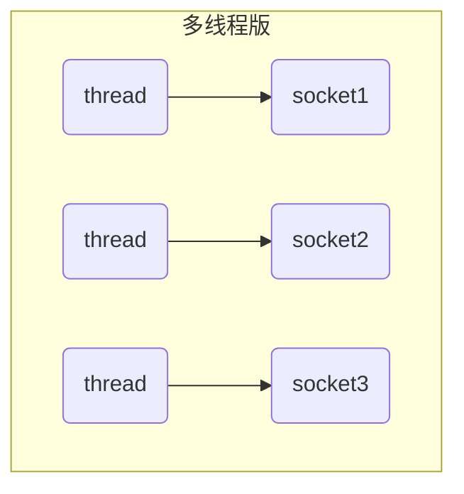
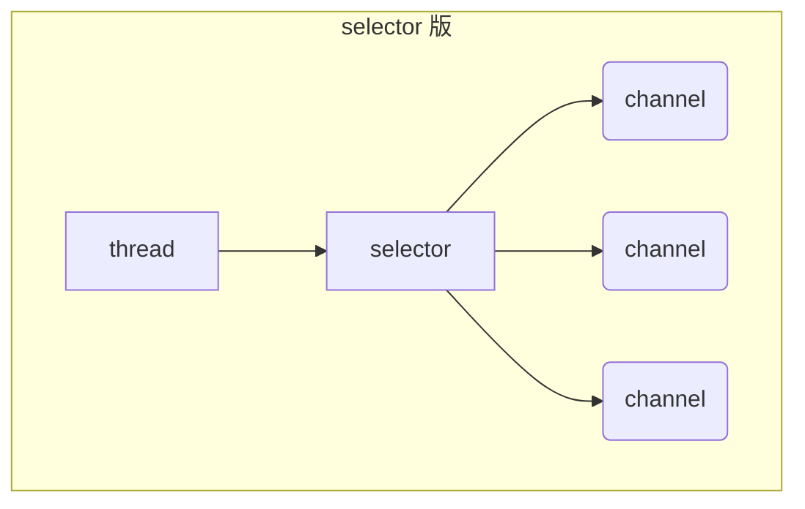

# netty

参考指南

笔记版：

https://bright-boy.gitee.io/technical-notes/#/%E7%BD%91%E7%BB%9C%E7%BC%96%E7%A8%8B/netty?id=%e7%ba%bf%e7%a8%8b%e6%b1%a0%e7%89%88%e8%ae%be%e8%ae%a1

B站： 

https://www.bilibili.com/video/BV1py4y1E7oA/?p=3&vd_source=0ee4a5fcc4ed2246ba902aa714c4428b

## 一、NIO基础

### 1.  三大组件

#### 1.1 Channel & Buffer

channel 有一点类似于 stream，它就是读写数据的**双向通道**，可以从 channel 将数据读入 buffer，也可以将 buffer 的数据写入 channel，而之前的 stream 要么是输入，要么是输出，channel 比 stream 更为底层


常见的 **Channel** 有

- FileChannel
- DatagramChannel
- SocketChannel
- ServerSocketChannel

**buffer** 则用来缓冲读写数据，常见的 buffer 有

- ByteBuffer
  - MappedByteBuffer
  - DirectByteBuffer
  - HeapByteBuffer
- ShortBuffer
- IntBuffer
- LongBuffer
- FloatBuffer
- DoubleBuffer
- CharBuffer

#### 1.2 Selector

**selector** 单从字面意思不好理解，需要结合服务器的设计演化来理解它的用途单从字面意思不好理解，需要结合服务器的设计演化来理解它的用途

**多线程版设计**



多线程版缺点：

- 内存占用高
- 线程上下文切换成本高
- 只适合连接数少的场景

**Selector版设计**

selector 的作用就是配合一个线程来管理多个 channel，获取这些 channel 上发生的事件，这些 channel 工作在非阻塞模式下，不会让线程吊死在一个 channel 上。适合连接数特别多，但流量低的场景（low traffic）



调用 selector 的 select() 会阻塞直到 channel 发生了读写就绪事件，这些事件发生，select 方法就会返回这些事件交给 thread 来处理

### 2. ByteBuffer

有一普通文本文件 data.txt，内容为

```
1234567890abcd
```

使用 FileChannel 来读取文件内容

```
@Slf4j
public class ChannelDemo1 {
    public static void main(String[] args) {
        try (RandomAccessFile file = new RandomAccessFile("helloword/data.txt", "rw")) {
            FileChannel channel = file.getChannel();
            ByteBuffer buffer = ByteBuffer.allocate(10);
            do {
                // 向 buffer 写入
                int len = channel.read(buffer);
                log.debug("读到字节数：{}", len);
                if (len == -1) {
                    break;
                }
                // 切换 buffer 读模式
                buffer.flip();
                while(buffer.hasRemaining()) {
                    log.debug("{}", (char)buffer.get());
                }
                // 切换 buffer 写模式
                buffer.clear();
            } while (true);
        } catch (IOException e) {
            e.printStackTrace();
        }
    }
}
```

