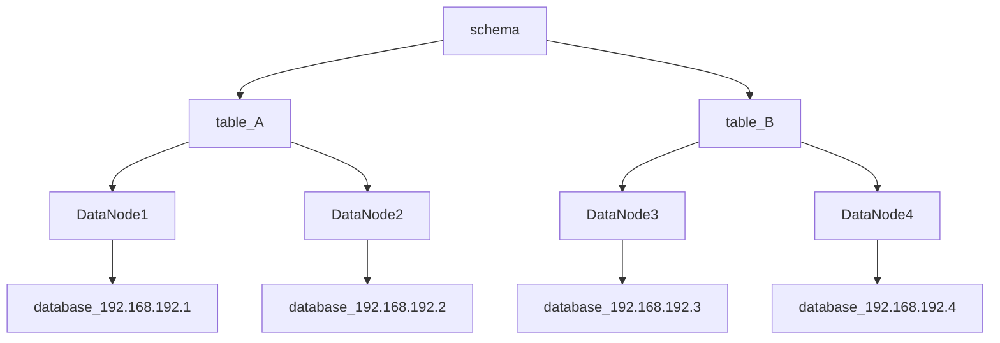

Mycat

源码社区：https://github.com/MyCATApache/Mycat-Server

学习视频：https://www.bilibili.com/video/BV17f4y1D7pm/?spm_id_from=333.337.search-card.all.click&vd_source=0ee4a5fcc4ed2246ba902aa714c4428b

笔记：https://blog.csdn.net/qq_22075913/article/details/119062209

## 一、简介

### 1.1 介绍

mycat是独立于应用层，和sharding-proxy差不多，而sharding-jdbc是嵌入于应用层，

mysql->mycat->各主机->各分片

需要服务器安装mycat

`基于 Java 开发`的，实现了 MySQL 公开的二进制传输协议，巧妙地将自己伪装成一个 MySQL Server

### 1.2 使用场景

1). 高可用性与MySQL读写分离

高可用：利用MyCat可以轻松实现热备份，当一台服务器停机时，可以由集群中的另一台服务器自动接 管业务，
无需人工干预，从而保证高可用。

读写分离：通过MySQL数据库的binlog日志完成主从复制，并可以通过MyCat轻松实现读写分离，
实现insert、update、delete走主库，而在select时走从库，从而缓解单台服务器的访问压力。

2). 业务数据分级存储保障

企业的数据量总是无休止的增长，这些数据的格式不一样，访问效率不一样，重要性也不一样。可以针
对不同级别的数据，采用不同的存储设备，通过分级存储管理软件实现数据客体在存储设备之间
自动迁移及自动访问切换。
3). 大表水平拆分，集群并行计算

数据切分是MyCat的核心功能，是指通过某种特定的条件，将存放在同一个数据库的数据，
分散存储在多个数据库中，以达到分散单台设备负载的效果。当数据库量超过800万行且需要做分片时，
就可以考 虑使用MyCat实现数据切分。
4). 数据库路由器

MyCat基于MySQL实例的连接池复用机制，可以让每个应用最大程度共享一个MySQL实例的所有连接 池，
让数据库的并发访问能力大大提升。
5). 整合多种数据源

当一个项目中使用了多个数据库（Oracle，MySQL，SQL Server,PostgreSQL），并配置了多个数
据源，操作起来就比较烦锁，这时就可以使用MyCat进行整合，最终我们的应用程序只需要访问一个数据源即可。

## 二、入门

### 2. 核心概念

#### 2.1 分片

垂直分片：每个系统一个数据库，订单/库存

水平拆分：一张表拆分到多个数据库

**分片策略**

#### 2.2 逻辑库(schema)

#### 2.3 逻辑表(table)

#### 2.4 分片节点(dataNode)

#### 2.5 分片主机(dataHost)

#### 2.6 分片规则(rule)

