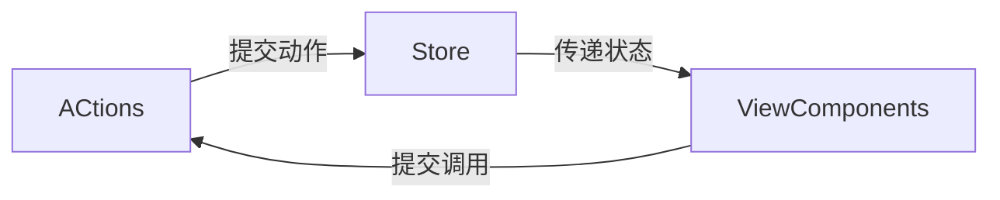
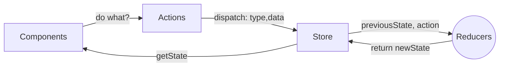

前端大全

## react

### 目录结构

public ---- 静态资源文件夹

​          favicon.icon ------ 网站页签图标

​          **index.html --------** **主页面**

​          logo192.png ------- logo图

​          logo512.png ------- logo图

​          manifest.json ----- 应用加壳的配置文件（可忽略）

​          robots.txt -------- 爬虫协议文件（可忽略）

src ---- 源码文件夹

​          App.css -------- App组件的样式

​          **App.js --------- App****组件**

​          App.test.js ---- 用于给App做测试 （可忽略）

​          index.css ------ 样式

​          **index.js -------** **入口文件**

​          logo.svg ------- logo图

​          reportWebVitals.js    （可忽略）

​                 --- 页面性能分析文件(需要web-vitals库的支持)

​          setupTests.js   （可忽略）

​                 ---- 组件单元测试的文件(需要jest-dom库的支持)

**package-lock.json**

**锁定安装模块的版本号**

需要更新版本，得去更新package.json里的模块版本，然后npm install，才能同步更新到package-lock.json

### 快捷键

快捷键`ctrl+p`弹出文件搜索弹窗，输入英文冒号`:`，继续输入想要跳转的行数，就是实现快速跳转到对应行。

rcc + tab键 - - 用ES6模块系统创建一个React组件类

rccp + tab键 - - 创建一个带有PropTypes和ES6模块系统的React组件类

rcfc + tab键 - - 创建一个带有PropTypes和所有生命周期方法以及ES6模块系统的React组件类

rcjc + tab键 - - 用ES6模块系统创建一个React组件类（无导出）

下面的自己可以尝试一下哦，笔者只是做了介绍就不放图了哈~
rdp + tab键 - - 快速生成defaultProps
rpc + tab键 - - 用PropTypes和ES6 moudle系统创建一个React纯组件类
rrc + tab键 - - 创建一个连接到redux的React组件类
rrdc + tab键 - - 创建一个通过dispatch连接到redux的React组件类
rsc + tab键 - - 创建没有PropTypes和ES6模块系统的无状态React组件
rscp + tab键 - - 创建有PropTypes和ES6模块系统的无状态React组件
rsf + tab键 - - 以命名函数的形式创建无状态的React组件，不使用PropTypes
rsfp + tab键 - - 使用PropTypes将无状态的React组件作为命名函数创建
rsi + tab键 - - 创建无状态的React组件，不使用PropTypes和ES6模块系统，但使用隐式返回和道具
rwwd + tab键 - - 在没有导入的情况下，在ES6模块系统中创建一个有构造函数、空状态、proptypes和导出的

### 调式技巧

https://blog.csdn.net/web2022050901/article/details/127845948

### react项目部署

https://reactjs-old.bootcss.com/tutorial/tutorial.html#setup-option-2-local-development-environment

#### 脚手架搭建

1.安装较新版本的node.js

2.npx create-react-app my-app         这个默认安装最新版本的react

3.降级操作，npm install react@16.13.1 react-dom@16.13.1 --save

5.npm install --save react-router-dom@5.2.0 --save       导入路由的包，否则不会感应<Route>等组件

5.修改index.js文件

```
import ReactDOM from 'react-dom';
import App from './App';
import React from 'react';

ReactDOM.render(
  <React.StrictMode>
    <App />
  </React.StrictMode>,
  document.getElementById('root')
)
```

6.npm start

7.安装antd蚂蚁组件 npm install antd --save

8.安装axios调接口  npm i axios --save

https://blog.csdn.net/qq_53123067/article/details/128696338

9.npm install styled-components

10.moment时间插件 -推荐用dayjs，这个占比太大

http://momentjs.cn/

npm install moment --save

11.dayjs插件


#### 技术架构

react/react-native

antd/antd-react-native

axios 调API

echarts 图表库    https://echarts.apache.org/handbook/zh/concepts/chart-size

es6

braft editor 富文本框 https://braft.margox.cn/demos/rem

redux


```
"dependencies": {
    "@ant-design/icons": "^4.6.2",
    "@antv/g6": "^4.0.1",
    "@csicida/components": "^0.1.20",
    "@fortawesome/fontawesome-svg-core": "^1.2.0-14",
    "@fortawesome/free-solid-svg-icons": "^5.1.0-11",
    "@fortawesome/react-fontawesome": "0.1.0-11",
    "@ztree/ztree_v3": "^3.5.44",
    "antd": "^3.10.0",
    "axios": "^0.27.2",
    "braft-editor": "^2.1.34",
    "braft-finder": "0.0.16",
    "braft-utils": "^3.0.8",
    "circular-json": "^0.5.5",
    "core-js": "^2.6.12",
    "cross-env": "^7.0.2",
    "echarts": "^4.9.0",
    "echarts-for-react": "^2.0.15-beta.0",
    "elastic-apm-js-base": "^3.0.0",
    "font-awesome": "^4.7.0",
    "immutability-helper": "^2.7.1",
    "intl": "^1.2.5",
    "jquery": "^3.5.1",
    "lodash": "^4.17.11",
    "memoize-one": "^4.1.0",
    "moment": "^2.29.4",
    "mutation-observer": "^1.0.3",
    "npm": "^6.4.1",
    "qs": "^6.6.0",
    "rc-select": "^8.0.14",
    "react": "^16.13.1",
    "react-app-polyfill": "^2.0.0",
    "react-beautiful-dnd": "^10.1.1",
    "react-data-grid": "^4.0.8",
    "react-data-grid-addons": "^4.0.8",
    "react-datepicker": "^1.5.0",
    "react-dnd": "^7.0.2",
    "react-dnd-html5-backend": "^7.0.2",
    "react-dom": "^16.13.1",
    "react-highlight-words": "^0.16.0",
    "react-copy-to-clipboard": "^5.1.0",
    "react-intl": "^2.9.0",
    "react-moment": "^0.8.2",
    "react-redux": "^7.2.0",
    "react-resizable": "^1.11.0",
    "react-router": "^5.2.0",
    "react-router-dom": "^4.2.2",
    "react-scripts": "^3.4.3",
    "react-table": "^6.8.6",
    "react-tabs": "^2.2.2",
    "react-waypoint": "^8.1.0",
    "reactjs-popup": "^1.1.1",
    "redux": "^4.0.4",
    "redux-logger": "^3.0.6",
    "redux-saga": "^1.1.3",
    "reflux": "^6.4.1",
    "showdown": "^1.9.0",
    "simplemde": "^1.11.2",
    "styled-components": "^4.1.3",
    "universal-cookie": "^2.1.5",
    "ztree": "^3.5.24"
  }
```

#### 路由配置 

```
import React from 'react';
import { BrowserRouter as Router, Route, Link } from "react-router-dom";
import './App.css';
import Home from './component/Home';
import About from './component/About';
import Message from './component/Message';
import Table from './component/Table';

class App extends React.Component {
  render() {
    return (
      <Router>
      <div>
        <ul>
          <li>
            <Link to="/">Home</Link>
          </li>
          <li>
            <Link to="/About">About</Link>
          </li>
          <li>
            <Link to="/Message">Message</Link>
          </li>
          <li>
            <Link to="/Table">Table</Link>
          </li>
        </ul>
        <Route exact path="/" component={Home} />
        <Route exact path="/About" component={About} />
        <Route exact path="/Message" component={Message} />
        <Route exact path="/Table" component={Table} />
      </div>
    </Router> 
    );
  }
}

export default App;
```

其他几个页面类似如下

```
import React from 'react';

class Home extends React.Component {
    constructor(props) {
        super(props);
        this.state = {
          pageText: "我是Home界面"
        }
      }

      render () {
        return (
          <div>
            <h1>{this.state.pageText}</h1>
          </div>
        )
      }
}
export default Home
```

#### axios配置

/util/axios.js

```
import axios from 'axios';

axios.defaults.timeout=60000;
axios.interceptors.request.use(
    request => {
        return request;
    },
    error => {
        return Promise.reject(error.response);
    }
);

axios.interceptors.response.use((res) => {
    return res;
}, (error) => {
    console.log(error);
    return Promise.reject(error);
});

export default axios;
```

/api/api.js

```
import axios from '../util/axios';

export async function getUserList() {
    return await axios.get(
        `http://127.0.0.1:8003/vuln/redis/api/v1/lin/list`)
        .then(resp => resp.data && resp.data)
        .catch(() => ({ status: 'error' })); 
}
```

调用

```
    componentDidMount() {
        // 原生fetch方式调后端
        // fetch("http://127.0.0.1:8003/vuln/redis/api/v1/lin/list")
        //     .then(res => res.json())
        //     .then(
        //         (result) => {
        //             this.setState({
        //                 userlist: result.body,
        //                 isLoaded: true
        //             });
        //         },
        //         (error) => {
        //             console.log(error);
        //         }
        //     )
        getUserList()
            .then(
                (result) => {
                    this.setState({
                        userlist: result.body,
                        isLoaded: true
                    });
                },
                (error) => {
                    console.log(error);
                }
            )
    }
```

#### proxy代理配置

package.json 配置这一行

将默认的本地访问路径localhost:3000代理为后面的，一般为本地启动前端调dev环境的接口

Proxy error: Could not proxy request /%PUBLIC_URL%/manifest.json from localhost:3000 to http://127.0.0.1:8003.

```
"proxy": "http://127.0.0.1:8003",
```

#### 部署运维日志

1.前端是nginx转发到静态资源部署访问；

2.后端是spring-boot默认内嵌了tomcat服务器，启动jar包部署访问；


#### 部署方法

1.前后端不分离：前端放在spring项目的resources下，并且打包成war包，而不是可执行jar包，war包放在tomcat目录下，启动tomcat访问；   这是 spring-boot没出来前的打包方式

2.前后端分离： 前端可以使用nginx/tomcat部署:   tomcat/nginx都是一种web服务器，因为直接访问计算器是访问不了的

(1) 前端react项目build文件夹复制到tomcat目录下，启动tomcat;

(2) 前端build文件夹复制到服务器上，配置nginx转发规则


注意：jar包类型分为可执行jar包和依赖jar包，依赖jar包比较小，几百k。可执行jar包就几百m

### 技术点积累

#### state&props

```
const {vulnFixInfo, status} = this.state // 当前组件的属性
const {versionName, taskId} = this.props // 父组件传递下来的属性
```

对象/属性的取值及赋值，setState会触发react组件update更新

```
const {code} = this.props;
const {fixInfo}=this.state; 
let param={
    code:code, url:fixInfo.url // 这个fixInfo是个对象
}
this.setState({status:'通过'});
```

#### 函数式组件

```
import React from 'react';

function About() {
  return (
    <div>
      我是About函数式组件界面
    </div>
  );
}

export default About
```

#### 箭头函数&普通函数

```
// Correct
this.setState((state, props) => ({
  counter: state.counter + props.increment
}));

// Correct
this.setState(function(state, props) {
  return {
    counter: state.counter + props.increment
  };
});

```

#### 更新属性

ES6 计算属性名称的语法更新给定输入名称对应的 state 值：

```
this.setState({
  [name]: value
});
```

等同 ES5:

```
var partialState = {};
partialState[name] = value;
this.setState(partialState);
```

#### 事件监听

使用 React 时，你一般不需要使用 `addEventListener` 为已创建的 DOM 元素添加监听器。事实上，你只需要在该元素初始渲染的时候添加监听器即可。 bind

```
class Toggle extends React.Component {
  constructor(props) {
    super(props);
    this.state = {isToggleOn: true};

    // 为了在回调中使用 `this`，这个绑定是必不可少的
    this.handleClick = this.handleClick.bind(this);
  }

  handleClick() {
    this.setState(prevState => ({
      isToggleOn: !prevState.isToggleOn
    }));
  }

  render() {
    return (
      <button onClick={this.handleClick}>
        {this.state.isToggleOn ? 'ON' : 'OFF'}
      </button>
    );
  }
}

ReactDOM.render(
  <Toggle />,
  document.getElementById('root')
);
```

#### iframe嵌入

```
import React from 'react';
import styled from "styled-components";

const Wrap = styled.div`
    height: 100%;
    display: flex;
    .hidden{
        display:none;
    }
`;
class BaiduIframe extends React.Component {

    render () {
        return (<Wrap style={{height: 'calc(100% - 51px)'}}>
            <iframe src='https://www.baidu.com/'
                    width={'100%'} frameBorder={0}
                    title={'unknown'}
            />
        </Wrap>)
    }
}

export default BaiduIframe
```

```
<Route exact path="/baidu" component={BaiduIframe} />
```

#### flux

原理解析： https://www.jianshu.com/p/0ccf27d55e4c

Action -> dispatch -> store -> view components

#### reflux

[Flux](https://link.jianshu.com/?t=https://facebook.github.io/flux), [Reflux](https://link.jianshu.com/?t=(https://facebook.github.io/flux))和[Redux](https://link.jianshu.com/?t=(http://redux.js.org/))它们都是用于管理数据流转的

https://www.jianshu.com/p/d1988a22f4c7

**数据流结构对比**

- Reflux的数据流相对简单，没有dispatcher的概念，没有Redux的中间件概念
- Flux的数据流结构对于Reflux来所相对复杂，多了dispatcher的概念
- Redux数据流结构和Flux相当，但不相同，复杂程度差不多，还有中间件概念

**代码层面的对比**

- Reflux代码的复杂度相对来比简单易于理解，简洁优美
- Flux复杂度相当高，相对于Reflux来说，Flux的代码太多，而且不易于阅读
- Redux复杂度中等，阅读相对容易理解

**功能上对比**

- Reflux很简单，支持异步数据流，支持事件触发器的切换
- Flux
- Redux功能堪称强大， logging（日志）, hot reloading（热重载）, time travel（时间旅行）, universal apps（通用）, record（记录） and replay（回放）

reflux流程图如下



**使用流程**

也可用于调用后端接口，store层是api  axios层

```s
npm install relux
```

```
import Reflux from 'reflux'

let Action = Reflux.createActions([
    'add'
]);
export default Action;
```

```
import Reflux from 'reflux'
import Action from '../actions/Action';

// 可以抽离出公共的Store,后期组件多的时候，可以多个组件从这里取state
class Store extends Reflux.Store {
    constructor() {
        super();
        this.listenables = Action;
        this.state = {	
            num: 0
        }
    }

    // 根据actions中定义的  on+大写开头
    onAdd() {
        this.setState({num: this.state.num + 1});
    }
}

export default Store;
```

```
import React from 'react'
import Reflux from 'reflux'
import Action from '../actions/Action';
import Store from '../stores/Store';

class Index extends Reflux.Component {
    constructor(props) {
        super(props);
        this.store = Store;
    }

    render() {
        return (
            <div>
                {this.state.num}
                <button onClick={() => Action.add()}>+</button>
            </div>
        );
    }
}

export default Index;
```

#### redux

原理解析：https://www.jianshu.com/p/85086337645d

流程：

npm install redux



### 问题积累

#### 1. map遍历null问题

Cannot read properties of undefined (reading 'map')

```
// 2、&& 判断
Array.isArray(userlist)&&userlist.map(()=>{ …… })

//3. 
userlist&&Object.values(userlist).map() 
```

```
{userlist?.map(item => (
{userlist&&userlist.map(item => (

 {/*调式技巧：打印为表格的方式 */}
                    {console.table(userlist)}
                    {/* 请求成功的时候才是array,否则不算 */}
                    {console.log(Array.isArray(userlist))}
                    {/* 先判断是不是array,再map输出；或者只是  userlist&&Object.values(userlist).map() */}
                    {console.log(Array.isArray(Object.values(userlist)))}
                    {Array.isArray(userlist)&&userlist.map((item, index) => (
                        <li key={index}>
                            {item.proxySystem} {item.healthDesc} {item.request12hour}
                        </li>
                    ))}
```

#### 2. antd组件

##### (1) Table组件改变dataSource没有重新渲染问题

```
    let { searchTime, uriList } = this.state
    // 指针改变了，Table组件中的dataSource也会有变化，Table组件会重新渲染！否则默认数据无变化不重新渲染
    const uriListDisPlay = uriList ? [...uriList] : [];
    
       <Table
          rowKey={record => record.proxyUri}
          columns={columns}
          dataSource={uriListDisPlay}
          pagination={false}
        />
```

### 案例

#### 1. 原生展示列表

```
import React from 'react';
import MyTableList from './MyTableList';

class Table extends React.Component {
    constructor(props) {
        super(props);
        this.state = {
          pageText: "我是Table组件界面"
        }
      }

      render () {
        return (
          <div>
            <h3>{this.state.pageText}</h3>
            <MyTableList/>
          </div>
        )
      }
}
export default Table
```

```
import React from 'react';
import { getUserList } from '../api/api';

class MyTableList extends React.Component {
    constructor(props) {
        super(props);
        this.state = {
            isLoaded: false,
            userlist: []
        }
    }
    componentDidMount() {
        // 原生fetch方式调后端
        // fetch("http://127.0.0.1:8003/vuln/redis/api/v1/lin/list")
        //     .then(res => res.json())
        //     .then(
        //         (result) => {
        //             this.setState({
        //                 userlist: result.body,
        //                 isLoaded: true
        //             });
        //         },
        //         (error) => {
        //             console.log(error);
        //         }
        //     )
        getUserList()
            .then(
                (result) => {
                    this.setState({
                        userlist: result.body,
                        isLoaded: true
                    });
                },
                (error) => {
                    console.log(error);
                }
            )
    }

    render() {
        const { isLoaded, userlist } = this.state;
        if (isLoaded) {
            return (
                <ul>
                    <li>
                        Name Savings Job
                    </li>
                    {/*调式技巧：打印为表格的方式 */}
                    {console.table(userlist)}
                    {userlist.map(item => (
                        <li>
                            {item.name} {item.age} {item.job}
                        </li>
                    ))}
                </ul>
            )
        } else {
            return (
                <div>请求未成功</div>
            )
        }
    }
}
export default MyTableList
```

### vscode插件推荐

Auto Import 

CSS Peek

Debugger for chrome

GitLens

Import Cost  看导入的包大小

indent-rainbow  括号高亮

npm Intellisense

Intellisense for CSS class

