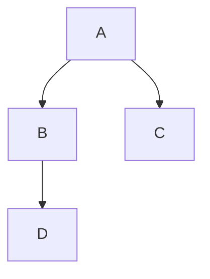
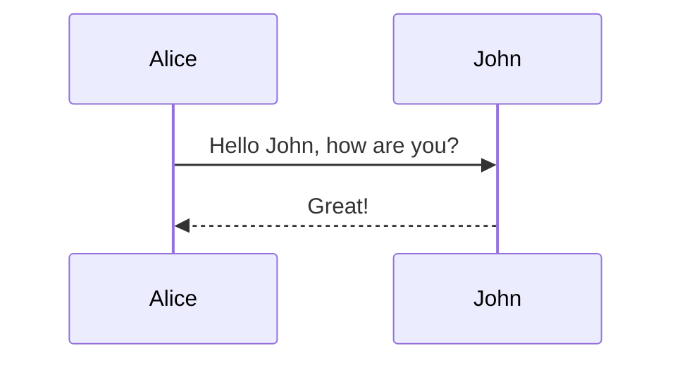
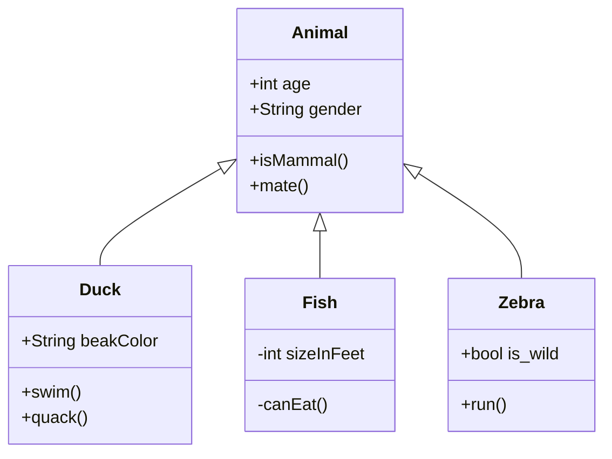
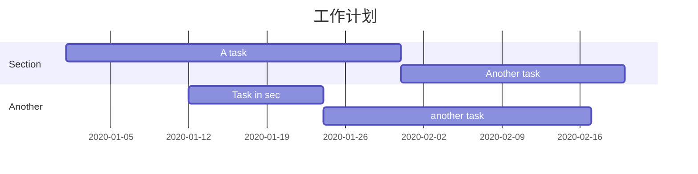
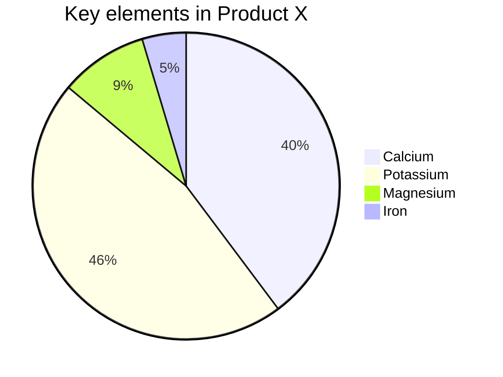

## typora画图

先在 Typora 中，输入 **```mermaid** 然后敲击回车，即可初始化一张空白图。

参考：

mermaid官方文档（详细，博客只是常用一些）: https://mermaid-js.github.io/mermaid/#/flowchart

参考文章（只是常用几个）： https://zhuanlan.zhihu.com/p/172635547

### 一、流程图

语法解释：`graph` 关键字就是声明一张流程图，`TD` 表示的是方向，这里的含义是 Top-Down 由上至下

TD从上到下，LR从左到右

```
graph TD; 
    A-->B;
    A-->C;
    B-->D;
```



### 二、时序图

语法解释：`->>` 代表实线箭头，`-->>` 则代表虚线

```
sequenceDiagram
    Alice->>John: Hello John, how are you?
    John-->>Alice: Great!
```




### 三、状态图

语法解释：`[*]` 表示开始或者结束，如果在箭头右边则表示结束

```
stateDiagram
    [*] --> s1
    s1 --> [*]
```


### 四、类图

语法解释：`<|--` 表示继承，`+` 表示 `public`，`-` 表示 `private`

```
classDiagram
    Animal <|-- Duck
    Animal <|-- Fish
    Animal <|-- Zebra
    Animal : +int age
    Animal : +String gender
    Animal: +isMammal()
    Animal: +mate()
    class Duck{
        +String beakColor
        +swim()
        +quack()
    }
    class Fish{
        -int sizeInFeet
        -canEat()
    }
    class Zebra{
        +bool is_wild
        +run()
    }
```




### 五、甘特图

甘特图一般用来表示项目的计划排期，目前在工作中经常会用到

语法也非常简单，从上到下依次是图片标题、日期格式、项目、项目细分的任务

```
gantt
    title 工作计划
    dateFormat  YYYY-MM-DD
    section Section
    A task           :a1, 2020-01-01, 30d
    Another task     :after a1  , 20d
    section Another
    Task in sec      :2020-01-12  , 12d
    another task      : 24d
```



### 六、饼图

饼图使用 `pie` 表示，标题下面分别是区域名称及其百分比

```
pie
    title Key elements in Product X
    "Calcium" : 42.96
    "Potassium" : 50.05
    "Magnesium" : 10.01
    "Iron" :  5
```



